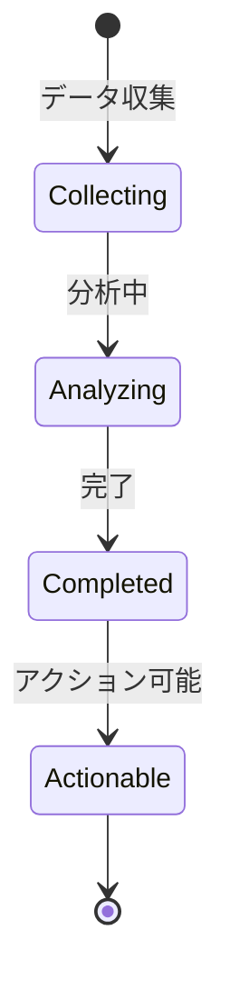

# ビジネスオペレーション: スキルギャップを分析する

**バージョン**: 1.0.0
**更新日**: 2025-10-01

## 概要

**目的**: 組織の現状スキルと必要スキルのギャップを分析する

**パターン**: Analytics

**ゴール**: スキルギャップが定量的に把握され、育成の優先順位が明確になる

## 関係者とロール

- **人事管理者**: スキルギャップ分析の実施
- **経営層**: 必要スキルの方針決定
- **マネージャー**: 部門別ギャップの確認

## プロセスフロー

> **重要**: プロセスフローは必ず番号付きリスト形式で記述してください。
> Mermaid形式は使用せず、テキスト形式で記述することで、代替フローと例外フローが視覚的に分離されたフローチャートが自動生成されます。

1. システムが現状スキル調査を処理する
2. システムが必要スキル定義を処理する
3. システムがギャップ計算を処理する
4. システムが重要度評価を処理する
5. システムが優先順位付けを処理する
6. システムがギャップレポート作成を行う

## 代替フロー

### 代替フロー1: 情報不備
- 2-1. システムが情報の不備を検知する
- 2-2. システムが修正要求を送信する
- 2-3. ユーザーが情報を修正し再実行する
- 2-4. 基本フロー2に戻る

## 例外処理

### 例外1: システムエラー
- システムエラーが発生した場合
- エラーメッセージを表示する
- 管理者に通知し、ログに記録する

### 例外2: 承認却下
- 承認が却下された場合
- 却下理由をユーザーに通知する
- 修正後の再実行を促す

## ビジネス状態

## KPI

- **分析頻度**: 四半期毎に実施
- **ギャップ解消率**: 年間で特定ギャップの50%以上を解消
- **予測精度**: プロジェクト要件の80%以上を予測
- **対応率**: 特定したギャップの70%以上に対策実施

## ビジネスルール

- ギャップ重要度: ビジネスインパクト × 緊急度で評価
- 優先順位: 高重要度かつ習得容易なスキルを優先
- 閾値: ギャップが20%以上のスキルを重点対象

## 入出力仕様

### 入力

- **メンバーの現状スキルデータ**: スキルマップ、レベル情報
- **プロジェクト要件データ**: 計画中・実行中のプロジェクトの必要スキル
- **ビジネス戦略・計画**: 中期経営計画、事業戦略
- **市場トレンド情報**: 業界動向、技術トレンド

### 出力

- **スキルギャップ分析レポート**: ギャップの詳細分析結果
- **優先スキルリスト**: 優先的に育成すべきスキル
- **スキルマップ（現状 vs 目標）**: 可視化された比較図
- **育成推奨リスト**: 具体的な育成アクション提案

## 例外処理

- **データ不足**: サンプル調査で代替、推定値使用
- **急激な環境変化**: 緊急分析の実施、計画外の対応
- **ギャップ大**: 外部調達の検討、パートナー連携

## 派生ユースケース

このビジネスオペレーションから以下のユースケースが派生します：

1. 現状スキルを調査する
2. 必要スキルを定義する
3. ギャップを計算する
4. 優先順位を決定する
