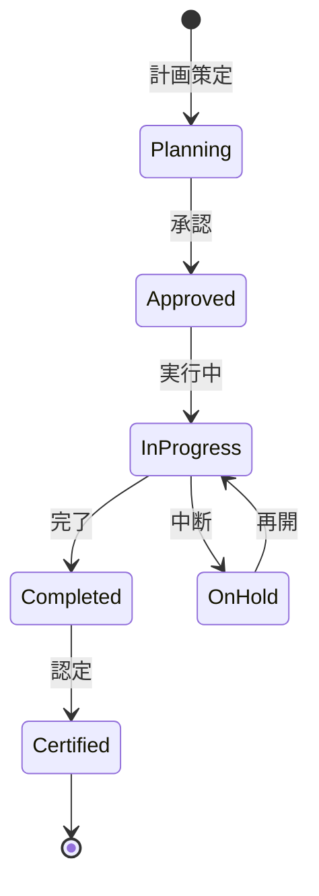

# ビジネスオペレーション: スキル開発を計画し実行する

**バージョン**: 1.0.0
**更新日**: 2025-10-01

## 概要

**目的**: スキルギャップに基づき、具体的な開発計画を策定し実行する

**パターン**: Workflow

**ゴール**: スキル開発計画が実行され、メンバーのスキルが向上する

## 関係者とロール

- **人事管理者**: 開発計画の策定、研修提供
- **マネージャー**: OJT計画、進捗管理
- **メンバー**: スキル習得、認定取得

## プロセスフロー

> **重要**: プロセスフローは必ず番号付きリスト形式で記述してください。
> Mermaid形式は使用せず、テキスト形式で記述することで、代替フローと例外フローが視覚的に分離されたフローチャートが自動生成されます。

1. システムがギャップ分析結果を処理する
2. システムが開発計画策定を処理する
3. システムが研修プログラム選定を処理する
4. システムがOJT計画作成を行う
5. システムが実行を実行する
6. システムが進捗モニタリングを処理する
7. システムがスキル認定を処理する

## 代替フロー

### 代替フロー1: 情報不備
- 2-1. システムが情報の不備を検知する
- 2-2. システムが修正要求を送信する
- 2-3. ユーザーが情報を修正し再実行する
- 2-4. 基本フロー2に戻る

## 例外処理

### 例外1: システムエラー
- システムエラーが発生した場合
- エラーメッセージを表示する
- 管理者に通知し、ログに記録する

### 例外2: 承認却下
- 承認が却下された場合
- 却下理由をユーザーに通知する
- 修正後の再実行を促す

## ビジネス状態

## KPI

- **計画実行率**: 策定した計画の85%以上を実行
- **スキル習得率**: 研修受講者の70%以上が目標レベル達成
- **認定取得率**: 計画対象者の60%以上が認定取得
- **育成期間**: 1スキル習得に平均3ヶ月

## ビジネスルール

- 開発方法: 研修（30%）、OJT（50%）、自己学習（20%）
- 認定基準: 実践プロジェクトでの適用と評価
- 予算: メンバー1人あたり年間20万円

## 入出力仕様

### 入力

- **スキルギャップ分析結果**: 優先スキルリスト、必要人数
- **メンバーの希望・適性**: キャリア希望、学習スタイル
- **研修プログラムカタログ**: 利用可能な研修の一覧
- **OJT機会（プロジェクト）**: スキル習得可能なプロジェクト

### 出力

- **スキル開発計画書**: メンバー別の詳細計画
- **研修スケジュール**: 研修の日程・場所・受講者
- **OJT計画**: プロジェクトアサインとOJT目標
- **スキル認定証**: 認定取得の証明書

## 例外処理

- **研修キャンセル**: 代替研修の手配、オンライン研修への切替
- **OJT機会不足**: 社外プロジェクト参加、シミュレーション演習
- **習得困難**: 個別指導、メンター配置、期間延長

## 派生ユースケース

このビジネスオペレーションから以下のユースケースが派生します：

1. スキル開発計画を策定する
2. 研修を実施する
3. OJTを実施する
4. スキルを認定する
