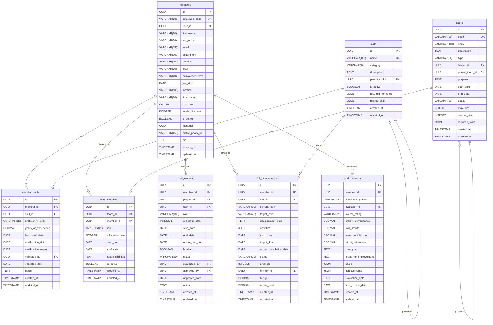

# データベース設計: タレント最適化サービス

## 設計概要
**データベース**: SQLite (開発環境) / PostgreSQL (本番環境想定)
**文字エンコーディング**: UTF-8
**タイムゾーン**: UTC

## 論理設計

### ER図



## 物理設計

### テーブル作成SQL

#### membersテーブル
```sql
CREATE TABLE members (
    id UUID PRIMARY KEY DEFAULT gen_random_uuid(),
    employee_code VARCHAR(20) NOT NULL UNIQUE,
    user_id UUID NOT NULL UNIQUE,
    first_name VARCHAR(50) NOT NULL,
    last_name VARCHAR(50) NOT NULL,
    email VARCHAR(255) NOT NULL UNIQUE,
    department VARCHAR(100) NOT NULL,
    position VARCHAR(100) NOT NULL,
    level VARCHAR(20) NOT NULL CHECK (level IN ('Junior', 'Middle', 'Senior', 'Expert', 'Principal')),
    employment_type VARCHAR(20) NOT NULL CHECK (employment_type IN ('FullTime', 'PartTime', 'Contract', 'Intern')),
    join_date DATE NOT NULL,
    location VARCHAR(100) NOT NULL,
    time_zone VARCHAR(50) NOT NULL,
    cost_rate DECIMAL(10, 2) NOT NULL,
    availability_rate INTEGER NOT NULL CHECK (availability_rate BETWEEN 0 AND 100),
    is_active BOOLEAN NOT NULL DEFAULT TRUE,
    manager UUID REFERENCES members(id) ON DELETE SET NULL,
    profile_photo_url VARCHAR(255),
    bio TEXT,
    created_at TIMESTAMP NOT NULL DEFAULT NOW(),
    updated_at TIMESTAMP NOT NULL DEFAULT NOW(),
    CONSTRAINT check_member_cost_rate CHECK (cost_rate > 0),
    CONSTRAINT check_member_manager CHECK (id != manager)
);

-- インデックス
CREATE INDEX idx_members_employee_code ON members(employee_code);
CREATE INDEX idx_members_user_id ON members(user_id);
CREATE INDEX idx_members_email ON members(email);
CREATE INDEX idx_members_department ON members(department);
CREATE INDEX idx_members_level ON members(level);
CREATE INDEX idx_members_is_active ON members(is_active);
CREATE INDEX idx_members_manager ON members(manager);
```

#### skillsテーブル
```sql
CREATE TABLE skills (
    id UUID PRIMARY KEY DEFAULT gen_random_uuid(),
    name VARCHAR(100) NOT NULL UNIQUE,
    category VARCHAR(20) NOT NULL CHECK (category IN ('Technical', 'Business', 'Soft', 'Language', 'Certification')),
    description TEXT,
    parent_skill_id UUID REFERENCES skills(id) ON DELETE SET NULL,
    is_active BOOLEAN NOT NULL DEFAULT TRUE,
    required_for_roles JSON,
    related_skills JSON,
    created_at TIMESTAMP NOT NULL DEFAULT NOW(),
    updated_at TIMESTAMP NOT NULL DEFAULT NOW(),
    CONSTRAINT check_skill_no_self_parent CHECK (id != parent_skill_id)
);

-- インデックス
CREATE INDEX idx_skills_name ON skills(name);
CREATE INDEX idx_skills_category ON skills(category);
CREATE INDEX idx_skills_parent ON skills(parent_skill_id);
CREATE INDEX idx_skills_is_active ON skills(is_active);
```

#### member_skillsテーブル
```sql
CREATE TABLE member_skills (
    id UUID PRIMARY KEY DEFAULT gen_random_uuid(),
    member_id UUID NOT NULL REFERENCES members(id) ON DELETE CASCADE,
    skill_id UUID NOT NULL REFERENCES skills(id) ON DELETE CASCADE,
    proficiency_level VARCHAR(20) NOT NULL CHECK (proficiency_level IN ('Beginner', 'Intermediate', 'Advanced', 'Expert')),
    years_of_experience DECIMAL(4, 1) NOT NULL,
    last_used_date DATE,
    certification_date DATE,
    certification_expiry DATE,
    validated_by UUID REFERENCES members(id) ON DELETE SET NULL,
    validated_date DATE,
    notes TEXT,
    created_at TIMESTAMP NOT NULL DEFAULT NOW(),
    updated_at TIMESTAMP NOT NULL DEFAULT NOW(),
    CONSTRAINT unique_member_skill UNIQUE (member_id, skill_id),
    CONSTRAINT check_ms_years CHECK (years_of_experience >= 0),
    CONSTRAINT check_ms_cert_dates CHECK (certification_date IS NULL OR certification_expiry IS NULL OR certification_date <= certification_expiry)
);

-- インデックス
CREATE INDEX idx_member_skills_member ON member_skills(member_id);
CREATE INDEX idx_member_skills_skill ON member_skills(skill_id);
CREATE INDEX idx_member_skills_proficiency ON member_skills(proficiency_level);
CREATE INDEX idx_member_skills_validated ON member_skills(validated_by);
```

#### teamsテーブル
```sql
CREATE TABLE teams (
    id UUID PRIMARY KEY DEFAULT gen_random_uuid(),
    code VARCHAR(20) NOT NULL UNIQUE,
    name VARCHAR(100) NOT NULL,
    description TEXT,
    type VARCHAR(20) NOT NULL CHECK (type IN ('Project', 'Department', 'Virtual', 'Temporary')),
    leader_id UUID NOT NULL REFERENCES members(id) ON DELETE RESTRICT,
    parent_team_id UUID REFERENCES teams(id) ON DELETE SET NULL,
    purpose TEXT NOT NULL,
    start_date DATE NOT NULL,
    end_date DATE,
    status VARCHAR(20) NOT NULL CHECK (status IN ('Forming', 'Active', 'OnHold', 'Disbanded')),
    max_size INTEGER,
    current_size INTEGER NOT NULL DEFAULT 0,
    required_skills JSON,
    created_at TIMESTAMP NOT NULL DEFAULT NOW(),
    updated_at TIMESTAMP NOT NULL DEFAULT NOW(),
    CONSTRAINT check_team_dates CHECK (end_date IS NULL OR end_date >= start_date),
    CONSTRAINT check_team_size CHECK (max_size IS NULL OR current_size <= max_size),
    CONSTRAINT check_team_no_self_parent CHECK (id != parent_team_id)
);

-- インデックス
CREATE INDEX idx_teams_code ON teams(code);
CREATE INDEX idx_teams_type ON teams(type);
CREATE INDEX idx_teams_leader ON teams(leader_id);
CREATE INDEX idx_teams_parent ON teams(parent_team_id);
CREATE INDEX idx_teams_status ON teams(status);
CREATE INDEX idx_teams_dates ON teams(start_date, end_date);
```

#### team_membersテーブル
```sql
CREATE TABLE team_members (
    id UUID PRIMARY KEY DEFAULT gen_random_uuid(),
    team_id UUID NOT NULL REFERENCES teams(id) ON DELETE CASCADE,
    member_id UUID NOT NULL REFERENCES members(id) ON DELETE CASCADE,
    role VARCHAR(20) NOT NULL CHECK (role IN ('Leader', 'CoreMember', 'SupportMember', 'Advisor')),
    allocation_rate INTEGER NOT NULL CHECK (allocation_rate BETWEEN 0 AND 100),
    start_date DATE NOT NULL,
    end_date DATE,
    responsibilities TEXT,
    is_active BOOLEAN NOT NULL DEFAULT TRUE,
    created_at TIMESTAMP NOT NULL DEFAULT NOW(),
    updated_at TIMESTAMP NOT NULL DEFAULT NOW(),
    CONSTRAINT check_tm_dates CHECK (end_date IS NULL OR end_date >= start_date),
    CONSTRAINT unique_active_team_member UNIQUE (team_id, member_id, is_active)
);

-- インデックス
CREATE INDEX idx_team_members_team ON team_members(team_id);
CREATE INDEX idx_team_members_member ON team_members(member_id);
CREATE INDEX idx_team_members_role ON team_members(role);
CREATE INDEX idx_team_members_is_active ON team_members(is_active);
```

#### assignmentsテーブル
```sql
CREATE TABLE assignments (
    id UUID PRIMARY KEY DEFAULT gen_random_uuid(),
    member_id UUID NOT NULL REFERENCES members(id) ON DELETE CASCADE,
    project_id UUID NOT NULL,
    task_id UUID,
    role VARCHAR(100) NOT NULL,
    allocation_rate INTEGER NOT NULL CHECK (allocation_rate BETWEEN 0 AND 100),
    start_date DATE NOT NULL,
    end_date DATE NOT NULL,
    actual_end_date DATE,
    billable BOOLEAN NOT NULL DEFAULT TRUE,
    status VARCHAR(20) NOT NULL CHECK (status IN ('Planned', 'Active', 'OnHold', 'Completed')),
    requested_by UUID NOT NULL,
    approved_by UUID,
    approved_date DATE,
    notes TEXT,
    created_at TIMESTAMP NOT NULL DEFAULT NOW(),
    updated_at TIMESTAMP NOT NULL DEFAULT NOW(),
    CONSTRAINT check_assignment_dates CHECK (start_date <= end_date),
    CONSTRAINT check_assignment_actual CHECK (actual_end_date IS NULL OR actual_end_date >= start_date),
    CONSTRAINT check_assignment_approval CHECK (
        (status = 'Active' AND approved_by IS NOT NULL AND approved_date IS NOT NULL) OR
        (status != 'Active')
    )
);

-- インデックス
CREATE INDEX idx_assignments_member ON assignments(member_id);
CREATE INDEX idx_assignments_project ON assignments(project_id);
CREATE INDEX idx_assignments_task ON assignments(task_id);
CREATE INDEX idx_assignments_status ON assignments(status);
CREATE INDEX idx_assignments_dates ON assignments(start_date, end_date);
CREATE INDEX idx_assignments_approved_by ON assignments(approved_by);
```

#### skill_developmentsテーブル
```sql
CREATE TABLE skill_developments (
    id UUID PRIMARY KEY DEFAULT gen_random_uuid(),
    member_id UUID NOT NULL REFERENCES members(id) ON DELETE CASCADE,
    skill_id UUID NOT NULL REFERENCES skills(id) ON DELETE RESTRICT,
    current_level VARCHAR(20) NOT NULL CHECK (current_level IN ('Beginner', 'Intermediate', 'Advanced', 'Expert')),
    target_level VARCHAR(20) NOT NULL CHECK (target_level IN ('Beginner', 'Intermediate', 'Advanced', 'Expert')),
    development_plan TEXT NOT NULL,
    activities JSON,
    start_date DATE NOT NULL,
    target_date DATE NOT NULL,
    actual_completion_date DATE,
    status VARCHAR(20) NOT NULL CHECK (status IN ('Planning', 'InProgress', 'Completed', 'Cancelled')),
    progress INTEGER NOT NULL DEFAULT 0 CHECK (progress BETWEEN 0 AND 100),
    mentor_id UUID REFERENCES members(id) ON DELETE SET NULL,
    budget DECIMAL(10, 2),
    actual_cost DECIMAL(10, 2),
    created_at TIMESTAMP NOT NULL DEFAULT NOW(),
    updated_at TIMESTAMP NOT NULL DEFAULT NOW(),
    CONSTRAINT check_sd_dates CHECK (start_date <= target_date),
    CONSTRAINT check_sd_actual CHECK (actual_completion_date IS NULL OR actual_completion_date >= start_date),
    CONSTRAINT check_sd_budget CHECK (budget IS NULL OR budget > 0),
    CONSTRAINT check_sd_cost CHECK (actual_cost IS NULL OR actual_cost >= 0)
);

-- インデックス
CREATE INDEX idx_skill_dev_member ON skill_developments(member_id);
CREATE INDEX idx_skill_dev_skill ON skill_developments(skill_id);
CREATE INDEX idx_skill_dev_status ON skill_developments(status);
CREATE INDEX idx_skill_dev_mentor ON skill_developments(mentor_id);
CREATE INDEX idx_skill_dev_dates ON skill_developments(start_date, target_date);
```

#### performancesテーブル
```sql
CREATE TABLE performances (
    id UUID PRIMARY KEY DEFAULT gen_random_uuid(),
    member_id UUID NOT NULL REFERENCES members(id) ON DELETE CASCADE,
    evaluation_period VARCHAR(20) NOT NULL,
    evaluator_id UUID NOT NULL REFERENCES members(id) ON DELETE RESTRICT,
    overall_rating VARCHAR(20) NOT NULL CHECK (overall_rating IN ('Outstanding', 'Exceeds', 'Meets', 'NeedsImprovement')),
    project_performance DECIMAL(3, 1) NOT NULL CHECK (project_performance BETWEEN 1 AND 5),
    skill_growth DECIMAL(3, 1) NOT NULL CHECK (skill_growth BETWEEN 1 AND 5),
    team_contribution DECIMAL(3, 1) NOT NULL CHECK (team_contribution BETWEEN 1 AND 5),
    client_satisfaction DECIMAL(3, 1) CHECK (client_satisfaction IS NULL OR client_satisfaction BETWEEN 1 AND 5),
    strengths TEXT,
    areas_for_improvement TEXT,
    goals JSON,
    achievements JSON,
    evaluation_date DATE NOT NULL,
    next_review_date DATE,
    created_at TIMESTAMP NOT NULL DEFAULT NOW(),
    updated_at TIMESTAMP NOT NULL DEFAULT NOW(),
    CONSTRAINT unique_member_period UNIQUE (member_id, evaluation_period),
    CONSTRAINT check_perf_evaluator CHECK (member_id != evaluator_id),
    CONSTRAINT check_perf_next_review CHECK (next_review_date IS NULL OR next_review_date > evaluation_date)
);

-- インデックス
CREATE INDEX idx_performances_member ON performances(member_id);
CREATE INDEX idx_performances_evaluator ON performances(evaluator_id);
CREATE INDEX idx_performances_period ON performances(evaluation_period);
CREATE INDEX idx_performances_rating ON performances(overall_rating);
CREATE INDEX idx_performances_eval_date ON performances(evaluation_date);
```

## パフォーマンス設計

### インデックス戦略

#### 主要検索パターン
1. **メンバー検索**: department, level, is_activeによる検索
2. **スキル保有者検索**: skill_id, proficiency_levelによる検索
3. **チーム検索**: leader_id, statusによる検索
4. **アサインメント検索**: member_id, project_id, statusによる検索
5. **稼働率計算**: member_id, start_date, end_dateによる範囲検索

#### 複合インデックス
```sql
-- メンバーの部署とレベルでの検索
CREATE INDEX idx_members_dept_level ON members(department, level);

-- アクティブスキル保有者の検索
CREATE INDEX idx_member_skills_active ON member_skills(skill_id, proficiency_level) WHERE member_id IN (SELECT id FROM members WHERE is_active = TRUE);

-- アクティブアサインメントの稼働率計算
CREATE INDEX idx_assignments_active ON assignments(member_id, start_date, end_date) WHERE status = 'Active';
```

### クエリ最適化

#### よく使用されるクエリ例

1. **メンバーのスキルプロファイル取得**
```sql
SELECT m.id, m.first_name, m.last_name, m.department,
       s.name as skill_name, ms.proficiency_level, ms.years_of_experience
FROM members m
INNER JOIN member_skills ms ON m.id = ms.member_id
INNER JOIN skills s ON ms.skill_id = s.id
WHERE m.is_active = TRUE
  AND s.is_active = TRUE
ORDER BY m.last_name, s.category;
```

2. **チームの構成とスキルカバレッジ**
```sql
SELECT t.name as team_name,
       COUNT(DISTINCT tm.member_id) as member_count,
       COUNT(DISTINCT ms.skill_id) as skill_count,
       AVG(tm.allocation_rate) as avg_allocation
FROM teams t
INNER JOIN team_members tm ON t.id = tm.team_id
LEFT JOIN member_skills ms ON tm.member_id = ms.member_id
WHERE t.status = 'Active' AND tm.is_active = TRUE
GROUP BY t.id, t.name;
```

3. **メンバーの稼働率計算**
```sql
SELECT m.id, m.first_name, m.last_name,
       SUM(a.allocation_rate) as total_allocation,
       COUNT(a.id) as assignment_count
FROM members m
LEFT JOIN assignments a ON m.id = a.member_id
WHERE m.is_active = TRUE
  AND a.status = 'Active'
  AND CURRENT_DATE BETWEEN a.start_date AND a.end_date
GROUP BY m.id, m.first_name, m.last_name
HAVING SUM(a.allocation_rate) > 100;
```

## セキュリティ設計

### アクセス制御
```sql
-- ロール定義（PostgreSQL想定）
CREATE ROLE talent_reader;
CREATE ROLE talent_writer;
CREATE ROLE talent_manager;
CREATE ROLE talent_admin;

-- 権限付与
GRANT SELECT ON ALL TABLES IN SCHEMA public TO talent_reader;
GRANT SELECT, INSERT, UPDATE ON members, member_skills, teams, team_members TO talent_writer;
GRANT SELECT, INSERT, UPDATE, DELETE ON assignments, skill_developments TO talent_manager;
GRANT ALL PRIVILEGES ON ALL TABLES IN SCHEMA public TO talent_admin;
```

### 行レベルセキュリティ（PostgreSQL想定）
```sql
-- メンバーは自分の情報のみアクセス可能
CREATE POLICY member_self_access ON members
    FOR SELECT
    USING (id = current_user_id() OR manager = current_user_id());

-- パフォーマンス評価は評価者と被評価者のみ
CREATE POLICY performance_access ON performances
    FOR SELECT
    USING (member_id = current_user_id() OR evaluator_id = current_user_id());
```

### データ暗号化
- **機密フィールド**: bio, notes, areas_for_improvementは暗号化推奨
- **個人情報**: email, profile_photo_urlは厳密なアクセス制御
- **評価データ**: performances全体は高いセキュリティレベル

## 運用設計

### バックアップ戦略
- **フルバックアップ**: 日次（深夜2:00）
- **差分バックアップ**: 6時間毎
- **保管期間**: 90日（人事データのため長期保管）
- **リストアテスト**: 週次で実行

### 監視項目
- **接続数**: 最大接続数の80%以下を維持
- **クエリレスポンス時間**:
  - 単純検索: 50ms以下
  - スキル検索: 100ms以下
  - 稼働率計算: 200ms以下
- **テーブルサイズ**:
  - members: 10万件まで
  - member_skills: 50万件まで
  - assignments: 100万件まで
- **インデックス効率**: 週次でANALYZE実行

### メンテナンス

#### 定期メンテナンス（PostgreSQL）
```sql
-- 統計情報更新
ANALYZE members;
ANALYZE member_skills;
ANALYZE assignments;

-- バキューム実行
VACUUM ANALYZE members;

-- インデックス再構築
REINDEX TABLE member_skills;
```

#### データアーカイブ
```sql
-- 退職後1年経過したメンバーをアーカイブテーブルへ移動
INSERT INTO members_archive
SELECT * FROM members
WHERE is_active = FALSE
  AND updated_at < NOW() - INTERVAL '1 year';

-- 元テーブルから削除（CASCADE設定により関連データも削除）
DELETE FROM members
WHERE is_active = FALSE
  AND updated_at < NOW() - INTERVAL '1 year';
```

### データ整合性チェック

#### 定期チェッククエリ
```sql
-- メンバーの総アサイン率が100%を超えていないか
SELECT m.id, m.first_name, m.last_name,
       SUM(a.allocation_rate) as total_allocation
FROM members m
INNER JOIN assignments a ON m.id = a.member_id
WHERE a.status = 'Active'
  AND CURRENT_DATE BETWEEN a.start_date AND a.end_date
GROUP BY m.id, m.first_name, m.last_name
HAVING SUM(a.allocation_rate) > 100;

-- チームサイズが最大人数を超えていないか
SELECT t.id, t.name, t.current_size, t.max_size
FROM teams t
WHERE t.max_size IS NOT NULL
  AND t.current_size > t.max_size;

-- 認定有効期限切れのスキル
SELECT ms.id, m.first_name, m.last_name, s.name,
       ms.certification_date, ms.certification_expiry
FROM member_skills ms
INNER JOIN members m ON ms.member_id = m.id
INNER JOIN skills s ON ms.skill_id = s.id
WHERE ms.certification_expiry IS NOT NULL
  AND ms.certification_expiry < CURRENT_DATE;
```

## 移行戦略

### 初期データ移行
```sql
-- レガシーシステムからのメンバーデータ移行例
INSERT INTO members (id, employee_code, user_id, first_name, last_name, email, department, position, level, employment_type, join_date, location, time_zone, cost_rate, availability_rate)
SELECT
    gen_random_uuid(),
    legacy_emp_code,
    map_user_id(legacy_user),
    legacy_first_name,
    legacy_last_name,
    legacy_email,
    legacy_dept,
    legacy_position,
    map_level(legacy_grade),
    'FullTime',
    legacy_join_date,
    'Tokyo',
    'Asia/Tokyo',
    calculate_cost_rate(legacy_grade),
    100
FROM legacy_employees
WHERE legacy_status = 'ACTIVE';
```

### データ検証
```sql
-- 移行後の件数チェック
SELECT
    (SELECT COUNT(*) FROM legacy_employees WHERE legacy_status = 'ACTIVE') as legacy_count,
    (SELECT COUNT(*) FROM members) as migrated_count;
```
