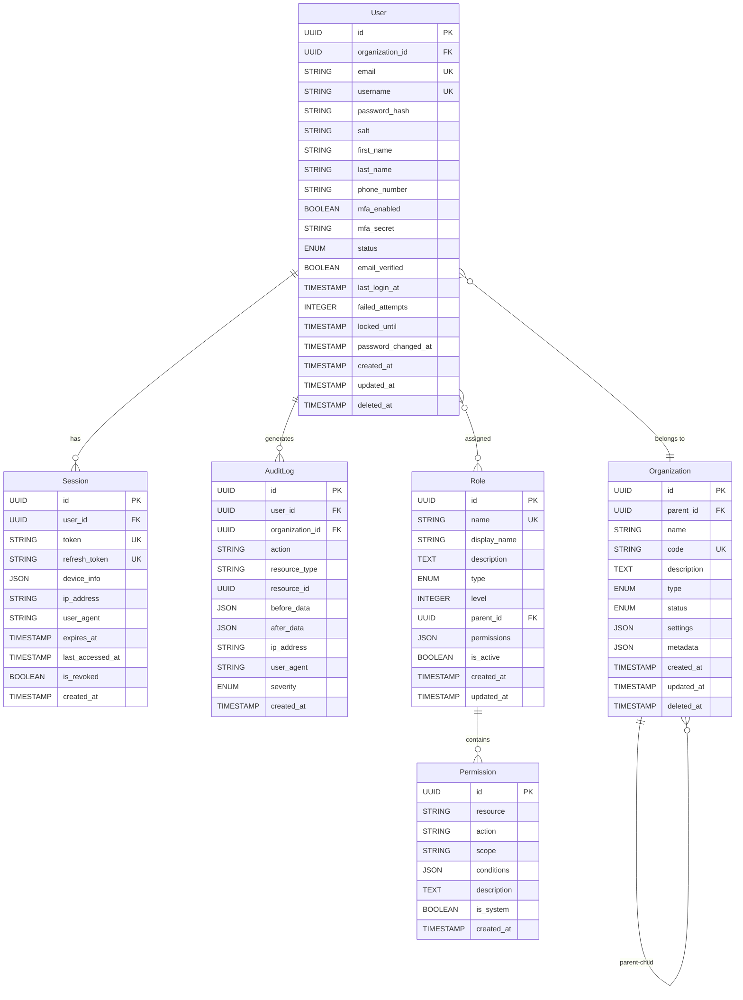
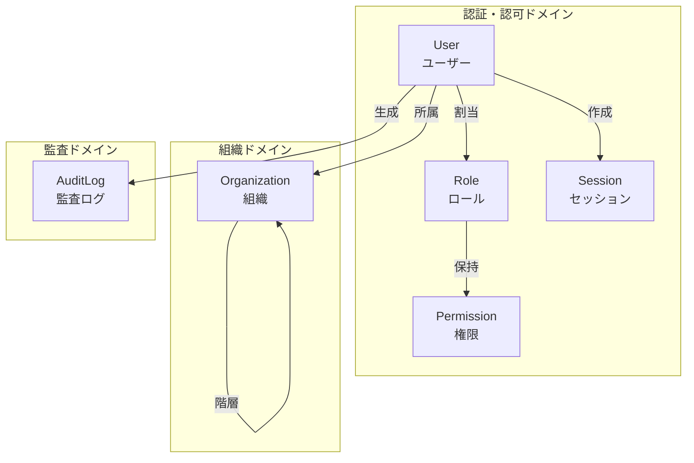

# データベース設計: {サービス名}

**バージョン**: v1.0.0
**更新日**: YYYY-MM-DD
**作成者**: {作成者名}

## 設計概要

**目的**: {このデータベースが管理するドメインとビジネス価値}

**DBMS**: SQLite / PostgreSQL / MySQL

**文字エンコーディング**: UTF-8

**タイムゾーン**: UTC

**命名規則**:
- テーブル名: スネークケース、複数形（例: `users`, `project_members`）
- カラム名: スネークケース、単数形（例: `user_id`, `created_at`）
- インデックス名: `idx_{table}_{column}` または `idx_{table}_{column1}_{column2}`
- 外部キー名: `fk_{table}_{ref_table}`

## 論理設計

### ER図



### エンティティ関連図（概念レベル）



## 物理設計

### テーブル定義

---

#### Userテーブル

**テーブル名**: `users`

**目的**: システム利用者の認証情報とプロフィールを管理

**主要な用途**:
- ユーザー認証（ログイン）
- プロフィール管理
- アクセス制御の基礎

| カラム名 | データ型 | NULL | デフォルト | 制約 | 説明 |
|---------|---------|------|-----------|------|------|
| id | UUID | NOT NULL | uuid() | PK | ユーザーID（主キー） |
| organization_id | UUID | NOT NULL | - | FK → organizations.id | 所属組織ID |
| email | VARCHAR(255) | NOT NULL | - | UNIQUE | メールアドレス（ユニーク） |
| username | VARCHAR(50) | NOT NULL | - | UNIQUE | ユーザー名（ユニーク） |
| password_hash | VARCHAR(255) | NOT NULL | - | - | パスワードハッシュ（bcrypt） |
| salt | VARCHAR(32) | NOT NULL | - | - | ソルト値 |
| first_name | VARCHAR(100) | NOT NULL | - | - | 名 |
| last_name | VARCHAR(100) | NOT NULL | - | - | 姓 |
| phone_number | VARCHAR(20) | NULL | - | - | 電話番号 |
| mfa_enabled | BOOLEAN | NOT NULL | false | - | MFA有効フラグ |
| mfa_secret | VARCHAR(255) | NULL | - | - | MFAシークレット（暗号化） |
| status | VARCHAR(20) | NOT NULL | 'active' | CHECK | ステータス（active/inactive/locked/suspended） |
| email_verified | BOOLEAN | NOT NULL | false | - | メール確認済みフラグ |
| last_login_at | TIMESTAMP | NULL | - | - | 最終ログイン日時 |
| failed_attempts | INTEGER | NOT NULL | 0 | CHECK ≥ 0 | ログイン失敗回数 |
| locked_until | TIMESTAMP | NULL | - | - | ロック解除日時 |
| password_changed_at | TIMESTAMP | NOT NULL | NOW() | - | パスワード最終変更日時 |
| created_at | TIMESTAMP | NOT NULL | NOW() | - | 作成日時 |
| updated_at | TIMESTAMP | NOT NULL | NOW() | - | 更新日時 |
| deleted_at | TIMESTAMP | NULL | - | - | 削除日時（論理削除） |

**インデックス**:
```sql
-- 主キー
PRIMARY KEY (id)

-- ユニークインデックス
UNIQUE INDEX uk_users_email (email) WHERE deleted_at IS NULL
UNIQUE INDEX uk_users_username (username) WHERE deleted_at IS NULL

-- 外部キー
INDEX idx_users_organization_id (organization_id)

-- 検索用
INDEX idx_users_status (status) WHERE deleted_at IS NULL
INDEX idx_users_email_verified (email_verified) WHERE deleted_at IS NULL

-- ロック管理用
INDEX idx_users_locked_until (locked_until) WHERE locked_until IS NOT NULL

-- 論理削除用
INDEX idx_users_deleted_at (deleted_at)
```

**制約**:
```sql
-- チェック制約
CHECK (status IN ('active', 'inactive', 'locked', 'suspended'))
CHECK (failed_attempts >= 0)
CHECK (email LIKE '%@%')
CHECK (length(username) >= 3)

-- 外部キー制約
FOREIGN KEY (organization_id) REFERENCES organizations(id) ON DELETE RESTRICT
```

**トリガー**:
```sql
-- 更新日時の自動更新
CREATE TRIGGER update_users_updated_at
BEFORE UPDATE ON users
FOR EACH ROW
EXECUTE FUNCTION update_updated_at_column();
```

---

#### Organizationテーブル

**テーブル名**: `organizations`

**目的**: 企業・部門・チームなどの組織階層を管理

| カラム名 | データ型 | NULL | デフォルト | 制約 | 説明 |
|---------|---------|------|-----------|------|------|
| id | UUID | NOT NULL | uuid() | PK | 組織ID（主キー） |
| parent_id | UUID | NULL | - | FK → organizations.id | 親組織ID（階層構造用） |
| name | VARCHAR(100) | NOT NULL | - | - | 組織名 |
| code | VARCHAR(50) | NOT NULL | - | UNIQUE | 組織コード（ユニーク） |
| description | TEXT | NULL | - | - | 説明 |
| type | VARCHAR(20) | NOT NULL | - | CHECK | 組織タイプ（company/department/team） |
| status | VARCHAR(20) | NOT NULL | 'active' | CHECK | ステータス（active/inactive） |
| settings | JSON | NOT NULL | '{}' | - | 組織設定（JSON） |
| metadata | JSON | NULL | - | - | メタデータ（JSON） |
| created_at | TIMESTAMP | NOT NULL | NOW() | - | 作成日時 |
| updated_at | TIMESTAMP | NOT NULL | NOW() | - | 更新日時 |
| deleted_at | TIMESTAMP | NULL | - | - | 削除日時（論理削除） |

**インデックス**:
```sql
PRIMARY KEY (id)
UNIQUE INDEX uk_organizations_code (code) WHERE deleted_at IS NULL
INDEX idx_organizations_parent_id (parent_id)
INDEX idx_organizations_type (type)
INDEX idx_organizations_status (status)
```

**制約**:
```sql
CHECK (type IN ('company', 'department', 'team'))
CHECK (status IN ('active', 'inactive'))
FOREIGN KEY (parent_id) REFERENCES organizations(id) ON DELETE RESTRICT
```

---

#### Roleテーブル

**テーブル名**: `roles`

**目的**: ユーザーに割り当てる権限セットを管理

| カラム名 | データ型 | NULL | デフォルト | 制約 | 説明 |
|---------|---------|------|-----------|------|------|
| id | UUID | NOT NULL | uuid() | PK | ロールID（主キー） |
| name | VARCHAR(50) | NOT NULL | - | UNIQUE | ロール名（ユニーク） |
| display_name | VARCHAR(100) | NOT NULL | - | - | 表示名 |
| description | TEXT | NULL | - | - | 説明 |
| type | VARCHAR(20) | NOT NULL | - | CHECK | タイプ（system/custom） |
| level | INTEGER | NOT NULL | - | CHECK | 権限レベル（1-100） |
| parent_id | UUID | NULL | - | FK → roles.id | 親ロールID |
| permissions | JSON | NOT NULL | '[]' | - | 権限リスト（JSON配列） |
| is_active | BOOLEAN | NOT NULL | true | - | アクティブフラグ |
| created_at | TIMESTAMP | NOT NULL | NOW() | - | 作成日時 |
| updated_at | TIMESTAMP | NOT NULL | NOW() | - | 更新日時 |

**インデックス**:
```sql
PRIMARY KEY (id)
UNIQUE INDEX uk_roles_name (name)
INDEX idx_roles_type (type)
INDEX idx_roles_level (level)
INDEX idx_roles_parent_id (parent_id)
INDEX idx_roles_is_active (is_active)
```

**制約**:
```sql
CHECK (type IN ('system', 'custom'))
CHECK (level >= 1 AND level <= 100)
FOREIGN KEY (parent_id) REFERENCES roles(id) ON DELETE SET NULL
```

---

#### Permissionテーブル

**テーブル名**: `permissions`

**目的**: リソースへのアクセス権限を定義

| カラム名 | データ型 | NULL | デフォルト | 制約 | 説明 |
|---------|---------|------|-----------|------|------|
| id | UUID | NOT NULL | uuid() | PK | 権限ID（主キー） |
| resource | VARCHAR(100) | NOT NULL | - | - | リソース名 |
| action | VARCHAR(50) | NOT NULL | - | CHECK | アクション（create/read/update/delete/execute） |
| scope | VARCHAR(100) | NULL | - | CHECK | スコープ（own/team/organization/all） |
| conditions | JSON | NULL | - | - | 条件式（JSON） |
| description | TEXT | NULL | - | - | 説明 |
| is_system | BOOLEAN | NOT NULL | false | - | システム権限フラグ |
| created_at | TIMESTAMP | NOT NULL | NOW() | - | 作成日時 |

**インデックス**:
```sql
PRIMARY KEY (id)
UNIQUE INDEX uk_permissions_resource_action (resource, action, scope)
INDEX idx_permissions_resource (resource)
INDEX idx_permissions_is_system (is_system)
```

**制約**:
```sql
CHECK (action IN ('create', 'read', 'update', 'delete', 'execute'))
CHECK (scope IN ('own', 'team', 'organization', 'all') OR scope IS NULL)
```

---

#### Sessionテーブル

**テーブル名**: `sessions`

**目的**: ユーザーのログインセッションを管理

| カラム名 | データ型 | NULL | デフォルト | 制約 | 説明 |
|---------|---------|------|-----------|------|------|
| id | UUID | NOT NULL | uuid() | PK | セッションID（主キー） |
| user_id | UUID | NOT NULL | - | FK → users.id | ユーザーID |
| token | VARCHAR(255) | NOT NULL | - | UNIQUE | セッショントークン（ユニーク） |
| refresh_token | VARCHAR(255) | NULL | - | UNIQUE | リフレッシュトークン（ユニーク） |
| device_info | JSON | NOT NULL | '{}' | - | デバイス情報（JSON） |
| ip_address | VARCHAR(45) | NOT NULL | - | - | IPアドレス（IPv4/IPv6） |
| user_agent | TEXT | NOT NULL | - | - | ユーザーエージェント |
| expires_at | TIMESTAMP | NOT NULL | - | - | 有効期限 |
| last_accessed_at | TIMESTAMP | NOT NULL | NOW() | - | 最終アクセス日時 |
| is_revoked | BOOLEAN | NOT NULL | false | - | 無効化フラグ |
| created_at | TIMESTAMP | NOT NULL | NOW() | - | 作成日時 |

**インデックス**:
```sql
PRIMARY KEY (id)
UNIQUE INDEX uk_sessions_token (token)
UNIQUE INDEX uk_sessions_refresh_token (refresh_token) WHERE refresh_token IS NOT NULL
INDEX idx_sessions_user_id (user_id)
INDEX idx_sessions_expires_at (expires_at)
INDEX idx_sessions_is_revoked (is_revoked)
```

**制約**:
```sql
FOREIGN KEY (user_id) REFERENCES users(id) ON DELETE CASCADE
CHECK (expires_at > created_at)
```

---

#### AuditLogテーブル

**テーブル名**: `audit_logs`

**目的**: システム上の全ての重要な操作を記録

| カラム名 | データ型 | NULL | デフォルト | 制約 | 説明 |
|---------|---------|------|-----------|------|------|
| id | UUID | NOT NULL | uuid() | PK | 監査ログID（主キー） |
| user_id | UUID | NULL | - | FK → users.id | ユーザーID（NULL可：システム操作） |
| organization_id | UUID | NULL | - | FK → organizations.id | 組織ID |
| action | VARCHAR(100) | NOT NULL | - | - | アクション（例: USER_LOGIN, USER_CREATED） |
| resource_type | VARCHAR(100) | NOT NULL | - | - | リソースタイプ（例: User, Role） |
| resource_id | UUID | NULL | - | - | リソースID |
| before_data | JSON | NULL | - | - | 変更前データ（JSON） |
| after_data | JSON | NULL | - | - | 変更後データ（JSON） |
| ip_address | VARCHAR(45) | NOT NULL | - | - | IPアドレス |
| user_agent | TEXT | NULL | - | - | ユーザーエージェント |
| severity | VARCHAR(20) | NOT NULL | 'info' | CHECK | 重要度（debug/info/warning/error/critical） |
| created_at | TIMESTAMP | NOT NULL | NOW() | - | 作成日時 |

**インデックス**:
```sql
PRIMARY KEY (id)
INDEX idx_audit_logs_user_id (user_id)
INDEX idx_audit_logs_organization_id (organization_id)
INDEX idx_audit_logs_action (action)
INDEX idx_audit_logs_resource (resource_type, resource_id)
INDEX idx_audit_logs_created_at (created_at)
INDEX idx_audit_logs_severity (severity)
```

**制約**:
```sql
FOREIGN KEY (user_id) REFERENCES users(id) ON DELETE SET NULL
FOREIGN KEY (organization_id) REFERENCES organizations(id) ON DELETE SET NULL
CHECK (severity IN ('debug', 'info', 'warning', 'error', 'critical'))
```

---

### 中間テーブル

#### UserRoleテーブル

**テーブル名**: `user_roles`

**目的**: ユーザーとロールの多対多関係を管理

| カラム名 | データ型 | NULL | デフォルト | 制約 | 説明 |
|---------|---------|------|-----------|------|------|
| user_id | UUID | NOT NULL | - | FK → users.id | ユーザーID |
| role_id | UUID | NOT NULL | - | FK → roles.id | ロールID |
| assigned_by | UUID | NULL | - | FK → users.id | 割当実行者ID |
| assigned_at | TIMESTAMP | NOT NULL | NOW() | - | 割当日時 |

**インデックス**:
```sql
PRIMARY KEY (user_id, role_id)
INDEX idx_user_roles_role_id (role_id)
INDEX idx_user_roles_assigned_by (assigned_by)
```

**制約**:
```sql
FOREIGN KEY (user_id) REFERENCES users(id) ON DELETE CASCADE
FOREIGN KEY (role_id) REFERENCES roles(id) ON DELETE CASCADE
FOREIGN KEY (assigned_by) REFERENCES users(id) ON DELETE SET NULL
```

---

## インデックス戦略

### 基本方針
1. **主キー**: 全テーブルにUUID型の主キーを設定
2. **外部キー**: 全ての外部キーにインデックスを作成
3. **ユニーク制約**: ビジネス上一意であるべき値にユニークインデックス
4. **検索頻度**: よく検索されるカラムにインデックス
5. **複合インデックス**: 複数カラムでの検索が多い場合に作成

### パフォーマンス考慮
- **カーディナリティ**: 選択性の高いカラムを優先
- **複合インデックス**: 最も選択性の高いカラムを先頭に
- **部分インデックス**: WHERE句付きインデックスで容量削減
- **カバリングインデックス**: SELECT対象カラムを含めてテーブルアクセスを削減

### インデックスメンテナンス
```sql
-- インデックスの再構築（PostgreSQL）
REINDEX TABLE users;

-- インデックス使用状況の確認
SELECT schemaname, tablename, indexname, idx_scan
FROM pg_stat_user_indexes
ORDER BY idx_scan ASC;

-- 未使用インデックスの削除検討
SELECT schemaname, tablename, indexname
FROM pg_stat_user_indexes
WHERE idx_scan = 0 AND indexrelname NOT LIKE '%_pkey';
```

## パフォーマンス設計

### よく使用されるクエリの最適化

#### 1. ユーザー認証クエリ
```sql
-- メールアドレスでユーザーを検索（ログイン）
EXPLAIN ANALYZE
SELECT id, password_hash, salt, status, mfa_enabled, organization_id
FROM users
WHERE email = 'user@example.com'
  AND deleted_at IS NULL;

-- インデックス: uk_users_email
-- 期待: Index Scan, 実行時間 < 5ms
```

#### 2. ロール・権限の取得
```sql
-- ユーザーのロールと権限を取得
EXPLAIN ANALYZE
SELECT r.id, r.name, r.permissions
FROM roles r
INNER JOIN user_roles ur ON r.id = ur.role_id
WHERE ur.user_id = 'uuid-here'
  AND r.is_active = true;

-- インデックス: idx_user_roles_user_id, idx_roles_is_active
-- 期待: Index Scan + Nested Loop, 実行時間 < 10ms
```

#### 3. 組織階層の取得
```sql
-- 組織の階層構造を取得（再帰CTE）
WITH RECURSIVE org_hierarchy AS (
  SELECT id, parent_id, name, code, type, 1 as level
  FROM organizations
  WHERE id = 'root-org-uuid'

  UNION ALL

  SELECT o.id, o.parent_id, o.name, o.code, o.type, oh.level + 1
  FROM organizations o
  INNER JOIN org_hierarchy oh ON o.parent_id = oh.id
  WHERE o.deleted_at IS NULL
)
SELECT * FROM org_hierarchy
ORDER BY level, name;

-- インデックス: idx_organizations_parent_id
-- 期待: 実行時間 < 50ms（深さ5階層、100組織）
```

#### 4. 監査ログの検索
```sql
-- 特定期間・ユーザー・アクションで監査ログを検索
EXPLAIN ANALYZE
SELECT action, resource_type, resource_id, created_at
FROM audit_logs
WHERE user_id = 'uuid-here'
  AND created_at >= NOW() - INTERVAL '30 days'
  AND severity IN ('warning', 'error', 'critical')
ORDER BY created_at DESC
LIMIT 100;

-- インデックス: idx_audit_logs_user_id, idx_audit_logs_created_at
-- 期待: Index Scan, 実行時間 < 100ms
```

### パーティショニング戦略

#### 監査ログのパーティション（月次）
```sql
-- PostgreSQLのパーティション例
CREATE TABLE audit_logs (
    id UUID NOT NULL,
    user_id UUID,
    action VARCHAR(100) NOT NULL,
    created_at TIMESTAMP NOT NULL,
    -- その他のカラム...
    PRIMARY KEY (id, created_at)
) PARTITION BY RANGE (created_at);

-- 月次パーティションの作成
CREATE TABLE audit_logs_2024_01 PARTITION OF audit_logs
FOR VALUES FROM ('2024-01-01') TO ('2024-02-01');

CREATE TABLE audit_logs_2024_02 PARTITION OF audit_logs
FOR VALUES FROM ('2024-02-01') TO ('2024-03-01');

-- 自動パーティション作成（pg_partman拡張を使用）
```

### キャッシュ戦略
- **頻繁にアクセスされるデータ**: Redisでキャッシュ
  - ユーザーのロール・権限（TTL: 5分）
  - 組織情報（TTL: 10分）
  - セッション情報（TTL: セッション有効期限）

## セキュリティ設計

### データ暗号化

#### 保存時の暗号化
- **機密データ**: `password_hash`, `mfa_secret`, `salt`
- **暗号化方式**: AES-256-GCM
- **キー管理**: 環境変数またはKMS（Key Management Service）

#### 通信時の暗号化
- **SSL/TLS**: データベース接続は必ずSSL/TLS使用
- **証明書検証**: 本番環境では証明書検証を有効化

### アクセス制御

#### ロールベースアクセス制御（RBAC）
```sql
-- アプリケーション用ロールの作成
CREATE ROLE app_readonly;
CREATE ROLE app_readwrite;
CREATE ROLE app_admin;

-- 読み取り専用権限
GRANT SELECT ON ALL TABLES IN SCHEMA public TO app_readonly;

-- 読み書き権限
GRANT SELECT, INSERT, UPDATE ON ALL TABLES IN SCHEMA public TO app_readwrite;
GRANT USAGE, SELECT ON ALL SEQUENCES IN SCHEMA public TO app_readwrite;

-- 管理者権限
GRANT ALL PRIVILEGES ON ALL TABLES IN SCHEMA public TO app_admin;
GRANT ALL PRIVILEGES ON ALL SEQUENCES IN SCHEMA public TO app_admin;
```

#### 行レベルセキュリティ（RLS）
```sql
-- 組織レベルのデータ分離
ALTER TABLE users ENABLE ROW LEVEL SECURITY;

CREATE POLICY user_organization_policy ON users
FOR ALL
USING (organization_id = current_setting('app.current_organization_id')::UUID);

-- セッション変数の設定
SET app.current_organization_id = 'org-uuid-here';
```

### SQLインジェクション対策
- **プリペアドステートメント**: 必ずプリペアドステートメントを使用
- **パラメータバインディング**: 動的SQLは避け、パラメータバインディングを使用
- **入力値検証**: アプリケーション層でも入力値を検証

### 監査とコンプライアンス
- **全操作のログ記録**: 重要な操作は必ず`audit_logs`に記録
- **ログの不変性**: 監査ログは更新・削除不可（INSERT ONLYテーブル）
- **保管期間**: 最低1年間保管（法的要件に応じて調整）

## 運用設計

### バックアップ戦略

#### バックアップ頻度
- **フルバックアップ**: 日次（深夜2:00実行）
- **差分バックアップ**: 4時間毎
- **トランザクションログ**: 継続的（WAL archiving）

#### 保管期間
- **日次バックアップ**: 30日間
- **週次バックアップ**: 3ヶ月間
- **月次バックアップ**: 1年間

#### バックアップスクリプト（PostgreSQL）
```bash
#!/bin/bash
# フルバックアップスクリプト
BACKUP_DIR="/var/backups/postgres"
DATE=$(date +%Y%m%d_%H%M%S)
DB_NAME="secure_access_service"

pg_dump -U postgres -F c -b -v -f "$BACKUP_DIR/${DB_NAME}_${DATE}.backup" $DB_NAME

# 古いバックアップの削除（30日以上前）
find $BACKUP_DIR -name "*.backup" -mtime +30 -delete
```

#### リストアテスト
- **頻度**: 月次
- **環境**: ステージング環境でリストア確認
- **検証**: データ整合性、アプリケーション動作確認

### 監視項目

#### データベースパフォーマンス
- **接続数**: 最大接続数の80%以下を維持
- **スロークエリ**: 1秒以上のクエリを検知
- **デッドロック**: デッドロック発生を監視
- **レプリケーション遅延**: 10秒以内を維持

#### リソース使用率
- **CPU使用率**: 80%以下
- **メモリ使用率**: 85%以下
- **ディスク使用率**: 80%以下
- **IOPS**: 上限の70%以下

#### 監視クエリ（PostgreSQL）
```sql
-- 実行中のクエリ
SELECT pid, usename, state, query, now() - query_start AS duration
FROM pg_stat_activity
WHERE state <> 'idle'
ORDER BY duration DESC;

-- テーブルサイズ
SELECT schemaname, tablename,
       pg_size_pretty(pg_total_relation_size(schemaname||'.'||tablename)) AS size
FROM pg_tables
WHERE schemaname = 'public'
ORDER BY pg_total_relation_size(schemaname||'.'||tablename) DESC;

-- インデックス肥大化
SELECT schemaname, tablename, indexname,
       pg_size_pretty(pg_relation_size(indexrelid)) AS index_size
FROM pg_stat_user_indexes
ORDER BY pg_relation_size(indexrelid) DESC;
```

### メンテナンス

#### 定期メンテナンス
```sql
-- VACUUMとANALYZE（PostgreSQL）
VACUUM ANALYZE users;
VACUUM ANALYZE organizations;
VACUUM ANALYZE audit_logs;

-- 統計情報の更新
ANALYZE;

-- インデックスの再構築
REINDEX DATABASE secure_access_service;
```

#### パーティション管理
```sql
-- 古いパーティションの削除（監査ログ）
DROP TABLE IF EXISTS audit_logs_2023_01;

-- 新しいパーティションの作成（次月分）
CREATE TABLE audit_logs_2024_03 PARTITION OF audit_logs
FOR VALUES FROM ('2024-03-01') TO ('2024-04-01');
```

## マイグレーション戦略

### 初回セットアップ
```sql
-- データベース作成
CREATE DATABASE secure_access_service
WITH ENCODING = 'UTF8'
     LC_COLLATE = 'en_US.UTF-8'
     LC_CTYPE = 'en_US.UTF-8'
     TEMPLATE = template0;

-- 拡張機能の有効化
CREATE EXTENSION IF NOT EXISTS "uuid-ossp";
CREATE EXTENSION IF NOT EXISTS "pgcrypto";

-- スキーマ作成
CREATE SCHEMA IF NOT EXISTS public;
```

### バージョン管理
- **ツール**: Prisma Migrate / Flyway / Liquibase
- **命名規則**: `V{version}_{description}.sql`（例: `V001_create_users_table.sql`）
- **ロールバック**: 各マイグレーションにダウンスクリプトを用意

### マイグレーション実行手順
1. ステージング環境でテスト
2. 本番環境でバックアップ実行
3. メンテナンスウィンドウでマイグレーション実行
4. 動作確認
5. 問題があればロールバック

## パフォーマンスチューニング

### PostgreSQL設定例
```ini
# postgresql.conf

# メモリ設定
shared_buffers = 4GB
effective_cache_size = 12GB
work_mem = 16MB
maintenance_work_mem = 512MB

# 接続設定
max_connections = 200

# ログ設定
log_min_duration_statement = 1000  # 1秒以上のクエリをログ
log_line_prefix = '%t [%p]: [%l-1] user=%u,db=%d,app=%a,client=%h '

# チェックポイント
checkpoint_completion_target = 0.9
wal_buffers = 16MB

# 統計情報
track_activities = on
track_counts = on
track_io_timing = on
```

## 変更履歴

| バージョン | 日付 | 変更内容 | 作成者 |
|-----------|------|---------|--------|
| v1.0.0 | 2024-01-01 | 初版作成 | 開発チーム |
