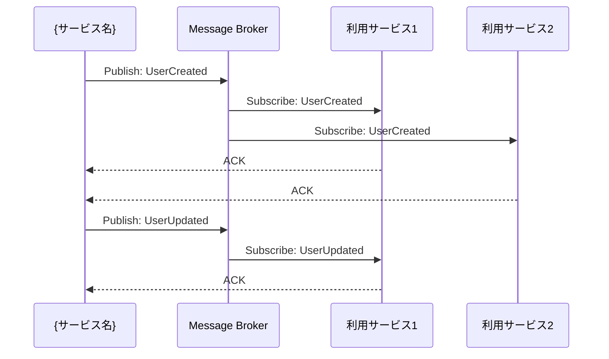
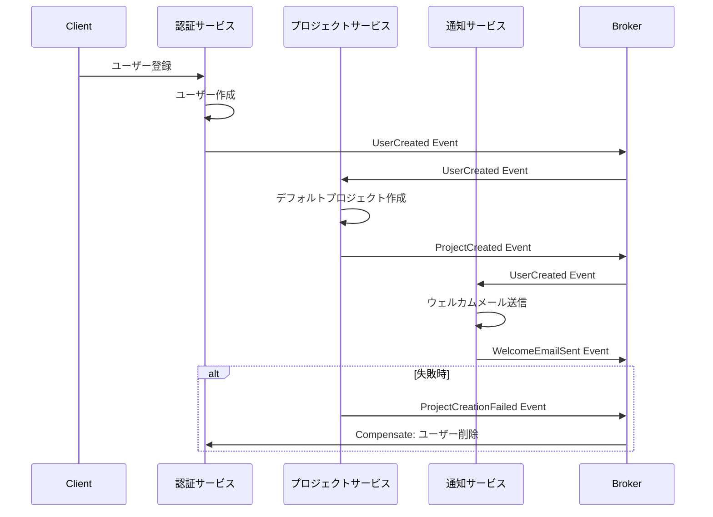

# 統合仕様: {サービス名}

**バージョン**: v1.0.0
**更新日**: YYYY-MM-DD
**作成者**: {作成者名}

## 統合概要

**目的**: {このサービスが他サービスとどのように連携するかを定義}

**統合パターン**:
- ✅ 同期API呼び出し（REST）
- ✅ 非同期メッセージング（イベント駆動）
- ✅ 共有データベース（参照のみ）
- ⬜ ファイル連携

**アーキテクチャスタイル**: マイクロサービス / モジュラーモノリス

## サービス依存関係

### 依存関係図

```mermaid
graph TB
    subgraph "このサービス"
        Service[{サービス名}]
    end

    subgraph "依存先サービス"
        Dep1[依存サービス1]
        Dep2[依存サービス2]
        Dep3[依存サービス3]
    end

    subgraph "依存元サービス"
        Consumer1[利用サービス1]
        Consumer2[利用サービス2]
    end

    Service -->|同期API| Dep1
    Service -->|イベント購読| Dep2
    Service -.->|DB参照| Dep3

    Consumer1 -->|同期API| Service
    Consumer2 -->|イベント購読| Service
```

### 依存先サービス一覧

#### 1. {依存サービス1}

**依存理由**: {なぜこのサービスに依存するか}

**依存タイプ**: 同期API呼び出し / イベント購読 / DB参照

**クリティカリティ**: 高 / 中 / 低

**フォールバック戦略**:
- サービス停止時の対応
- キャッシュ利用
- デフォルト値の使用

**SLA要件**:
- 可用性: 99.9%以上
- レスポンスタイム: 平均100ms以下

---

#### 2. {依存サービス2}

{同様の形式で他の依存サービスを記述}

---

### 依存元サービス一覧

#### 1. {利用サービス1}

**利用方法**: このサービスのどのAPIを呼び出すか

**提供するビジネス価値**: {このサービスが提供する価値}

**SLA保証**:
- 可用性: 99.9%以上
- レスポンスタイム: 平均200ms以下

---

## 同期API統合

### 他サービスへのAPI呼び出し

#### 呼び出し先: {依存サービス1}

##### エンドポイント1: GET /api/v1/resource/{id}

**目的**: {何のためにこのAPIを呼び出すか}

**呼び出しタイミング**: {いつ呼び出すか}

**頻度**: {呼び出し頻度}

**リクエスト例**:
```http
GET /api/v1/resource/{id}
Authorization: Bearer {service_token}
Accept: application/json
```

**レスポンス例**:
```json
{
  "success": true,
  "data": {
    "id": "uuid",
    "name": "string",
    "status": "active"
  }
}
```

**エラーハンドリング**:
| エラー | HTTPステータス | 対応 |
|--------|---------------|------|
| 認証エラー | 401 | サービストークンを更新 |
| リソース未存在 | 404 | デフォルト値を使用 |
| タイムアウト | 503 | リトライ（最大3回、指数バックオフ） |

**リトライ戦略**:
```
初回: 即座に実行
1回目リトライ: 1秒後
2回目リトライ: 2秒後
3回目リトライ: 4秒後
それでも失敗: フォールバック処理
```

**サーキットブレーカー設定**:
- 失敗閾値: 5回連続失敗
- タイムアウト: 10秒
- ハーフオープン状態への復帰: 30秒後

**キャッシュ戦略**:
- キャッシュ: ✅ 有効
- TTL: 5分
- キャッシュキー: `service1:resource:{id}`
- 無効化: リソース更新イベント受信時

---

##### エンドポイント2: POST /api/v1/resource

{同様の形式で他のエンドポイントを記述}

---

### 他サービスからのAPI呼び出し

#### 提供エンドポイント: GET /api/v1/users/{id}

**提供する機能**: ユーザー情報の取得

**呼び出し元サービス**:
- {利用サービス1}: 認証情報の確認
- {利用サービス2}: ユーザープロフィール表示

**認証方式**: JWT Bearer Token（サービス間認証）

**レート制限**:
- 通常: 1000リクエスト/分/サービス
- バースト: 最大2000リクエスト/分

**詳細**: `api-specification.md`を参照

---

## 非同期イベント統合

### イベント駆動アーキテクチャ概要

**メッセージブローカー**: RabbitMQ / Apache Kafka / AWS SNS/SQS

**イベント形式**: JSON

**配信保証**: At-least-once / Exactly-once

**順序保証**: パーティションキー単位で保証

### イベントフロー図



### 提供するドメインイベント

#### イベント1: UserCreated

**概要**: 新しいユーザーが作成された

**発生タイミング**: ユーザー登録が完了した時

**ペイロード**:
```json
{
  "eventId": "uuid",
  "eventType": "UserCreated",
  "eventVersion": "1.0",
  "occurredAt": "2024-01-01T00:00:00Z",
  "aggregateId": "user-uuid",
  "aggregateType": "User",
  "data": {
    "userId": "uuid",
    "email": "user@example.com",
    "username": "username",
    "organizationId": "org-uuid",
    "status": "active",
    "createdAt": "2024-01-01T00:00:00Z"
  },
  "metadata": {
    "causationId": "request-uuid",
    "correlationId": "trace-uuid",
    "userId": "admin-uuid"
  }
}
```

**スキーマバージョン**: v1.0

**互換性**: 後方互換性を維持（フィールド追加のみ）

**購読者**:
| サービス | 目的 | 処理内容 |
|---------|------|---------|
| プロジェクト成功支援サービス | メンバー追加 | プロジェクトメンバーとして追加可能に |
| 通知サービス | ウェルカムメール | ユーザーへウェルカムメールを送信 |
| 監査サービス | ログ記録 | ユーザー作成イベントを記録 |

**リトライポリシー**:
- 最大リトライ回数: 5回
- リトライ間隔: 指数バックオフ（1秒、2秒、4秒、8秒、16秒）
- デッドレターキュー: 5回失敗後にDLQへ移動

---

#### イベント2: UserUpdated

**概要**: ユーザー情報が更新された

**発生タイミング**: ユーザープロフィールまたはステータスが変更された時

**ペイロード**:
```json
{
  "eventId": "uuid",
  "eventType": "UserUpdated",
  "eventVersion": "1.0",
  "occurredAt": "2024-01-01T00:00:00Z",
  "aggregateId": "user-uuid",
  "aggregateType": "User",
  "data": {
    "userId": "uuid",
    "changes": {
      "email": {
        "old": "old@example.com",
        "new": "new@example.com"
      },
      "status": {
        "old": "active",
        "new": "inactive"
      }
    },
    "updatedBy": "admin-uuid",
    "updatedAt": "2024-01-01T00:00:00Z"
  }
}
```

**購読者**:
| サービス | 目的 | 処理内容 |
|---------|------|---------|
| プロジェクト成功支援サービス | メンバー情報同期 | プロジェクトメンバー情報を更新 |
| 通知サービス | 変更通知 | 管理者へ変更通知を送信 |

---

#### イベント3: UserDeleted

**概要**: ユーザーが削除（無効化）された

**発生タイミング**: ユーザーアカウントが論理削除された時

**ペイロード**:
```json
{
  "eventId": "uuid",
  "eventType": "UserDeleted",
  "eventVersion": "1.0",
  "occurredAt": "2024-01-01T00:00:00Z",
  "aggregateId": "user-uuid",
  "aggregateType": "User",
  "data": {
    "userId": "uuid",
    "deletedBy": "admin-uuid",
    "deletedAt": "2024-01-01T00:00:00Z",
    "reason": "アカウント閉鎖"
  }
}
```

**購読者**:
| サービス | 目的 | 処理内容 |
|---------|------|---------|
| プロジェクト成功支援サービス | メンバー削除 | プロジェクトからメンバーを除外 |
| セッションサービス | セッション無効化 | 全セッションを無効化 |
| 監査サービス | ログ記録 | ユーザー削除イベントを記録 |

---

### 購読するドメインイベント

#### イベント1: ProjectCreated（from プロジェクト成功支援サービス）

**概要**: 新しいプロジェクトが作成された

**購読理由**: プロジェクトメンバーのロールを自動付与

**処理内容**:
1. プロジェクトメンバーを取得
2. 各メンバーに適切なロール（PM、コンサルタント）を付与
3. 権限設定の完了を通知

**ペイロード例**:
```json
{
  "eventId": "uuid",
  "eventType": "ProjectCreated",
  "data": {
    "projectId": "uuid",
    "projectName": "プロジェクト名",
    "members": [
      {
        "userId": "uuid",
        "role": "pm"
      },
      {
        "userId": "uuid",
        "role": "member"
      }
    ]
  }
}
```

**エラーハンドリング**:
- ユーザーが存在しない: ログに記録、スキップ
- ロール付与失敗: リトライ（最大3回）
- 全失敗: 管理者へアラート

---

#### イベント2: OrganizationUpdated（from 組織管理サービス）

{同様の形式で他のイベントを記述}

---

## データ連携

### 共有データベースアクセス

#### 参照のみアクセス

**アクセス先**: {依存サービス}のデータベース

**アクセス理由**: {なぜ直接アクセスが必要か}

**アクセス方式**: 読み取り専用レプリカ

**アクセス制限**:
- 読み取りのみ許可（INSERT/UPDATE/DELETE禁止）
- 特定テーブルのみアクセス可能
- VIEWを経由したアクセス

**参照テーブル**:
| テーブル名 | 目的 | アクセス頻度 |
|-----------|------|-------------|
| projects | プロジェクト情報の参照 | 高頻度 |
| project_members | メンバー情報の参照 | 中頻度 |

**キャッシュ戦略**:
- ローカルキャッシュ: 5分間
- 無効化: イベント受信時

**注意事項**:
- データの整合性はイベントで保証
- 直接アクセスは最小限に
- 将来的にAPIへ移行

---

### ファイル連携

#### ファイルのアップロード・ダウンロード

**ファイルストレージ**: AWS S3 / Azure Blob Storage / MinIO

**バケット構成**:
```
{service-name}/
├── users/
│   └── avatars/
│       └── {userId}/
│           └── avatar.jpg
└── documents/
    └── {documentId}/
        └── file.pdf
```

**アクセス制御**:
- Pre-signed URLによる一時的なアクセス
- 有効期限: 1時間
- IP制限: オプション

**ファイルサイズ制限**:
- 画像: 最大5MB
- ドキュメント: 最大50MB

---

## トランザクション管理

### 分散トランザクション戦略

**パターン**: Sagaパターン

**実装方式**: イベント駆動Saga（Choreography）

### Saga例: ユーザー登録プロセス



### 補償トランザクション

**補償イベント一覧**:
| 失敗イベント | 補償アクション | 補償イベント |
|------------|--------------|-------------|
| ProjectCreationFailed | ユーザーを無効化 | UserDeactivated |
| EmailSendFailed | リトライキューに追加 | EmailQueued |

---

## セキュリティ

### サービス間認証

**認証方式**: JWT Bearer Token（サービス専用）

**トークン発行**:
- 発行者: 認証サービス
- 有効期限: 1時間
- リフレッシュ: 自動更新

**トークンペイロード**:
```json
{
  "iss": "auth-service",
  "sub": "service-id",
  "aud": "target-service",
  "exp": 1609459200,
  "iat": 1609455600,
  "scope": "read:users write:users"
}
```

### 認可

**スコープベース認可**:
| スコープ | 説明 |
|---------|------|
| `read:users` | ユーザー情報の読み取り |
| `write:users` | ユーザー情報の書き込み |
| `admin:users` | ユーザー管理（削除含む） |

### 通信の暗号化

- **サービス間通信**: TLS 1.3以上
- **メッセージブローカー**: TLS接続
- **データベース接続**: SSL/TLS

### シークレット管理

- **保管場所**: AWS Secrets Manager / HashiCorp Vault
- **ローテーション**: 90日毎
- **アクセス制御**: IAMロール / サービスアカウント

---

## 監視とオブザーバビリティ

### 分散トレーシング

**ツール**: Jaeger / Zipkin / AWS X-Ray

**トレースID**: リクエストヘッダー `X-Trace-ID`

**スパン情報**:
- サービス名
- オペレーション名
- 開始時刻・終了時刻
- タグ（HTTPメソッド、ステータスコード等）

### メトリクス

**サービス間通信メトリクス**:
- リクエスト数（成功/失敗）
- レスポンスタイム（p50, p95, p99）
- エラー率
- リトライ回数

**イベント処理メトリクス**:
- イベント発行数
- イベント処理時間
- DLQ投入数
- ラグ（Kafka Consumer Lag）

### ログ

**ログレベル**:
- DEBUG: 詳細な処理フロー
- INFO: 通常の処理ログ
- WARN: 警告（リトライ発生等）
- ERROR: エラー（処理失敗）
- CRITICAL: 重大エラー（システム停止）

**構造化ログ形式**:
```json
{
  "timestamp": "2024-01-01T00:00:00Z",
  "level": "INFO",
  "service": "auth-service",
  "traceId": "trace-uuid",
  "message": "User created successfully",
  "userId": "user-uuid",
  "duration": 123
}
```

---

## エラーハンドリング

### サービス停止時の対応

#### 依存サービスが停止した場合

**戦略**: Graceful Degradation（段階的縮退）

| 依存サービス | クリティカリティ | 停止時の対応 |
|------------|----------------|-------------|
| 認証サービス | 高 | キャッシュされた認証情報を使用（最大10分） |
| 通知サービス | 低 | 非同期キューに積む（後で再送） |
| プロジェクトサービス | 中 | エラーメッセージ表示、読み取り専用モード |

#### 部分的な機能停止

**フィーチャーフラグ**:
```json
{
  "features": {
    "user_registration": true,
    "mfa_authentication": false,
    "social_login": false
  }
}
```

### タイムアウト設定

| 統合タイプ | タイムアウト | 説明 |
|-----------|------------|------|
| 同期API呼び出し | 5秒 | コネクションタイムアウト |
| 同期API呼び出し | 30秒 | リードタイムアウト |
| イベント処理 | 60秒 | 処理タイムアウト |
| DB接続 | 10秒 | コネクションプールタイムアウト |

---

## パフォーマンス要件

### レイテンシ目標

| 統合タイプ | 目標 | 最大許容 |
|-----------|------|---------|
| サービス間API呼び出し | 50ms (p95) | 200ms |
| イベント発行 | 10ms | 50ms |
| イベント処理（エンドツーエンド） | 500ms (p95) | 2000ms |

### スループット目標

| 統合タイプ | 目標 | ピーク時 |
|-----------|------|---------|
| API呼び出し | 1000 req/sec | 3000 req/sec |
| イベント発行 | 500 events/sec | 1500 events/sec |
| イベント処理 | 500 events/sec | 1500 events/sec |

---

## 変更管理

### API変更ポリシー

**バージョニング**:
- メジャーバージョン: 破壊的変更
- マイナーバージョン: 機能追加（後方互換性あり）
- パッチバージョン: バグ修正

**非推奨化プロセス**:
1. 非推奨アナウンス（6ヶ月前）
2. ドキュメント更新
3. 警告ログの追加
4. 新バージョンへの移行支援
5. 廃止（6ヶ月後）

### イベントスキーマ変更ポリシー

**後方互換性の原則**:
- ✅ フィールド追加: OK
- ❌ フィールド削除: NG（非推奨マーク）
- ❌ フィールド型変更: NG（新フィールド追加）
- ✅ オプションフィールドの追加: OK

**スキーマバージョン管理**:
- スキーマレジストリ使用（Confluent Schema Registry等）
- 各イベントに`eventVersion`フィールド
- 購読者は複数バージョンに対応

---

## テスト戦略

### 統合テスト

**契約テスト（Contract Testing）**:
- ツール: Pact / Spring Cloud Contract
- 提供者側: API仕様の保証
- 消費者側: 期待する契約の定義

**エンドツーエンドテスト**:
- 複数サービスを組み合わせたシナリオテスト
- テスト環境: ステージング環境
- データ準備: シードデータ

**カオスエンジニアリング**:
- ツール: Chaos Monkey
- テスト内容:
  - サービスの意図的な停止
  - ネットワーク遅延の注入
  - リソース枯渇のシミュレーション

---

## 変更履歴

| バージョン | 日付 | 変更内容 | 作成者 |
|-----------|------|---------|--------|
| v1.0.0 | 2024-01-01 | 初版作成 | 開発チーム |
