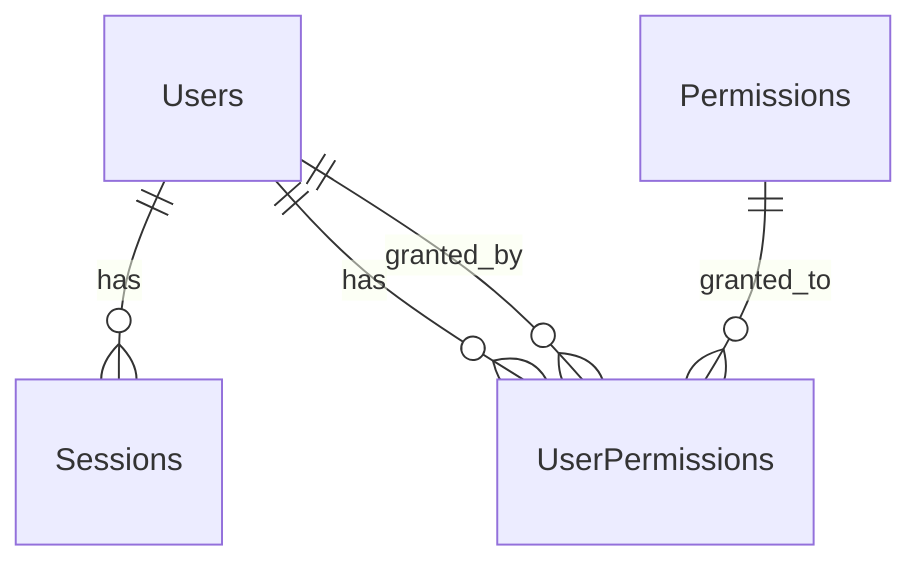

# Auth Service Database Schema

## 概要
認証サービスのデータベーススキーマ定義。ユーザー認証、セッション管理、権限管理を担当。

## テーブル構成

### Users Table
ユーザー情報を管理するメインテーブル

| Column | Type | Constraints | Description |
|--------|------|------------|-------------|
| id | UUID | PRIMARY KEY | ユーザーID |
| email | VARCHAR(255) | UNIQUE, NOT NULL | メールアドレス |
| password | VARCHAR(255) | NOT NULL | ハッシュ化されたパスワード |
| name | VARCHAR(100) | NOT NULL | ユーザー名 |
| role | ENUM | NOT NULL | ロール (Executive, PM, Consultant, Client, Admin) |
| is_active | BOOLEAN | DEFAULT true | アカウント有効フラグ |
| created_at | TIMESTAMP | NOT NULL | 作成日時 |
| updated_at | TIMESTAMP | NOT NULL | 更新日時 |

### Sessions Table
セッション管理テーブル

| Column | Type | Constraints | Description |
|--------|------|------------|-------------|
| id | UUID | PRIMARY KEY | セッションID |
| user_id | UUID | FOREIGN KEY | ユーザーID |
| token | VARCHAR(500) | UNIQUE, NOT NULL | セッショントークン |
| expires_at | TIMESTAMP | NOT NULL | 有効期限 |
| created_at | TIMESTAMP | NOT NULL | 作成日時 |

### Permissions Table
権限管理テーブル

| Column | Type | Constraints | Description |
|--------|------|------------|-------------|
| id | UUID | PRIMARY KEY | 権限ID |
| name | VARCHAR(100) | UNIQUE, NOT NULL | 権限名 |
| resource | VARCHAR(100) | NOT NULL | リソース名 |
| action | VARCHAR(50) | NOT NULL | アクション (read, write, delete, etc.) |
| created_at | TIMESTAMP | NOT NULL | 作成日時 |

### UserPermissions Table
ユーザーと権限の関連テーブル

| Column | Type | Constraints | Description |
|--------|------|------------|-------------|
| user_id | UUID | FOREIGN KEY | ユーザーID |
| permission_id | UUID | FOREIGN KEY | 権限ID |
| granted_at | TIMESTAMP | NOT NULL | 付与日時 |
| granted_by | UUID | FOREIGN KEY | 付与者ID |

## リレーションシップ

## インデックス

- `idx_users_email`: Users.email
- `idx_users_role`: Users.role
- `idx_sessions_user_id`: Sessions.user_id
- `idx_sessions_token`: Sessions.token
- `idx_user_permissions_user_id`: UserPermissions.user_id

## 統計情報

- 総ユーザー数: ~1,000
- アクティブセッション数: ~100
- 権限種別: 20種類
- 平均セッション時間: 2時間

## 注意事項

- パスワードは必ずbcryptでハッシュ化
- セッショントークンはJWT形式で生成
- 権限チェックは全APIアクセス時に実施
- セッションは定期的にクリーンアップ（24時間経過後）