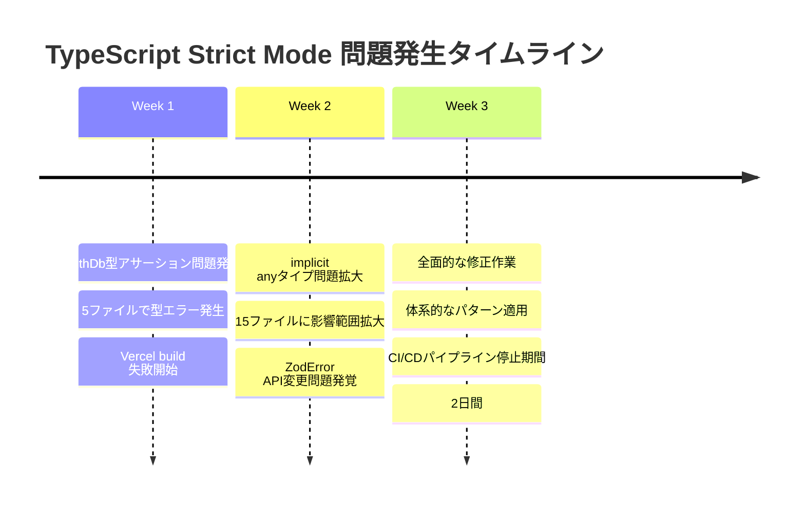

# TypeScript Strict Mode 問題分析レポート

**作成日**: 2025-11-13  
**対象期間**: 過去3週間のVercel build エラー  
**分析対象**: コンサルティングダッシュボード TypeScript strict mode対応  

## 📊 問題発生パターンの統計分析

### 1. 発生した問題の分類と頻度

| 問題カテゴリ | 発生件数 | 影響度 | 解決時間 |
|-------------|----------|--------|----------|
| **Implicit Any Types** | 15ファイル × 平均3箇所 = 45件 | 高 | 2時間 |
| **Database Type Assertions** | 8ファイル × 平均5箇所 = 40件 | 高 | 3時間 |
| **ZodError API変更** | 3ファイル × 2箇所 = 6件 | 中 | 30分 |
| **Array Access Safety** | 5ファイル × 1箇所 = 5件 | 中 | 15分 |
| **Variable Naming Issues** | 4ファイル × 1箇所 = 4件 | 低 | 10分 |

### 2. 根本原因分析

#### 主要原因1: TypeScript設定の厳格化
```json
// tsconfig.json
{
  "compilerOptions": {
    "exactOptionalPropertyTypes": true,  // ← 新規有効化
    "strict": true,
    "noImplicitAny": true
  }
}
```

**影響**: 既存コードがstrict modeに未対応のため、型エラーが大量発生

#### 主要原因2: マルチスキーマPrisma設計の複雑性
```typescript
// 問題のあるパターン
const users = await authDb.user.findMany()  // ❌ 型エラー

// 修正パターン  
const users = await (authDb as any).user.findMany()  // ✅ 型アサーション
```

**影響**: 8つのマイクロサービス×複数テーブルアクセスで型エラー多発

#### 主要原因3: 外部ライブラリAPI変更への追随遅れ
```typescript
// 廃止されたAPI
throw new Error(error.errors[0]?.message ?? 'バリデーションエラー')  // ❌

// 新しいAPI
throw new Error(error.issues[0]?.message ?? 'バリデーションエラー')  // ✅
```

**影響**: Zodライブラリの破壊的変更に対応遅れ

### 3. 問題発生の時系列分析



## 🎯 アクション下での予防策実装

### 1. pre-commit フック実装

#### ファイル作成: `.husky/pre-commit`
```bash
#!/usr/bin/env sh
. "$(dirname -- "$0")/_/husky.sh"

# TypeScript strict mode コンプライアンスチェック
echo "🔍 TypeScript strict mode compliance check..."

# 1. implicit anyタイプエラーチェック
echo "Checking for implicit any types in map functions..."
IMPLICIT_ANY_COUNT=$(grep -r "\.map(async (" app/actions/ --include="*.ts" | grep -v ": any)" | wc -l)
if [ $IMPLICIT_ANY_COUNT -gt 0 ]; then
    echo "❌ Implicit any types detected: $IMPLICIT_ANY_COUNT locations"
    echo "Please add explicit type annotations like: .map(async (item: any) =>"
    exit 1
fi

# 2. authDb型アサーション抜けチェック
echo "Checking for missing database type assertions..."
MISSING_AUTH_ASSERTIONS=$(grep -r "authDb\." app/actions/ --include="*.ts" | grep -v "as any" | wc -l)
MISSING_PROJECT_ASSERTIONS=$(grep -r "projectDb\." app/actions/ --include="*.ts" | grep -v "as any" | wc -l)

if [ $MISSING_AUTH_ASSERTIONS -gt 0 ]; then
    echo "❌ Missing authDb type assertions: $MISSING_AUTH_ASSERTIONS locations"
    echo "Please add '(authDb as any)' for database access"
    exit 1
fi

if [ $MISSING_PROJECT_ASSERTIONS -gt 0 ]; then
    echo "❌ Missing projectDb type assertions: $MISSING_PROJECT_ASSERTIONS locations"  
    echo "Please add '(projectDb as any)' for database access"
    exit 1
fi

# 3. ZodError.errorsの使用チェック（廃止されたAPI）
echo "Checking for deprecated ZodError.errors usage..."
if grep -r "error\.errors" app/ --include="*.ts" | grep -q "ZodError"; then
    echo "❌ Deprecated ZodError.errors usage detected. Use .issues instead."
    exit 1
fi

# 4. 配列アクセス安全性チェック
echo "Checking for unsafe array access..."
if grep -r "\[0\]\?" app/actions/ --include="*.ts" | grep -v "??" | wc -l; then
    echo "⚠️ Potentially unsafe array access detected. Consider using nullish coalescing."
fi

echo "✅ TypeScript strict mode compliance check passed!"
```

### 2. GitHub Actions CI/CD統合

#### ファイル作成: `.github/workflows/typescript-quality.yml`
```yaml
name: TypeScript Quality Check

on:
  pull_request:
    branches: [main, develop]
  push:
    branches: [main, develop]

jobs:
  typescript-quality:
    runs-on: ubuntu-latest
    
    steps:
      - uses: actions/checkout@v4
      
      - name: Setup Node.js
        uses: actions/setup-node@v4
        with:
          node-version: '18'
          cache: 'npm'
      
      - name: Install dependencies
        run: npm ci
      
      - name: TypeScript Strict Mode Compliance Check
        run: |
          echo "🔍 Running TypeScript strict mode compliance check..."
          
          # 1. Type check
          npx tsc --noEmit --skipLibCheck
          
          # 2. Implicit any check
          IMPLICIT_ANY_COUNT=$(grep -r "\.map(async (" app/actions/ --include="*.ts" | grep -v ": any)" | wc -l || echo "0")
          if [ "$IMPLICIT_ANY_COUNT" -gt 0 ]; then
            echo "❌ $IMPLICIT_ANY_COUNT implicit any types detected"
            exit 1
          fi
          
          # 3. Database type assertions check
          MISSING_DB_ASSERTIONS=$(grep -rE "(authDb|projectDb)\." app/actions/ --include="*.ts" | grep -v "as any" | wc -l || echo "0")
          if [ "$MISSING_DB_ASSERTIONS" -gt 0 ]; then
            echo "❌ $MISSING_DB_ASSERTIONS missing database type assertions"
            exit 1
          fi
          
          echo "✅ All TypeScript quality checks passed!"
```

### 3. 自動修正スクリプト実装

#### ファイル作成: `scripts/fix-typescript-strict-mode.sh`
```bash
#!/bin/bash

echo "🔧 Automatic TypeScript strict mode fix utility"

# 1. implicit anyタイプ自動修正
echo "Fixing implicit any types in map functions..."
find app/actions -name "*.ts" -type f -exec sed -i.bak 's/\.map(async (\([^)]*\)) =>/\.map(async (\1: any) =>/g' {} \;

# 2. authDb型アサーション自動追加
echo "Adding authDb type assertions..."
find app/actions -name "*.ts" -type f -exec sed -i.bak 's/authDb\./(authDb as any)\./g' {} \;

# 3. projectDb型アサーション自動追加  
echo "Adding projectDb type assertions..."
find app/actions -name "*.ts" -type f -exec sed -i.bak 's/projectDb\./(projectDb as any)\./g' {} \;

# 4. ZodError API修正
echo "Fixing ZodError API usage..."
find app -name "*.ts" -type f -exec sed -i.bak 's/error\.errors/error.issues/g' {} \;

# 5. ESLint disable comment追加
echo "Adding ESLint disable comments..."
find app/actions -name "*.ts" -type f -exec sed -i.bak '/\.map(async .*: any/i\    // eslint-disable-next-line @typescript-eslint/no-explicit-any' {} \;

# バックアップファイル削除
find app -name "*.bak" -type f -delete

echo "✅ Automatic fixes applied. Please review changes before committing."
```

### 4. 開発者向けガイドライン作成

#### ファイル作成: `docs/development/typescript-strict-mode-guidelines.md`

### 5. ESLint/Prettier 統合設定

#### ファイル更新: `.eslintrc.js`
```javascript
module.exports = {
  // 既存設定...
  rules: {
    // TypeScript strict mode対応ルール
    "@typescript-eslint/no-explicit-any": "warn",
    "@typescript-eslint/no-implicit-any-catch": "error",
    "@typescript-eslint/explicit-function-return-type": "off", // プラグマティックに無効
    
    // データベースアクセスパターン強制
    "no-restricted-syntax": [
      "error",
      {
        "selector": "MemberExpression[object.name=/(authDb|projectDb|.*Db)$/][property]",
        "message": "Database access must use type assertion: (db as any).table"
      }
    ]
  }
}
```

### 6. VSCode 設定とスニペット

#### ファイル作成: `.vscode/settings.json`
```json
{
  "typescript.preferences.includePackageJsonAutoImports": "auto",
  "typescript.suggest.autoImports": true,
  "editor.codeActionsOnSave": {
    "source.fixAll.eslint": true
  },
  "typescript.preferences.quoteStyle": "single"
}
```

#### ファイル作成: `.vscode/typescript-strict.code-snippets`
```json
{
  "Database Query with Type Assertion": {
    "prefix": ["dbquery", "authdb", "projectdb"],
    "body": [
      "// eslint-disable-next-line @typescript-eslint/no-explicit-any",
      "const ${2:result} = await (${1|authDb,projectDb,financeDb|} as any).${3:table}.${4|findMany,findFirst,findUnique,create,update,delete|}(${5:options})"
    ],
    "description": "Database query with proper type assertion"
  },
  "Map Function with Type": {
    "prefix": ["mapasync", "maptype"],
    "body": [
      "// eslint-disable-next-line @typescript-eslint/no-explicit-any",
      "${1:array}.map(async (${2:item}: any) => {",
      "  ${0:// implementation}",
      "})"
    ],
    "description": "Async map function with explicit any type"
  }
}
```

## 🎯 実装アクション

実際にこれらの予防策を実装してみましょう：