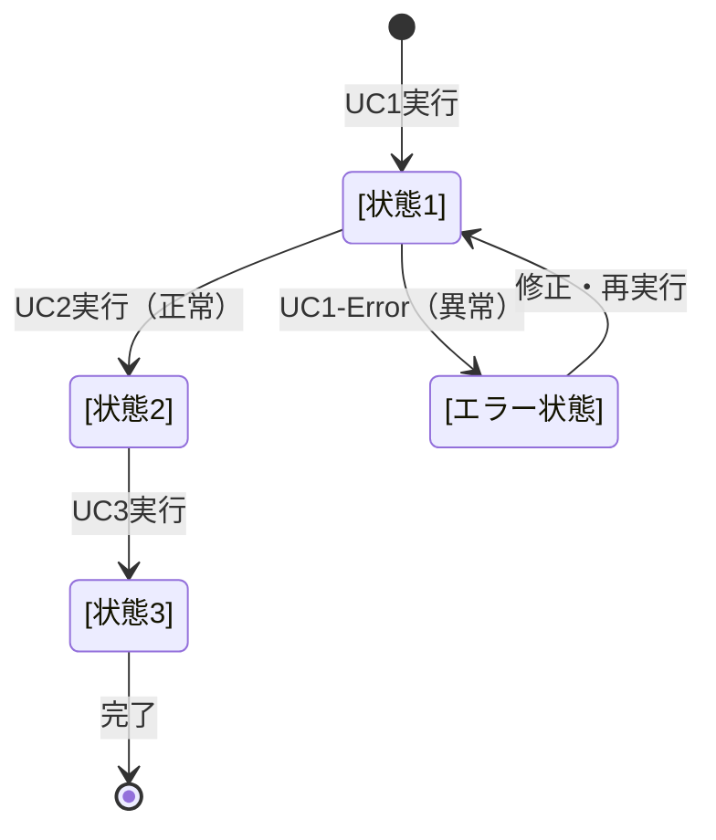

# ビジネスオペレーション強化テンプレート: [オペレーション名]

**バージョン**: 2.0.0
**更新日**: 2025-10-08
**設計方針**: ユースケース・ページ分解指向 + パラソルドメイン言語連携

## 📋 概要
**目的**: [ビジネス価値を明確に記述]
**パターン**: [CRUD/Workflow/Analytics/Communication/Administration]
**ゴール**: [測定可能な成果を定義]

## 🎭 関係者とロール
- **[ロール1]**: [責務とアクション]
- **[ロール2]**: [責務とアクション]
- **システム**: [自動処理の範囲]

## 🏗️ パラソルドメイン連携

### サービス境界とユースケース連携

> **⚡ マイクロサービス設計の基本原則（ユースケース利用型）**
> - **自サービス管理**: 自エンティティの全CRUD + 自ユースケースの実装
> - **他サービス連携**: **他サービスの公開ユースケースを利用**（エンティティは意識しない）

#### 📦 自サービス管理（[service-name]）
**責務**: ✅ エンティティ管理 ✅ ユースケース実装 ✅ ビジネスロジック

```
Entity: [エンティティ名] - Aggregate Root
├── id: UUID - 一意識別子
├── 属性1: [型] - [説明]
├── 属性2: [型] - [説明]
└── 状態: [ビジネス状態との対応]

ValueObject: [値オブジェクト名]
├── 値: [型] - [制約とルール]

Aggregate: [集約名]
├── ルート: [エンティティ名]
├── 包含: [包含エンティティ群]
└── 不変条件: [ビジネスルール]
```

#### 🔗 他サービスユースケース利用（ユースケース呼び出し型）
**責務**: ❌ エンティティ知識不要 ✅ ユースケース利用のみ

```
[service-name-1] ユースケース利用:
├── UC-AUTH-01: ユーザー認証を実行する → POST /api/auth/authenticate
├── UC-AUTH-02: 権限を検証する → POST /api/auth/validate-permission
└── UC-AUTH-03: アクセスログを記録する → POST /api/auth/log-access

[service-name-2] ユースケース利用:
├── UC-NOTIFY-01: 通知を配信する → POST /api/notifications/send
├── UC-NOTIFY-02: 通知設定を取得する → GET /api/notifications/settings
└── UC-NOTIFY-03: 配信状況を確認する → GET /api/notifications/status

[service-name-3] ユースケース利用:
├── UC-KNOWLEDGE-01: 知識を記事化する → POST /api/knowledge/articles/create
├── UC-KNOWLEDGE-02: 検索インデックスを更新する → PUT /api/knowledge/search/index
└── UC-KNOWLEDGE-03: 関連知識を発見する → GET /api/knowledge/discover
```

**ユースケース連携パターン**:
- **機能利用**: `POST /api/{service}/usecases/{usecase-id}` - 他サービス機能実行
- **状況照会**: `GET /api/{service}/usecases/{usecase-id}/status` - 実行状況確認
- **結果取得**: `GET /api/{service}/usecases/{usecase-id}/result` - 処理結果取得

### マイクロサービス連携型ドメインサービス

#### 🎯 ビジネス価値重視のドメインサービス
```
DomainService: [ValueCreationService]（価値創造サービス）
├── enhance[BusinessValue]() - [ビジネス価値向上]
├── optimize[Process]() - [プロセス最適化]（→ [other-service]連携）
├── strengthen[Capability]() - [能力強化]
└── amplify[Impact]() - [影響拡大]

DomainService: [CoordinationService]（調整サービス）
├── coordinate[CrossService]() - [サービス間調整]（→ [service-1], [service-2]連携）
├── maintain[Quality]() - [品質維持]
├── prevent[Issues]() - [問題予防]
└── ensure[Compliance]() - [コンプライアンス確保]
```

## 🔄 プロセスフロー（ユースケース分解指向）

> **重要**: 各ステップは「誰が何をするか」を明記し、ユースケース分解の根拠とする

### 基本フロー
1. **[アクター]が[アクション]を実行** → **UC1: [ユースケース名]**
   - **操作エンティティ**: [Entity名]
   - **必要ページ**: [ページ種別] - [ページ目的]

2. **システムが[検証処理]を実行** → **内部処理（ページなし）**
   - **ドメインサービス**: [Service名].validate[Entity]()

3. **[アクター]が[承認操作]を実行** → **UC2: [ユースケース名]**
   - **操作エンティティ**: [Entity名]
   - **必要ページ**: [ページ種別] - [ページ目的]

4. **システムが[データ保存]を実行** → **内部処理（ページなし）**
   - **ドメインサービス**: [Service名].save[Entity]()

5. **[アクター]が[結果確認]を実行** → **UC3: [ユースケース名]**
   - **操作エンティティ**: [Entity名]
   - **必要ページ**: [ページ種別] - [ページ目的]

### ユースケース分解原則（3つのカテゴリ分解）

プロセスステップは以下の3つのカテゴリに分類し、それぞれ異なる設計アプローチを取ります：

#### 1. **🖥️ UIが必要なもの → ユースケース + ページ定義**
**条件**:
- **ユーザー操作**が必要
- **意思決定**や**確認作業**がある
- **入力**や**選択**がある

**設計対象**:
```markdown
UC1: [ユースケース名]
├── 【メイン処理】ユーザーが[操作内容]
├── 【必要ページ】[ページ種別] - [ページ目的]
└── 【設計場所】usecases/[usecase-name]/
    ├── usecase.md
    ├── robustness.md
    └── pages/[page-name].md
```

#### 2. **⚙️ 処理だけのもの → 内部処理（ドメインサービス）**
**条件**:
- **システム自動処理**
- **データ変換・計算**
- **ログ記録**・**状態更新**

**設計対象**:
```markdown
システムが[処理内容] → 内部処理（ページなし）
├── 【ドメインサービス】[ServiceName].[methodName]()
├── 【設計場所】domain-language.md のドメインサービスセクション
└── 【API仕様】POST /internal/[resource]/[action]
```

#### 3. **🔗 他サービスを利用するもの → 統合サービス利用**
**条件**:
- **外部サービス連携**
- **他マイクロサービスのユースケース利用**
- **イベント駆動処理**

**設計対象**:
```markdown
[other-service] ユースケース利用:
├── UC-XXX-01: [機能名]を実行する → POST /api/[service]/[endpoint]
├── UC-XXX-02: [権限]を検証する → POST /api/[service]/validate
└── 【設計場所】integration-specification.md のサービス連携セクション
```

### 内部処理の5段階設計

**ユースケースにならない内部処理**は、以下の5つの場所で段階的に設計します：

| 設計レベル | 場所 | 記載内容 | 目的 |
|----------|------|----------|------|
| **概要** | operation.md | 処理の存在と役割 | ビジネス理解 |
| **詳細** | domain-language.md | メソッド定義・ルール | 実装指針 |
| **実装** | api-specification.md | エンドポイント・I/O | 開発仕様 |
| **永続化** | database-design.md | テーブル・スキーマ | データ設計 |
| **連携** | integration-specification.md | サービス間通信 | 統合設計 |

### 基本原則
- **1ユースケース = 1つの明確な目的 = 1つのページ**
- **内部処理は5つのMDファイルに役割分担**して設計
- **全ステップの30-50%がユースケース化**される（残りは内部処理）

## 📄 ユースケース・ページ設計マトリックス

| UC# | ユースケース名 | 対応ページ | エンティティ | アクター | 設計方針 |
|-----|---------------|-----------|-------------|----------|----------|
| UC1 | [UC名] | [ページ名] | [Entity名] | [アクター] | [入力重視/表示重視/操作重視] |
| UC2 | [UC名] | [ページ名] | [Entity名] | [アクター] | [入力重視/表示重視/操作重視] |
| UC3 | [UC名] | [ページ名] | [Entity名] | [アクター] | [入力重視/表示重視/操作重視] |

## 📐 ロバストネス分析（BCE要素設計）

### 重要：BCE要素とパラソル設計の対応（API分離アーキテクチャ版）

| ロバストネス要素 | パラソル設計v2.0対応 | 具体的な実装要素 | 効果 |
|----------------|-------------------|---------------|------|
| **Boundary（境界）** | ページ定義（UI） + API仕様 | • UIコンポーネント<br/>• REST APIエンドポイント<br/>• データ変換・バリデーション | フロント・バック境界の具体化 |
| **Control（制御）** | **3層の制御要素** | **① UIの関数**：フロントエンド制御<br/>**② ドメインサービス**：アグリゲート横断処理<br/>**③ APIメソッド**：バックエンド制御 | 制御責務の階層的明確化 |
| **Entity（実体）** | **アグリゲート** | • アグリゲートルート<br/>• 集約内エンティティ群<br/>• 値オブジェクト<br/>• 不変条件 | ドメインモデルの境界明確化 |

#### **Control要素の3層分類（詳細実装指針）**

**Control Layer 1: UIの関数（フロントエンド制御）**
```typescript
// React Component内の制御関数例
const [EntityName]Controller = {
  handleFormChange: (field, value) => { /* UI状態制御 */ },
  validateInput: (formData) => { /* フロント検証 */ },
  handleSubmit: async (formData) => {
    // APIメソッド（Layer 3）呼び出し
    await [entityName]API.create(formData)
  }
}
```

**Control Layer 2: ドメインサービス（アグリゲート横断処理）**
```markdown
### [BusinessName]Coordinator（複数アグリゲート制御）
**アグリゲート横断処理**:
- coordinate([Agg1], [Agg2], [Agg3])
- orchestrate[Business]Workflow(): 業務フロー統制
- handle[Cross]AggregateValidation(): 集約間整合性
```

**Control Layer 3: APIメソッド（バックエンド制御）**
```typescript
// API Route Handler例
export async function POST(request: Request) {
  const { auth } = await validateAuth(request)  // API制御
  const data = await request.json()

  // ドメインサービス（Layer 2）呼び出し
  const result = await [BusinessName]Coordinator
    .orchestrate[Process](data, auth)

  return Response.json(result, { status: 201 })
}
```

#### **Entity要素のアグリゲート設計（実装指針）**

**アグリゲート境界の明確化**:
```markdown
### [MainEntity]Aggregate
**集約ルート**: [MainEntity]
**包含エンティティ**: [Entity1], [Entity2], [ValueObject1]
**不変条件**:
- [BusinessRule1]: [具体的な制約]
- [BusinessRule2]: [具体的な制約]
**トランザクション境界**: この集約内のみで一貫性保証
```

### UC1: [ユースケース名] - ロバストネス分析

#### 📱 Boundary Objects (境界オブジェクト)
**UI境界要素**:
- **[PageName]**: [ページの役割と責務]
  - 入力フィールド: [具体的な入力項目]
  - 表示領域: [表示するデータ内容]
  - 操作ボタン: [ユーザーが実行できるアクション]

**API境界要素**:
- **[APIEndpoint]**: [外部インターフェース]
  - リクエスト形式: [入力データ形式]
  - レスポンス形式: [出力データ形式]

#### ⚙️ Control Objects (制御オブジェクト) - 3層制御設計

**Control Layer 1: UIの関数**:
- **[UI_Controller]**: フロントエンド制御
  - handle[UserAction](): ユーザー操作制御
  - validate[FormInput](): フロントエンド検証
  - manage[UIState](): UI状態管理

**Control Layer 2: ドメインサービス（アグリゲート横断）**:
- **[Business_Coordinator]**: 複数アグリゲート制御
  - coordinate[MainAgg_RelatedAgg](): 集約間調整
  - orchestrate[BusinessFlow](): 業務フロー統制
  - ensure[BusinessRules](): ビジネスルール保証

**Control Layer 3: APIメソッド**:
- **[API_Handler]**: バックエンド制御
  - process[HTTPRequest](): API要求処理
  - authenticate[User](): 認証・認可制御
  - format[Response](): レスポンス制御

#### 💾 Entity Objects (実体オブジェクト) - アグリゲート設計

**メインアグリゲート**:
- **[MainEntity]Aggregate**: [ビジネス境界の説明]
  - **集約ルート**: [MainEntity]
  - **包含エンティティ**: [Entity1], [Entity2]
  - **包含値オブジェクト**: [ValueObject1], [ValueObject2]
  - **不変条件**:
    - [BusinessRule1]: [具体的制約]
    - [BusinessRule2]: [具体的制約]
  - **トランザクション境界**: [一貫性保証の範囲]

**関連アグリゲート**:
- **[RelatedEntity]Aggregate**: [関連する境界]
  - **集約ルート**: [RelatedEntity]
  - **参照関係**: [MainEntity]Aggregateとの関係
  - **独立性**: [独立したトランザクション境界]

#### 🔄 ロバストネス図（API分離アーキテクチャ対応）

```mermaid
graph TD
    %% Boundary Objects (境界オブジェクト)
    UI[🖥️ [PageName]<br/><<boundary-ui>>]
    API_IF[🔌 [APIEndpoint]<br/><<boundary-api>>]

    %% Control Objects (制御オブジェクト) - 3層
    UI_CTRL[⚙️ [UI_Controller]<br/><<control-layer1>>]
    API_CTRL[🛡️ [API_Handler]<br/><<control-layer3>>]
    BIZ_CTRL[🎯 [Business_Coordinator]<br/><<control-layer2>>]

    %% Entity Objects (実体オブジェクト) - アグリゲート
    MAIN_AGG[📦 [MainEntity]Aggregate<br/><<entity-aggregate>>]
    RELATED_AGG[📦 [RelatedEntity]Aggregate<br/><<entity-aggregate>>]

    %% API分離アーキテクチャフロー
    UI --> UI_CTRL
    UI_CTRL -->|HTTP Request| API_IF
    API_IF --> API_CTRL
    API_CTRL --> BIZ_CTRL
    BIZ_CTRL --> MAIN_AGG
    BIZ_CTRL --> RELATED_AGG
    MAIN_AGG -.->|参照| RELATED_AGG

    %% 3層制御の色分け
    classDef boundary_ui fill:#e1f5fe
    classDef boundary_api fill:#b3e5fc
    classDef control_ui fill:#f3e5f5
    classDef control_api fill:#e8eaf6
    classDef control_biz fill:#fff3e0
    classDef entity_agg fill:#e8f5e8

    class UI boundary_ui
    class API_IF boundary_api
    class UI_CTRL control_ui
    class API_CTRL control_api
    class BIZ_CTRL control_biz
    class MAIN_AGG,RELATED_AGG entity_agg
```

#### 🎯 実装指針（API分離アーキテクチャ対応BCE）

**Boundary実装（2層境界）**:
- **UI境界実装**:
  - コンポーネント設計: [React/Vue等UIフレームワーク]
  - 状態管理: [フロントエンド状態管理方法]
  - イベントハンドリング: [ユーザー操作処理]
- **API境界実装**:
  - エンドポイント設計: [REST API設計方針]
  - リクエスト/レスポンス: [データ変換処理]
  - 認証・認可: [セキュリティ制御]

**Control実装（3層制御）**:
- **Layer 1 - UI制御実装**:
  - フロントエンド制御: [TypeScript/JavaScript関数]
  - フォーム制御: [入力検証・状態管理]
  - ナビゲーション制御: [画面遷移制御]
- **Layer 2 - ドメインサービス実装**:
  - アグリゲート横断制御: [複数集約の調整ロジック]
  - ビジネスフロー制御: [業務プロセスオーケストレーション]
  - ビジネスルール適用: [ドメインルール実装]
- **Layer 3 - API制御実装**:
  - HTTP要求処理: [Express/Next.js APIハンドラー]
  - 認証・認可制御: [JWT/OAuth処理]
  - レスポンス制御: [エラーハンドリング・形式変換]

**Entity実装（アグリゲート設計）**:
- **アグリゲート実装**:
  - 集約ルート設計: [ルートエンティティの責務定義]
  - 集約境界実装: [トランザクション境界の実装]
  - 不変条件実装: [ビジネスルール・制約の実装]
- **エンティティ永続化**:
  - リポジトリパターン: [データアクセス抽象化]
  - ORM連携: [Prisma/TypeORM等との連携]
  - キャッシュ戦略: [集約レベルでのキャッシュ設計]

### UC2: [ユースケース名] - ロバストネス分析

#### 📱 Boundary Objects
[UC2の境界オブジェクト詳細]

#### ⚙️ Control Objects
[UC2の制御オブジェクト詳細]

#### 💾 Entity Objects
[UC2の実体オブジェクト詳細]

#### 🔄 ロバストネス図
[UC2のMermaid図]

### UC3: [ユースケース名] - ロバストネス分析

#### 📱 Boundary Objects
[UC3の境界オブジェクト詳細]

#### ⚙️ Control Objects
[UC3の制御オブジェクト詳細]

#### 💾 Entity Objects
[UC3の実体オブジェクト詳細]

#### 🔄 ロバストネス図
[UC3のMermaid図]

### 🔗 BCE要素間の依存関係（API分離アーキテクチャ版）

#### API分離アーキテクチャでの依存関係原則
```
UI Boundary → UI Control → API Boundary → API Control → Domain Control → Aggregate Entity
     ↓            ↓            ↓            ↓              ↓              ↓
   React      JavaScript    HTTP API    Express      Domain       Prisma
 Components    Functions    Endpoints   Handlers     Services     Models
```

#### 3層制御の責務分離原則
- **Control Layer 1（UI制御）**: フロントエンド制御・UI状態管理のみ
- **Control Layer 2（ドメイン制御）**: ビジネスロジック・アグリゲート横断処理のみ
- **Control Layer 3（API制御）**: HTTP処理・認証認可・レスポンス制御のみ

#### アグリゲート境界の責務原則
- **アグリゲート内**: 強い一貫性（トランザクション境界内）
- **アグリゲート間**: 結果整合性（イベント駆動、参照のみ）
- **ルートエンティティ**: 集約への唯一のアクセスポイント

### 📋 ロバストネス分析チェックリスト（API分離アーキテクチャ版）

#### 基本BCE要素チェック
- [ ] 各ユースケースにBCE要素が揃っている
- [ ] Boundary要素がページ定義とAPI仕様の両方に対応している
- [ ] Control要素が3層（UI・ドメイン・API）に適切に分離されている
- [ ] Entity要素がアグリゲート設計になっている

#### API分離アーキテクチャチェック
- [ ] フロントエンド制御とバックエンド制御が明確に分離されている
- [ ] API境界でのデータ変換が適切に設計されている
- [ ] 認証・認可制御がAPI層に配置されている
- [ ] ドメイン制御が複数アグリゲートを適切に調整している

#### アグリゲート設計チェック
- [ ] 各アグリゲートのトランザクション境界が明確に定義されている
- [ ] アグリゲート間の依存関係が参照のみに制限されている
- [ ] 不変条件がアグリゲート内で完結している
- [ ] 集約ルートが外部アクセスの唯一のポイントになっている

#### 実装準備チェック
- [ ] 各Control層の実装技術が明確に選択されている
- [ ] Mermaid図で3層制御とアグリゲート関係が表現されている
- [ ] 実装指針が具体的な技術スタックまで記載されている
- [ ] 責務分離が実装レベルまで落とし込まれている

## 🔀 代替フロー（ユースケース分岐指向）

### 代替フロー1: [条件]
- **分岐元**: 基本フロー ステップX
- **条件**: [分岐条件]
- **代替ユースケース**: UC1-Alt: [代替ユースケース名]
  - **必要ページ**: [代替ページ] - [代替目的]
  - **操作エンティティ**: [Entity名]

## ⚠️ 例外フロー（エラーページ設計指向）

### 例外1: [エラー条件]
- **発生ステップ**: ステップX
- **エラーユースケース**: UC1-Error: [エラー処理ユースケース]
  - **必要ページ**: エラー表示ページ - [エラー対応目的]
  - **表示情報**: エラーメッセージ、回復手順、代替操作

## 📊 ビジネス状態（エンティティライフサイクル）



**状態とエンティティの対応**:
- **[状態1]**: [Entity名].[属性] = [値]
- **[状態2]**: [Entity名].[属性] = [値]

## 📏 KPI（ユースケース別成功指標）

| ユースケース | KPI | 目標値 | 測定方法 |
|-------------|-----|--------|----------|
| UC1 | [指標名] | [目標] | [測定手法] |
| UC2 | [指標名] | [目標] | [測定手法] |
| UC3 | [指標名] | [目標] | [測定手法] |

## 📜 ビジネスルール（ドメイン制約）

### エンティティ制約
- **[Entity名]**: [制約内容] → ドメインサービスで実装
- **[ValueObject名]**: [制約内容] → コンストラクタで実装

### ユースケース制約
- **UC1**: [制約内容] → ページバリデーションで実装
- **UC2**: [制約内容] → ページバリデーションで実装

## 🔗 入出力仕様（API・ページ連携）

### ユースケース別入出力

#### UC1: [ユースケース名]
**入力（ページ → API）**:
```json
{
  "entityData": {
    "field1": "type - description",
    "field2": "type - description"
  }
}
```

**出力（API → ページ）**:
```json
{
  "result": "success/error",
  "entity": {Entity JSON},
  "nextAction": "UC2実行可能 | エラー修正要求"
}
```

## 🚀 実装指針

### パラソルドメイン言語の段階的進化指針

このオペレーション設計では、**段階的にリッチになるドメイン言語進化**を実践します：

#### 第1段階：ケーパビリティからの抽出 🌱
**このテンプレート利用時に実行**:
```markdown
## 段階1: 基本ドメイン言語（ケーパビリティベース）

### エンティティ（基本版）
[Entity名]:
- id: UUID - 一意識別子
- name: String - 基本名称
- status: [StatusEnum] - 基本状態

### 値オブジェクト（基本版）
[ValueObject名]:
- value: [Type] - 核となる値
```

#### 第2段階：ビジネスオペレーションからの詳細化 🌿
**このテンプレート完了時に実行**:
```markdown
## 段階2: 詳細ドメイン言語（オペレーションベース）

### エンティティ（詳細版）
[Entity名] (拡張):
+ [operation_specific_attributes] - オペレーション固有属性
+ ビジネス状態: [StateTransition] - 状態遷移定義

### 集約（新規）
[Aggregate名]:
- ルート: [Entity名]
- 境界: [Business_Boundary]
- 不変条件: [Business_Rules]

### ドメインサービス（初期版）
[Service名]:
- execute[Operation](): [Main_Logic]
- validate[Rule](): [Validation_Logic]
```

#### 第3段階：ユースケース + ロバストネス分析からの精緻化 🌳
**各ユースケース設計完了時に実行**:
```markdown
## 段階3: 精緻化ドメイン言語（ユースケース + ロバストネス分析ベース）

### ロバストネス分析実施（新規）
#### BCE要素特定
- Boundary: [UI/API境界要素]
- Control: [ビジネスロジック制御要素]
- Entity: [データ実体要素]

#### 実装指針決定
- Boundary実装: [UI/API実装方針]
- Control実装: [ドメインサービス実装方針]
- Entity実装: [エンティティ実装方針]

### エンティティ（ロバストネス分析反映版）
[Entity名] (BCE分析結果統合):
+ BCE分析で特定された全属性
+ Control要素との連携メソッド
+ Boundary要素への公開メソッド
+ バリデーション制約（BCE責務分離）
+ イベント発行機能

### ドメインサービス（Control要素完全版）
[Service名] (ロバストネス分析Control要素):
+ handle[UseCase1](): [BC1_Control_Logic]
+ handle[UseCase2](): [UC2_Control_Logic]
+ coordinate[CrossUseCase](): [BCE_Integration_Logic]
+ validateBusinessRules(): [Entity要素連携]
+ handleBoundaryRequests(): [Boundary要素連携]

### 境界サービス（Boundary要素新規）
[BoundaryService名]:
+ renderUI(): [UI描画制御]
+ handleAPIRequests(): [API要求処理]
+ validateInputs(): [入力値検証]
+ formatOutputs(): [出力値整形]

### ドメインイベント（新規）
[Event名]:
- 発生条件: [Trigger_Condition]
- ペイロード: [Event_Data]
- BCE連携: [どの要素から発生するか]
```

#### 第4段階：API実装からの最終確定 🌲
**API実装完了時に実行**:
```markdown
## 段階4: 実装レベルドメイン言語（APIベース）

### エンティティ（実装版）
[Entity名] (API準拠):
+ JSONマッピング完備
+ APIバリデーション対応
+ シリアライゼーション最適化

### リポジトリ（新規）
[Repository名]:
+ CRUD操作
+ ビジネス検索
+ パフォーマンス最適化

### ファクトリ（新規）
[Factory名]:
+ 複雑生成ロジック
+ バリデーション付き生成
```

### 進化実践ガイド

#### 進化チェックポイント
- [ ] **第1段階完了**: 基本エンティティが特定できている
- [ ] **第2段階完了**: オペレーション要求がドメイン言語に反映されている
- [ ] **第3段階完了**: 全ユースケースに対応するドメインサービスが定義されている
- [ ] **第4段階完了**: API実装とドメイン言語が完全に整合している

#### 進化時の注意事項
- **後方互換性**: 前段階の設計を破壊しない
- **必要最小限**: 各段階で必要最小限の要素のみ追加
- **実装駆動**: 実装の進捗に合わせて進化
- **継続精緻化**: 実装経験をドメイン言語にフィードバック

### 推奨実装順序（進化版）
1. **第1段階完了**: ケーパビリティからのドメイン言語抽出
2. **第2段階完了**: オペレーション設計と初期ドメインサービス
3. **第3段階反復**: ユースケース・ページのペア実装（段階的にドメイン言語精緻化）
4. **第4段階完了**: API実装と最終ドメイン言語確定
5. **統合テスト**: 進化したドメイン言語の全体検証

### 品質チェックポイント
- [ ] 各ユースケースに対応するページが1対1で存在する
- [ ] パラソルドメイン言語エンティティが正しく操作される
- [ ] ビジネス状態遷移がエンティティ状態と一致する
- [ ] 代替・例外フローにも適切なページが用意される

---
*このテンプレートは、ユースケース・ページ分解とパラソルドメイン言語連携を強化したビジネスオペレーション設計指針v2.0に基づいています*