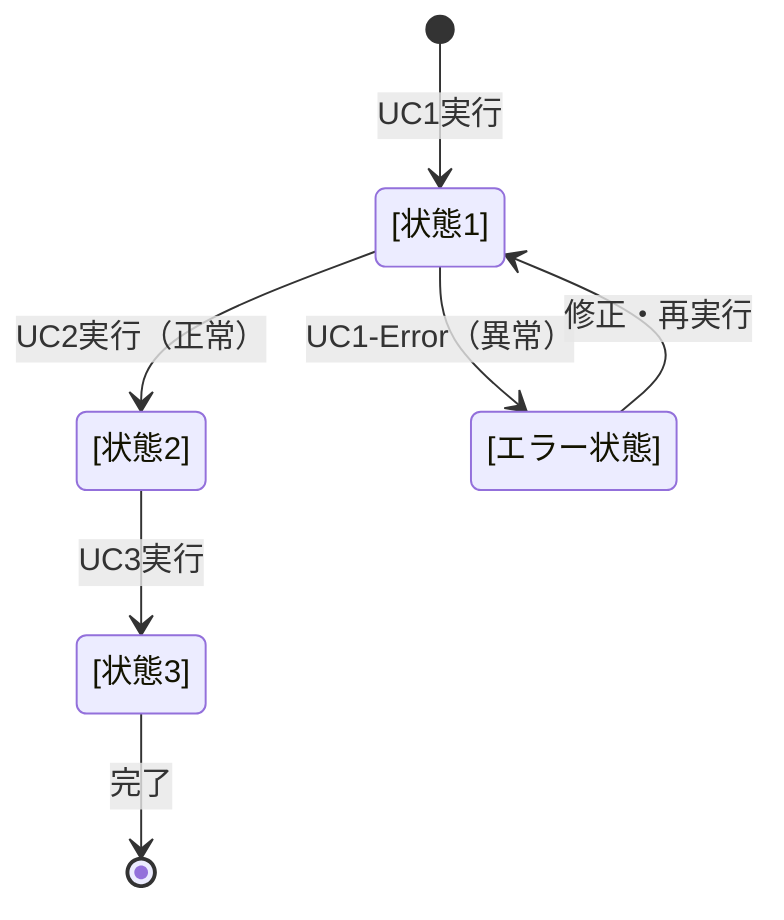

# ビジネスオペレーション強化テンプレート: [オペレーション名]

**バージョン**: 2.0.0
**更新日**: 2025-10-08
**設計方針**: ユースケース・ページ分解指向 + パラソルドメイン言語連携

## 📋 概要
**目的**: [ビジネス価値を明確に記述]
**パターン**: [CRUD/Workflow/Analytics/Communication/Administration]
**ゴール**: [測定可能な成果を定義]

## 🎭 関係者とロール
- **[ロール1]**: [責務とアクション]
- **[ロール2]**: [責務とアクション]
- **システム**: [自動処理の範囲]

## 🏗️ パラソルドメイン連携

### 主要エンティティ
このオペレーションで操作する主要なドメインエンティティ：

```
Entity: [エンティティ名]
├── 属性1: [型] - [説明]
├── 属性2: [型] - [説明]
└── 状態: [ビジネス状態との対応]

ValueObject: [値オブジェクト名]
├── 値: [型] - [制約とルール]

Aggregate: [集約名]
├── ルート: [エンティティ名]
├── 不変条件: [ビジネスルール]
```

### ドメインサービス
```
DomainService: [サービス名]
├── validate[Entity]() - [検証ロジック]
├── process[Operation]() - [中核ビジネスロジック]
└── notify[Event]() - [イベント発行]
```

## 🔄 プロセスフロー（ユースケース分解指向）

> **重要**: 各ステップは「誰が何をするか」を明記し、ユースケース分解の根拠とする

### 基本フロー
1. **[アクター]が[アクション]を実行** → **UC1: [ユースケース名]**
   - **操作エンティティ**: [Entity名]
   - **必要ページ**: [ページ種別] - [ページ目的]

2. **システムが[検証処理]を実行** → **内部処理（ページなし）**
   - **ドメインサービス**: [Service名].validate[Entity]()

3. **[アクター]が[承認操作]を実行** → **UC2: [ユースケース名]**
   - **操作エンティティ**: [Entity名]
   - **必要ページ**: [ページ種別] - [ページ目的]

4. **システムが[データ保存]を実行** → **内部処理（ページなし）**
   - **ドメインサービス**: [Service名].save[Entity]()

5. **[アクター]が[結果確認]を実行** → **UC3: [ユースケース名]**
   - **操作エンティティ**: [Entity名]
   - **必要ページ**: [ページ種別] - [ページ目的]

### ユースケース分解原則
- **ユーザー操作ステップ** → ユースケース + ページ
- **システム内部処理** → ドメインサービス（ページなし）
- **1ユースケース = 1つの明確な目的 = 1つのページ**

## 📄 ユースケース・ページ設計マトリックス

| UC# | ユースケース名 | 対応ページ | エンティティ | アクター | 設計方針 |
|-----|---------------|-----------|-------------|----------|----------|
| UC1 | [UC名] | [ページ名] | [Entity名] | [アクター] | [入力重視/表示重視/操作重視] |
| UC2 | [UC名] | [ページ名] | [Entity名] | [アクター] | [入力重視/表示重視/操作重視] |
| UC3 | [UC名] | [ページ名] | [Entity名] | [アクター] | [入力重視/表示重視/操作重視] |

## 🔀 代替フロー（ユースケース分岐指向）

### 代替フロー1: [条件]
- **分岐元**: 基本フロー ステップX
- **条件**: [分岐条件]
- **代替ユースケース**: UC1-Alt: [代替ユースケース名]
  - **必要ページ**: [代替ページ] - [代替目的]
  - **操作エンティティ**: [Entity名]

## ⚠️ 例外フロー（エラーページ設計指向）

### 例外1: [エラー条件]
- **発生ステップ**: ステップX
- **エラーユースケース**: UC1-Error: [エラー処理ユースケース]
  - **必要ページ**: エラー表示ページ - [エラー対応目的]
  - **表示情報**: エラーメッセージ、回復手順、代替操作

## 📊 ビジネス状態（エンティティライフサイクル）



**状態とエンティティの対応**:
- **[状態1]**: [Entity名].[属性] = [値]
- **[状態2]**: [Entity名].[属性] = [値]

## 📏 KPI（ユースケース別成功指標）

| ユースケース | KPI | 目標値 | 測定方法 |
|-------------|-----|--------|----------|
| UC1 | [指標名] | [目標] | [測定手法] |
| UC2 | [指標名] | [目標] | [測定手法] |
| UC3 | [指標名] | [目標] | [測定手法] |

## 📜 ビジネスルール（ドメイン制約）

### エンティティ制約
- **[Entity名]**: [制約内容] → ドメインサービスで実装
- **[ValueObject名]**: [制約内容] → コンストラクタで実装

### ユースケース制約
- **UC1**: [制約内容] → ページバリデーションで実装
- **UC2**: [制約内容] → ページバリデーションで実装

## 🔗 入出力仕様（API・ページ連携）

### ユースケース別入出力

#### UC1: [ユースケース名]
**入力（ページ → API）**:
```json
{
  "entityData": {
    "field1": "type - description",
    "field2": "type - description"
  }
}
```

**出力（API → ページ）**:
```json
{
  "result": "success/error",
  "entity": {Entity JSON},
  "nextAction": "UC2実行可能 | エラー修正要求"
}
```

## 🚀 実装指針

### 推奨実装順序
1. **パラソルドメイン言語定義** - エンティティ、値オブジェクト、集約
2. **ドメインサービス実装** - ビジネスロジック中核
3. **ユースケース・ページのペア実装** - 1対1で段階的に
4. **統合テスト** - プロセスフロー全体の検証

### 品質チェックポイント
- [ ] 各ユースケースに対応するページが1対1で存在する
- [ ] パラソルドメイン言語エンティティが正しく操作される
- [ ] ビジネス状態遷移がエンティティ状態と一致する
- [ ] 代替・例外フローにも適切なページが用意される

---
*このテンプレートは、ユースケース・ページ分解とパラソルドメイン言語連携を強化したビジネスオペレーション設計指針v2.0に基づいています*