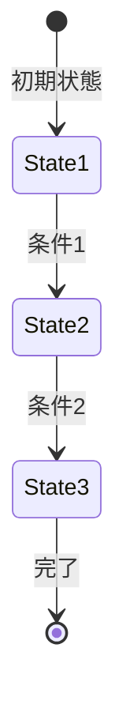

# ビジネスオペレーション: [オペレーション名]

**バージョン**: 1.0.0
**更新日**: [YYYY-MM-DD]

## 概要

**目的**: [このオペレーションの目的と範囲]

**パターン**: [Workflow/CRUD/Analytics/Communication/Administration]

**ゴール**: [達成すべき具体的な成果]

## 関係者とロール

- **[ロール1]**: [責務の説明]
- **[ロール2]**: [責務の説明]
- **[ロール3]**: [責務の説明]

## プロセスフロー

> **重要**: プロセスフローは必ず番号付きリスト形式で記述してください。
> Mermaid形式は使用せず、テキスト形式で記述することで、代替フローと例外フローが視覚的に分離されたフローチャートが自動生成されます。

1. [ステップ1の説明]
2. [ステップ2の説明]
3. [ステップ3の説明]
4. [ステップ4の説明]
5. [ステップ5の説明]
6. [ステップ6の説明]

## 代替フロー

### 代替フロー1: [条件]
- [X-1]. [代替ステップ1の説明]
- [X-2]. [代替ステップ2の説明]
- [X-3]. [代替ステップ3の説明]
- [X-4]. 基本フロー[Y]に戻る

### 代替フロー2: [条件]
- [X-1]. [代替ステップ1の説明]
- [X-2]. [代替ステップ2の説明]

## 例外処理

### 例外1: [例外条件]
- [例外対応ステップ1]
- [例外対応ステップ2]
- [例外対応ステップ3]

### 例外2: [例外条件]
- [例外対応ステップ1]
- [例外対応ステップ2]

### 例外3: [例外条件]
- [例外対応ステップ1]
- [例外対応ステップ2]

## ビジネス状態

> **注意**: ビジネス状態図は引き続きMermaid形式を使用します。
> プロセスフローとは異なり、状態遷移図は静的な図表として表示されます。

## KPI

- **[指標1]**: [目標値] - [説明]
- **[指標2]**: [目標値] - [説明]
- **[指標3]**: [目標値] - [説明]

## ビジネスルール

- [ルール1の説明]
- [ルール2の説明]
- [ルール3の説明]

## 入出力仕様

### 入力
- **[入力1]**: [説明]
- **[入力2]**: [説明]

### 出力
- **[出力1]**: [説明]
- **[出力2]**: [説明]

## 派生ユースケース

1. [ユースケース1]
2. [ユースケース2]
3. [ユースケース3]

---

## テンプレート利用ガイド

### プロセスフローの記述ルール

1. **番号付きリスト形式を使用**
   - ✅ 正しい: `1. ユーザーがログインする`
   - ❌ 間違い: Mermaid形式のフローチャート

2. **代替フローの番号付け**
   - 形式: `[分岐元ステップ-連番]. 説明`
   - 例: `3-1. ユーザーが「パスワードを忘れた」を選択する`

3. **例外処理の記述**
   - 例外条件を明確に記述
   - 対応手順を具体的に記載

### 自動生成されるフローチャートの特徴

- **基本フロー**: 青色のノード
- **代替フロー**: 黄色のノード、点線接続
- **例外フロー**: オレンジ色のノード、点線接続

### 文字エンコーディング注意事項

- **ファイル保存時**: UTF-8エンコーディングで保存
- **コピー&ペースト時**: ANSIエスケープシーケンス（色情報）が含まれないよう注意
- **推奨エディタ**: プレーンテキストエディタまたはVS Code