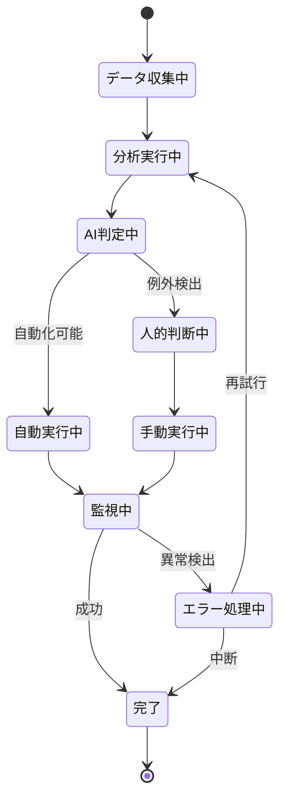

# DX変革オペレーションテンプレート

**バージョン**: 2.0.0
**更新日**: 2025-10-10
**DX原則**: ビジネス価値創造にフォーカスしたオペレーション設計
**設計方針**: ユースケース・ページ分解指向 + パラソルドメイン言語連携

## ビジネスオペレーション基本情報

### オペレーション名
**形式**: [価値創造動詞] + [対象] + [成果表現]
**例**:
- ✅ プロジェクトを成功に導く
- ✅ リスクを先回りして対策する
- ✅ 品質を継続的に向上させる
- ❌ プロジェクト作成（CRUD用語は禁止）
- ❌ データ更新（技術的表現は禁止）

### オペレーション概要
**目的**: [このオペレーションが達成すべきビジネス成果]
**パターン**: [Workflow / Analytics / Communication / Administration]
**デジタル変革**: [従来の手作業からの変革内容]

## DX価値創造の定義

### 従来の課題（Before）
- **手作業依存**: [人的作業に依存していた業務]
- **情報分散**: [データが散らばっていた状況]
- **後追い対応**: [問題発生後の対処中心]
- **属人的スキル**: [個人の経験・勘に依存]

### DX変革後（After）
- **自動化実現**: [デジタル化により自動化された作業]
- **統合された情報**: [統合されたデータによる全体最適]
- **予防的対応**: [データ活用による先手対応]
- **組織的ナレッジ**: [ベストプラクティスの体系化]

### 変革の価値
- **効率化**: [作業時間の短縮効果]
- **品質向上**: [精度・正確性の改善]
- **コスト削減**: [運用コストの削減]
- **体験向上**: [ユーザー体験の改善]

## 🏗️ パラソルドメイン連携

### サービス境界とユースケース連携

> **⚡ マイクロサービス設計の基本原則（ユースケース利用型）**
> - **自サービス管理**: 自エンティティの全CRUD + 自ユースケースの実装
> - **他サービス連携**: **他サービスの公開ユースケースを利用**（エンティティは意識しない）

#### 📦 自サービス管理（[service-name]）
**責務**: ✅ エンティティ管理 ✅ ユースケース実装 ✅ ビジネスロジック

```
Entity: [MainEntity] - Aggregate Root
├── id: UUID - 一意識別子
├── name: STRING_200 - [エンティティ名]
├── status: ENUM - 状態（draft/active/completed/archived）
├── [businessAttribute1]: [TYPE] - [ビジネス属性1の説明]
├── [businessAttribute2]: [TYPE] - [ビジネス属性2の説明]
└── metadata: JSON - DX拡張メタデータ

Entity: [SupportEntity] - Support Entity
├── id: UUID - 一意識別子
├── [mainEntityId]: UUID - 親エンティティ参照
├── [supportAttribute]: [TYPE] - [サポート属性の説明]
└── automationLevel: ENUM - 自動化レベル（manual/semi_auto/full_auto）

ValueObject: [DXValueObject]
├── value: [TYPE] - 値
├── confidence: PERCENTAGE - AI信頼度
└── lastUpdated: TIMESTAMP - 最終更新日時

Aggregate: [MainAggregate]
├── ルート: [MainEntity]
├── 包含: [SupportEntity]（多対多）、[DXValueObject]
└── 不変条件: [DXビジネスルール]、自動化レベルの整合性、データ品質基準
```

#### 🔗 他サービスユースケース利用（ユースケース呼び出し型）
**責務**: ❌ エンティティ知識不要 ✅ ユースケース利用のみ

```
[secure-access-service] ユースケース利用:
├── UC-AUTH-01: ユーザー認証を実行する → POST /api/auth/usecases/authenticate
├── UC-AUTH-02: 権限を検証する → POST /api/auth/usecases/validate-permission
└── UC-AUTH-03: アクセスログを記録する → POST /api/auth/usecases/log-access

[notification-service] ユースケース利用:
├── UC-NOTIFY-01: リアルタイム通知を配信する → POST /api/notifications/usecases/send-realtime
├── UC-NOTIFY-02: 配信状況を確認する → GET /api/notifications/usecases/delivery-status/{id}
└── UC-NOTIFY-03: 通知設定を管理する → POST /api/notifications/usecases/manage-settings

[knowledge-co-creation-service] ユースケース利用:
├── UC-KNOWLEDGE-01: DX学習データを記録する → POST /api/knowledge/usecases/record-learning
├── UC-KNOWLEDGE-02: ベストプラクティスを検索する → GET /api/knowledge/usecases/search-practices
└── UC-KNOWLEDGE-03: 改善提案を生成する → POST /api/knowledge/usecases/generate-suggestions
```

**ユースケース連携パターン**:
- **機能利用**: `POST /api/{service}/usecases/{usecase-id}` - 他サービス機能実行
- **状況照会**: `GET /api/{service}/usecases/{usecase-id}/status` - 実行状況確認
- **結果取得**: `GET /api/{service}/usecases/{usecase-id}/result` - 処理結果取得

### DXマイクロサービス連携型ドメインサービス

#### 🎯 ビジネス価値重視のドメインサービス
```
DomainService: DXTransformationCoordinator（DX変革調整サービス）
├── enhance[BusinessValue]() - ビジネス価値向上
├── coordinate[ServiceIntegration]() - サービス間連携調整（→ 他サービス連携）
├── strengthen[AutomationCapability]() - 自動化能力強化
└── amplify[DigitalImpact]() - デジタル効果拡大

DomainService: AIOperationCoordinator（AI運用調整サービス）
├── optimize[AIPerformance]() - AI性能最適化
├── ensure[DataQuality]() - データ品質保証（→ 品質サービス連携）
├── manage[LearningCycle]() - 学習サイクル管理
└── predict[BusinessOutcome]() - ビジネス成果予測（→ 分析サービス連携）
```

## 関係者とロール（DX時代）

### デジタルネイティブロール
- **[ロール1]**:
  - **従来**: [従来の手作業中心の責務]
  - **DX後**: [デジタルツールを活用した高付加価値業務]
  - **新スキル**: [必要な新しいスキル]

- **[ロール2]**:
  - **従来**: [従来の手作業中心の責務]
  - **DX後**: [デジタルツールを活用した高付加価値業務]
  - **新スキル**: [必要な新しいスキル]

### 新設ロール（DXで生まれる）
- **データアナリスト**: [データ活用による洞察提供]
- **プロセスオーケストレーター**: [デジタルワークフローの最適化]
- **ユーザーエクスペリエンス設計者**: [利用者体験の設計・改善]

## DXプロセスフロー

> **重要**: プロセスフローは必ず番号付きリスト形式で記述してください。
> この形式により、代替フローと例外フローが視覚的に分離されたフローチャートが自動生成されます。

### 基本フロー（DX最適化済み）
1. [デジタルトリガー] - [データ/イベントによる自動開始]
2. [自動データ収集] - [関連情報の自動収集・統合]
3. [AI支援分析] - [機械学習による分析・推奨]
4. [意思決定支援] - [データに基づく判断材料提供]
5. [自動実行] - [定型作業の自動実行]
6. [リアルタイム監視] - [進捗・品質の自動監視]
7. [結果フィードバック] - [成果の自動記録・学習]

### データ活用ポイント
- **ステップ2**: [収集するデータとその価値]
- **ステップ3**: [分析アルゴリズムと洞察]
- **ステップ4**: [意思決定に活用するKPI]
- **ステップ6**: [監視指標とアラート条件]

### DXユースケース分解指針

DXプロセスの各ステップを以下のカテゴリに分類し、適切な設計アプローチを取ります：

#### 🖥️ ユーザー判断・操作ステップ → ユースケース + DXページ
**対象**:
- **ステップ4**: 意思決定支援 → UC1: データに基づく意思決定を行う
  - **DXページ**: インタラクティブダッシュボード - AI分析結果の可視化
  - **UX特徴**: リアルタイムデータ、予測結果、推奨アクション

#### ⚙️ 自動化・AI処理ステップ → DXドメインサービス
**対象**:
- **ステップ1**: デジタルトリガー → 内部処理（DXEventDetector）
- **ステップ2**: 自動データ収集 → 内部処理（DataAggregationService）
- **ステップ3**: AI支援分析 → 内部処理（AIAnalysisService）
- **ステップ5**: 自動実行 → 内部処理（AutomationExecutor）
- **ステップ6**: リアルタイム監視 → 内部処理（MonitoringService）
- **ステップ7**: 結果フィードバック → 内部処理（LearningService）

#### 🔗 外部システム連携 → DX統合サービス
**対象**:
- **API統合**: 外部データソース連携
- **IoTデバイス**: センサーデータ取得
- **AI/MLプラットフォーム**: 機械学習サービス利用

### DX内部処理の設計場所

| 処理タイプ | 設計場所 | DX要素 |
|----------|---------|--------|
| **AIアルゴリズム** | domain-language.md | AIAnalysisService.analyzePattern() |
| **自動化ロジック** | domain-language.md | AutomationExecutor.executeWorkflow() |
| **データパイプライン** | api-specification.md | POST /internal/data/pipeline/process |
| **MLモデル連携** | integration-specification.md | ML Platform API連携 |
| **IoTデータ処理** | integration-specification.md | IoT Device Data Stream |

### DX設計原則
- **AI/自動化優先**: 可能な限り自動化し、人間は高付加価値判断に集中
- **データドリブン**: すべての判断にデータと分析結果を活用
- **継続学習**: システムが実行結果から継続的に学習・改善

## 📄 ユースケース・ページ設計マトリックス

> **重要**: 各ユースケースには必ず対応する1つのページが必要です。
> DXオペレーションでは、AI/自動化による内部処理とユーザーの価値判断を明確に分離します。

### ユースケース分解原則（DX特化）
- **ユーザー価値判断ステップ** → ユースケース + DXインタラクティブページ
- **AI/自動化処理ステップ** → ドメインサービス（ページなし）
- **1ユースケース = 1つの明確なDX価値 = 1つのDXページ**

### DXユースケース・ページ対応例

| UC# | ユースケース名 | 対応ページ | エンティティ | アクター | DX要素 |
|-----|-------------|-----------|-------------|----------|--------|
| UC1 | [判断支援データを分析する] | AIダッシュボードページ | [MainEntity]（参照・分析） | [ロール1] | リアルタイム分析・予測表示 |
| UC2 | [データに基づく意思決定を行う] | 意思決定支援ページ | [MainEntity]（状態更新） | [ロール2] | AI推奨・リスク評価 |
| UC3 | [自動実行結果を確認し承認する] | 実行結果確認ページ | [MainEntity]（承認） | [ロール1] | 自動化結果・例外検出 |
| UC4 | [DX成果を評価し次のアクションを決定する] | 成果評価ページ | [MainEntity]（評価・計画） | [ロール2] | 成果可視化・改善提案 |

### DXページ設計の特徴

#### AIダッシュボードページ（UC1対応）
- **リアルタイムデータ**: 自動収集されたデータの可視化
- **予測・分析結果**: AI分析による洞察とトレンド
- **アラート**: 異常検出や注意すべき変化の通知
- **ドリルダウン**: 詳細データへの段階的アクセス

#### 意思決定支援ページ（UC2対応）
- **推奨アクション**: AIによる最適解の提案
- **シナリオ比較**: 複数選択肢の影響予測
- **リスク評価**: 各選択肢のリスクレベル表示
- **承認ワークフロー**: 決定事項の組織承認プロセス

#### 実行結果確認ページ（UC3対応）
- **自動化ステータス**: 自動実行の進捗・結果
- **例外レポート**: 自動化で処理できなかった項目
- **品質指標**: 実行品質の評価メトリクス
- **手動介入**: 必要に応じた人的判断・修正

#### 成果評価ページ（UC4対応）
- **KPI可視化**: 設定した指標の達成状況
- **改善提案**: システムが学習した改善案
- **次期計画**: データに基づく次のアクション提案
- **学習ログ**: システムの継続学習状況

## 代替フロー（DX対応）

### 代替フロー1: [AI判定による自動分岐]
- [A-1]. AIが[条件]を検出した場合
- [A-2]. 自動的に[代替処理]を実行
- [A-3]. [結果]を関係者に通知
- [A-4]. 基本フロー[ステップX]に自動復帰

### 代替フロー2: [異常値検出時の対応]
- [B-1]. システムが[異常パターン]を検出
- [B-2]. 自動エスカレーション
- [B-3]. 専門家による判断介入
- [B-4]. 手動処理または基本フローに復帰

## 例外処理（DX強化）

### 例外1: [システム障害時の対応]
- [E-1]. 冗長システムへの自動切り替え
- [E-2]. 利害関係者への自動通知
- [E-3]. 手動バックアップ手順の実行
- [E-4]. 復旧後の自動同期処理

### 例外2: [データ品質問題]
- [E-1]. データ品質チェックでエラー検出
- [E-2]. データクレンジング処理実行
- [E-3]. 品質レベルに応じた処理継続判定

## DXビジネス状態

> **注意**: ビジネス状態図は引き続きMermaid形式を使用します。
> DXによる自動化・並列化された状態遷移を表現します。



## DXパフォーマンス指標（KPI）

### 効率性指標
- **処理時間短縮率**: [従来比X%短縮] (目標: [具体的数値])
- **自動化率**: [X%の作業を自動化] (目標: [具体的数値])
- **スループット向上**: [単位時間あたりの処理件数向上]

### 品質指標
- **精度向上**: [エラー率をX%削減] (目標: [具体的数値])
- **予測精度**: [AI予測の的中率] (目標: [具体的数値])
- **顧客満足度**: [サービス品質向上による満足度]

### イノベーション指標
- **新価値創造**: [DXにより新たに生まれた価値]
- **洞察発見**: [データ分析による新たな気づき]
- **改善提案**: [AI/データが提案する改善案の採用率]

## DXビジネスルール

### 自動化ルール
- **[ルール1]**: [完全自動化が可能な条件と処理]
- **[ルール2]**: [人的介入が必要な判定条件]
- **[ルール3]**: [例外処理の発動条件]

### データ品質ルール
- **[ルール4]**: [必要なデータ品質レベル]
- **[ルール5]**: [データ不整合時の対応]
- **[ルール6]**: [データ保持・削除のポリシー]

### 意思決定ルール
- **[ルール7]**: [AI推奨を採用する基準]
- **[ルール8]**: [人的判断に委ねる条件]
- **[ルール9]**: [リスク評価と承認プロセス]

## 入出力仕様（DX最適化）

### 入力（デジタル化）
- **自動入力**:
  - **[データ1]**: [センサー/API等からの自動収集]
  - **[データ2]**: [システム間連携による自動取得]

- **人的入力**:
  - **[データ3]**: [判断・承認等の人的価値が必要な入力]
  - **[データ4]**: [創造的思考が必要な入力]

### 出力（価値創造）
- **自動生成**:
  - **[アウトプット1]**: [AIによる分析レポート]
  - **[アウトプット2]**: [自動化された成果物]

- **付加価値**:
  - **[アウトプット3]**: [洞察・推奨事項]
  - **[アウトプット4]**: [次のアクション提案]

## DX技術活用

### 活用技術
- **AI/機械学習**: [予測・分類・最適化への活用]
- **RPA**: [定型作業の自動化]
- **API連携**: [システム間のリアルタイム連携]
- **データ分析**: [ビッグデータからの洞察抽出]

### 技術効果
- **[技術1]** → [業務改善効果]
- **[技術2]** → [業務改善効果]
- **[技術3]** → [業務改善効果]

## 継続的改善（DXの進化）

### 学習サイクル
1. **データ蓄積**: [実行結果の継続的収集]
2. **パターン分析**: [成功・失敗パターンの分析]
3. **アルゴリズム改善**: [AI/ルールの継続的最適化]
4. **プロセス進化**: [より効率的なフローへの進化]

### 改善指標
- **学習効果**: [時間経過による精度向上]
- **自動化拡大**: [自動化範囲の継続的拡大]
- **新価値発見**: [データから発見される新たな価値]

---

## DXオペレーション設計チェックリスト

### 価値創造の確認
- [ ] オペレーション名は価値創造を表現しているか？
- [ ] CRUD用語（作成、更新、削除等）を避けているか？
- [ ] デジタル変革の効果が明確に定義されているか？

### DX要素の確認
- [ ] 自動化可能な要素が特定されているか？
- [ ] データ活用による価値創造が含まれているか？
- [ ] AI/機械学習の活用ポイントが明確か？
- [ ] 継続的改善の仕組みが含まれているか？

### プロセス設計の確認
- [ ] フローは番号付きリスト形式で記述されているか？
- [ ] 代替フロー・例外フローが適切に定義されているか？
- [ ] ビジネス状態図はMermaid形式で記述されているか？

### v2.0仕様準拠の確認
- [ ] パラソルドメイン連携セクションが含まれているか？
- [ ] 他サービスユースケース利用が明記されているか？
- [ ] ユースケース・ページ分解マトリックスが定義されているか？
- [ ] 1対1関係強制ディレクトリ構造に対応しているか？

### 指標・運用の確認
- [ ] KPIは測定可能で意味のある指標か？
- [ ] 技術活用とその効果が明確に定義されているか？
- [ ] 継続的改善のサイクルが設計されているか？

---

## 📁 実装時のディレクトリ構造（v2.0仕様）

このテンプレートを使用して作成したオペレーション定義は、以下の1対1関係強制構造で実装してください：

```
operations/[operation-name]/
├── operation.md                    # このテンプレートで作成
└── usecases/                      # ハイフンなし（v2.0仕様）
    ├── [usecase-1-name]/
    │   ├── usecase.md              # ユースケース定義
    │   └── page.md                 # 対応DXページ定義（1対1強制）
    ├── [usecase-2-name]/
    │   ├── usecase.md
    │   └── page.md
    └── [usecase-3-name]/
        ├── usecase.md
        └── page.md
```

### 構造の利点
- **明示的な1対1関係**: ユースケースとページが必ず1対1で対応
- **DX要素の統合**: 自動化・AI・データ分析要素が統合管理される
- **保守性向上**: 関連ファイルが同一ディレクトリに配置
- **品質保証**: v2.0仕様により設計品質が自動的に向上