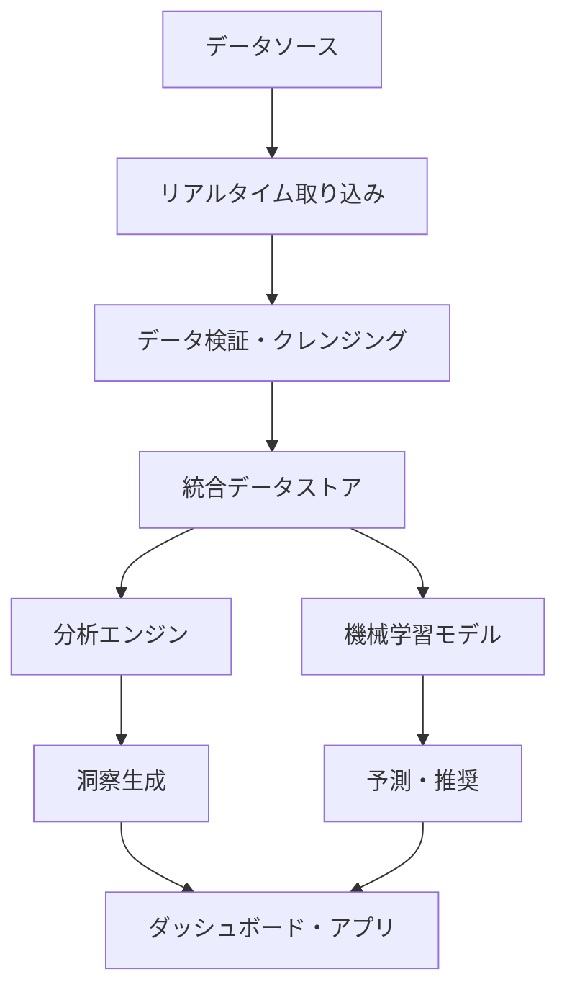

# DX洞察創出データベース設計テンプレート

**バージョン**: 1.0.0
**更新日**: 2025-01-15
**DX原則**: データを活用した価値創造とインサイト発見の基盤

## データベース基本情報

### データベース名
**形式**: [価値創造]_[サービス]_db
**例**:
- ✅ project_insight_db (プロジェクト洞察データベース)
- ✅ talent_optimization_db (タレント最適化データベース)
- ✅ revenue_analytics_db (収益分析データベース)
- ❌ project_management_db (管理用語は禁止)
- ❌ data_storage_db (技術的表現は禁止)

### データベース概要
- **対象サービス**: [関連するDXサービス名]
- **DX価値**: [このデータベースが支える価値創造]
- **データベースエンジン**: [PostgreSQL/MySQL/SQLite/MongoDB]
- **データ規模**: [想定されるデータ量とスケール]

## DX価値創造データ設計

### 従来の課題（Before）
- **データサイロ**: [各システムに分散したデータ]
- **静的データ**: [リアルタイム性の欠如]
- **分析困難**: [データ形式の不統一]
- **洞察不足**: [データからの価値抽出が困難]

### DX実現価値（After）
- **統合データ基盤**: [横断的なデータ統合と活用]
- **リアルタイム分析**: [即座のデータ更新と分析]
- **標準化された構造**: [一貫性のあるデータモデル]
- **自動的洞察生成**: [AIによる継続的な分析]

### データ戦略
- **収集戦略**: [多様なソースからのデータ収集]
- **統合戦略**: [ETL/ELTによるデータ統合]
- **分析戦略**: [機械学習とBI分析の組み合わせ]
- **活用戦略**: [意思決定支援とアクション誘導]

## DXデータアーキテクチャ

### データレイヤー構成
```
┌─────────────────────────────────────────┐
│           プレゼンテーション層            │
│  (Dashboard, Reports, Real-time Views)  │
├─────────────────────────────────────────┤
│              分析・洞察層                │
│    (AI/ML Analytics, Predictions)       │
├─────────────────────────────────────────┤
│              統合データ層                │
│   (Data Warehouse, Data Lake)           │
├─────────────────────────────────────────┤
│            オペレーショナル層             │
│  (Transactional Data, Real-time Data)   │
├─────────────────────────────────────────┤
│               データソース層              │
│    (External APIs, IoT, Manual Input)   │
└─────────────────────────────────────────┘
```

### データフロー設計


## DXエンティティ設計

### コアビジネスエンティティ

#### [Entity1]（価値創造エンティティ）
**目的**: [このエンティティが表現するビジネス価値]
**DX特徴**: [リアルタイム性・分析性・予測性]

| カラム名 | データ型 | NULL | 制約 | DX価値 | 説明 |
|---------|---------|------|------|-------|------|
| id | UUID | NOT NULL | PK | 一意性 | グローバル一意識別子 |
| business_key | VARCHAR(100) | NOT NULL | UNIQUE | 検索性 | ビジネス識別キー |
| name | VARCHAR(200) | NOT NULL | - | 可読性 | 表示名・検索用 |
| status | ENUM | NOT NULL | - | 状態管理 | active/inactive/archived |
| priority | INTEGER | NOT NULL | CHECK(1-5) | 意思決定 | ビジネス優先度 |
| value_score | DECIMAL(10,2) | NULL | - | 価値測定 | ビジネス価値スコア |
| risk_level | DECIMAL(5,2) | NULL | CHECK(0-100) | リスク管理 | リスク評価値 |
| created_at | TIMESTAMP | NOT NULL | DEFAULT NOW() | 監査 | 作成日時 |
| updated_at | TIMESTAMP | NOT NULL | DEFAULT NOW() | 監査 | 更新日時 |
| version | INTEGER | NOT NULL | DEFAULT 1 | 楽観ロック | データバージョン |

**ビジネスルール**:
- 高優先度（4-5）の場合、value_scoreは必須
- リスクレベルが80以上の場合、承認が必要
- 作成から30日経過後は自動的にreviewステータスに移行

#### [Entity2]（分析・洞察エンティティ）
**目的**: [分析結果・洞察の保存]
**DX特徴**: [時系列分析・トレンド把握・予測]

| カラム名 | データ型 | NULL | 制約 | DX価値 | 説明 |
|---------|---------|------|------|-------|------|
| id | UUID | NOT NULL | PK | 一意性 | 分析結果ID |
| entity_id | UUID | NOT NULL | FK | 関連性 | 対象エンティティ |
| metric_type | VARCHAR(50) | NOT NULL | - | 分類 | 指標種別 |
| metric_value | DECIMAL(15,4) | NOT NULL | - | 測定値 | 実際の測定値 |
| benchmark_value | DECIMAL(15,4) | NULL | - | 比較基準 | ベンチマーク値 |
| trend_direction | ENUM | NULL | - | トレンド | up/down/stable |
| confidence_level | DECIMAL(5,2) | NULL | CHECK(0-100) | 信頼性 | 分析信頼度 |
| analyzed_at | TIMESTAMP | NOT NULL | DEFAULT NOW() | 時系列 | 分析実行時刻 |
| data_period_start | TIMESTAMP | NOT NULL | - | 期間 | 分析対象期間開始 |
| data_period_end | TIMESTAMP | NOT NULL | - | 期間 | 分析対象期間終了 |

### DXイベント・ログエンティティ

#### [ActivityLog]（行動ログ）
**目的**: [ユーザー行動とシステム動作の記録]
**DX特徴**: [リアルタイム収集・パターン分析・学習データ]

| カラム名 | データ型 | NULL | 制約 | DX価値 | 説明 |
|---------|---------|------|------|-------|------|
| id | BIGSERIAL | NOT NULL | PK | 高性能 | 自動増分ID |
| event_id | UUID | NOT NULL | - | 追跡性 | イベント一意ID |
| user_id | UUID | NULL | FK | ユーザー分析 | 実行ユーザー |
| entity_type | VARCHAR(50) | NOT NULL | - | 分類 | 対象エンティティ種別 |
| entity_id | UUID | NULL | - | 関連性 | 対象エンティティID |
| action_type | VARCHAR(50) | NOT NULL | - | 行動分析 | 実行アクション |
| session_id | VARCHAR(100) | NULL | - | セッション分析 | セッション識別子 |
| ip_address | INET | NULL | - | セキュリティ | 接続元IP |
| user_agent | TEXT | NULL | - | 環境分析 | ブラウザ情報 |
| execution_time_ms | INTEGER | NULL | - | パフォーマンス | 処理時間 |
| success | BOOLEAN | NOT NULL | DEFAULT TRUE | 成功率分析 | 実行成功可否 |
| error_message | TEXT | NULL | - | エラー分析 | エラー詳細 |
| metadata | JSONB | NULL | - | 柔軟性 | 追加情報 |
| occurred_at | TIMESTAMP | NOT NULL | DEFAULT NOW() | 時系列分析 | 発生日時 |

## DX分析テーブル設計

### 時系列分析テーブル

#### [MetricTimeSeries]（指標時系列）
**目的**: [KPIの時系列変化追跡]
**DX特徴**: [リアルタイム更新・トレンド分析・予測]

```sql
CREATE TABLE metric_time_series (
    id BIGSERIAL PRIMARY KEY,
    metric_name VARCHAR(100) NOT NULL,
    entity_id UUID,
    entity_type VARCHAR(50),
    metric_value DECIMAL(15,4) NOT NULL,
    unit VARCHAR(20),
    recorded_at TIMESTAMP NOT NULL,
    aggregation_level VARCHAR(20) NOT NULL, -- minute/hour/day/week/month
    calculated_by VARCHAR(50), -- system/ai/manual
    quality_score DECIMAL(3,2), -- データ品質スコア
    INDEX idx_metric_time (metric_name, recorded_at),
    INDEX idx_entity_time (entity_id, recorded_at),
    INDEX idx_aggregation (aggregation_level, recorded_at)
) PARTITION BY RANGE (recorded_at);

-- パーティション作成（月次）
CREATE TABLE metric_time_series_2024_01 PARTITION OF metric_time_series
FOR VALUES FROM ('2024-01-01') TO ('2024-02-01');
```

### 機械学習・予測テーブル

#### [PredictionResults]（予測結果）
**目的**: [AI予測結果の保存と精度追跡]
**DX特徴**: [予測精度向上・学習効果測定]

```sql
CREATE TABLE prediction_results (
    id UUID PRIMARY KEY DEFAULT gen_random_uuid(),
    model_name VARCHAR(100) NOT NULL,
    model_version VARCHAR(20) NOT NULL,
    entity_id UUID NOT NULL,
    entity_type VARCHAR(50) NOT NULL,
    prediction_type VARCHAR(50) NOT NULL, -- classification/regression/anomaly
    predicted_value JSONB NOT NULL, -- 予測結果（柔軟な形式）
    confidence_score DECIMAL(5,4), -- 信頼度スコア
    prediction_horizon VARCHAR(20), -- 1day/1week/1month等
    features_used JSONB, -- 使用した特徴量
    actual_value JSONB, -- 実際の結果（後日更新）
    accuracy_score DECIMAL(5,4), -- 精度（実際値判明後）
    predicted_at TIMESTAMP NOT NULL DEFAULT NOW(),
    validated_at TIMESTAMP, -- 実際値で検証した日時
    created_by VARCHAR(50) DEFAULT 'ai_system',

    INDEX idx_model_time (model_name, predicted_at),
    INDEX idx_entity_prediction (entity_id, prediction_type),
    INDEX idx_accuracy (model_name, accuracy_score) WHERE accuracy_score IS NOT NULL
);
```

## DXリアルタイム処理設計

### ストリーミングデータ処理
```sql
-- リアルタイムイベントストリーム
CREATE TABLE event_stream (
    id BIGSERIAL PRIMARY KEY,
    stream_id UUID NOT NULL DEFAULT gen_random_uuid(),
    event_type VARCHAR(50) NOT NULL,
    source_system VARCHAR(50) NOT NULL,
    payload JSONB NOT NULL,
    processed BOOLEAN DEFAULT FALSE,
    processing_errors TEXT[],
    received_at TIMESTAMP NOT NULL DEFAULT NOW(),
    processed_at TIMESTAMP,

    INDEX idx_stream_unprocessed (processed, received_at) WHERE NOT processed,
    INDEX idx_event_type_time (event_type, received_at)
);

-- リアルタイム集計マテリアライズドビュー
CREATE MATERIALIZED VIEW real_time_metrics AS
SELECT
    entity_type,
    DATE_TRUNC('minute', occurred_at) as time_bucket,
    COUNT(*) as event_count,
    AVG(execution_time_ms) as avg_execution_time,
    COUNT(*) FILTER (WHERE success = false) as error_count,
    COUNT(DISTINCT user_id) as unique_users
FROM activity_log
WHERE occurred_at >= NOW() - INTERVAL '1 hour'
GROUP BY entity_type, time_bucket;

-- 自動更新（1分毎）
CREATE OR REPLACE FUNCTION refresh_real_time_metrics()
RETURNS void AS $$
BEGIN
    REFRESH MATERIALIZED VIEW CONCURRENTLY real_time_metrics;
END;
$$ LANGUAGE plpgsql;

-- スケジューラー登録
SELECT cron.schedule('refresh_metrics', '* * * * *', 'SELECT refresh_real_time_metrics();');
```

## DXインデックス戦略

### パフォーマンス最適化インデックス
```sql
-- 複合インデックス（DX分析用）
CREATE INDEX idx_entity_status_priority ON [Entity1] (status, priority, value_score);
CREATE INDEX idx_time_range_analysis ON metric_time_series (metric_name, recorded_at, entity_id);
CREATE INDEX idx_prediction_accuracy ON prediction_results (model_name, prediction_type, accuracy_score);

-- 部分インデックス（効率化）
CREATE INDEX idx_active_entities ON [Entity1] (id, name) WHERE status = 'active';
CREATE INDEX idx_high_risk ON [Entity1] (id, risk_level) WHERE risk_level >= 80;

-- 全文検索インデックス
CREATE INDEX idx_entity_search ON [Entity1] USING gin(to_tsvector('english', name || ' ' || COALESCE(description, '')));

-- JSON インデックス（メタデータ検索）
CREATE INDEX idx_metadata_search ON activity_log USING gin(metadata);
```

## DXデータ品質・整合性

### データ品質ルール
```sql
-- データ品質チェック関数
CREATE OR REPLACE FUNCTION validate_data_quality()
RETURNS TABLE (
    table_name text,
    quality_issue text,
    record_count bigint
) AS $$
BEGIN
    -- 重複データチェック
    RETURN QUERY
    SELECT
        '[Entity1]'::text,
        'duplicate_business_key'::text,
        COUNT(*)
    FROM [Entity1]
    GROUP BY business_key
    HAVING COUNT(*) > 1;

    -- データ鮮度チェック
    RETURN QUERY
    SELECT
        'metric_time_series'::text,
        'stale_data'::text,
        COUNT(*)
    FROM metric_time_series
    WHERE recorded_at < NOW() - INTERVAL '1 hour'
    AND aggregation_level = 'minute';

    -- 予測精度チェック
    RETURN QUERY
    SELECT
        'prediction_results'::text,
        'low_accuracy'::text,
        COUNT(*)
    FROM prediction_results
    WHERE accuracy_score < 0.7
    AND validated_at IS NOT NULL;
END;
$$ LANGUAGE plpgsql;
```

### データ整合性制約
```sql
-- ビジネスルール制約
ALTER TABLE [Entity1] ADD CONSTRAINT chk_priority_value_score
    CHECK (priority <= 3 OR value_score IS NOT NULL);

ALTER TABLE metric_time_series ADD CONSTRAINT chk_quality_score
    CHECK (quality_score IS NULL OR (quality_score >= 0 AND quality_score <= 1));

ALTER TABLE prediction_results ADD CONSTRAINT chk_confidence_score
    CHECK (confidence_score IS NULL OR (confidence_score >= 0 AND confidence_score <= 1));

-- 時系列整合性
ALTER TABLE metric_time_series ADD CONSTRAINT chk_time_order
    CHECK (recorded_at <= NOW());
```

## DXセキュリティ・プライバシー

### アクセス制御（RLS: Row Level Security）
```sql
-- 行レベルセキュリティ有効化
ALTER TABLE [Entity1] ENABLE ROW LEVEL SECURITY;

-- ユーザーロール別アクセス制御
CREATE POLICY entity_access_policy ON [Entity1]
    FOR ALL
    TO app_user
    USING (
        CASE
            WHEN current_setting('app.user_role') = 'executive' THEN true
            WHEN current_setting('app.user_role') = 'pm' THEN status = 'active'
            WHEN current_setting('app.user_role') = 'consultant' THEN
                id IN (SELECT entity_id FROM user_entity_access WHERE user_id = current_setting('app.user_id')::uuid)
            ELSE false
        END
    );
```

### データ暗号化・マスキング
```sql
-- 機密データの暗号化
CREATE EXTENSION IF NOT EXISTS pgcrypto;

-- 暗号化関数
CREATE OR REPLACE FUNCTION encrypt_sensitive_data(data text)
RETURNS text AS $$
BEGIN
    RETURN encode(encrypt(data::bytea, current_setting('app.encryption_key'), 'aes'), 'base64');
END;
$$ LANGUAGE plpgsql;

-- マスキング関数（表示用）
CREATE OR REPLACE FUNCTION mask_personal_data(data text, visible_chars int DEFAULT 3)
RETURNS text AS $$
BEGIN
    IF LENGTH(data) <= visible_chars THEN
        RETURN REPEAT('*', LENGTH(data));
    ELSE
        RETURN LEFT(data, visible_chars) || REPEAT('*', LENGTH(data) - visible_chars);
    END IF;
END;
$$ LANGUAGE plpgsql;
```

## DX運用・監視

### パフォーマンス監視
```sql
-- スロークエリ監視ビュー
CREATE VIEW slow_queries AS
SELECT
    query,
    calls,
    total_time,
    mean_time,
    rows,
    100.0 * shared_blks_hit / nullif(shared_blks_hit + shared_blks_read, 0) AS hit_percent
FROM pg_stat_statements
WHERE mean_time > 100 -- 100ms以上のクエリ
ORDER BY mean_time DESC;

-- データ成長監視
CREATE VIEW data_growth_monitoring AS
SELECT
    schemaname,
    tablename,
    pg_size_pretty(pg_total_relation_size(schemaname||'.'||tablename)) as size,
    pg_stat_get_tuples_inserted(c.oid) as inserts,
    pg_stat_get_tuples_updated(c.oid) as updates,
    pg_stat_get_tuples_deleted(c.oid) as deletes
FROM pg_tables t
JOIN pg_class c ON c.relname = t.tablename
WHERE schemaname = 'public'
ORDER BY pg_total_relation_size(schemaname||'.'||tablename) DESC;
```

### 自動バックアップ・アーカイブ
```sql
-- アーカイブ戦略（古いデータの移動）
CREATE OR REPLACE FUNCTION archive_old_data()
RETURNS void AS $$
BEGIN
    -- 3ヶ月以上古いログをアーカイブテーブルに移動
    INSERT INTO activity_log_archive
    SELECT * FROM activity_log
    WHERE occurred_at < NOW() - INTERVAL '3 months';

    DELETE FROM activity_log
    WHERE occurred_at < NOW() - INTERVAL '3 months';

    -- 統計情報更新
    ANALYZE activity_log;
    ANALYZE activity_log_archive;
END;
$$ LANGUAGE plpgsql;
```

## DXデータ活用促進

### 分析用ビュー・関数
```sql
-- ビジネス価値分析ビュー
CREATE VIEW business_value_analytics AS
SELECT
    e.id,
    e.name,
    e.value_score,
    e.risk_level,
    AVG(mts.metric_value) as avg_performance,
    COUNT(al.id) as activity_count,
    MAX(pr.confidence_score) as max_prediction_confidence
FROM [Entity1] e
LEFT JOIN metric_time_series mts ON e.id = mts.entity_id
LEFT JOIN activity_log al ON e.id = al.entity_id
LEFT JOIN prediction_results pr ON e.id = pr.entity_id
WHERE e.status = 'active'
GROUP BY e.id, e.name, e.value_score, e.risk_level;

-- トレンド分析関数
CREATE OR REPLACE FUNCTION get_trend_analysis(
    p_entity_id UUID,
    p_metric_name VARCHAR(100),
    p_days INTEGER DEFAULT 30
)
RETURNS TABLE (
    trend_direction text,
    change_rate decimal,
    current_value decimal,
    previous_value decimal
) AS $$
BEGIN
    RETURN QUERY
    WITH current_data AS (
        SELECT metric_value as current_val
        FROM metric_time_series
        WHERE entity_id = p_entity_id
        AND metric_name = p_metric_name
        AND recorded_at >= NOW() - INTERVAL '1 day'
        ORDER BY recorded_at DESC
        LIMIT 1
    ),
    previous_data AS (
        SELECT metric_value as previous_val
        FROM metric_time_series
        WHERE entity_id = p_entity_id
        AND metric_name = p_metric_name
        AND recorded_at >= NOW() - (p_days || ' days')::INTERVAL
        AND recorded_at < NOW() - INTERVAL '1 day'
        ORDER BY recorded_at DESC
        LIMIT 1
    )
    SELECT
        CASE
            WHEN c.current_val > p.previous_val THEN 'increasing'
            WHEN c.current_val < p.previous_val THEN 'decreasing'
            ELSE 'stable'
        END as trend_direction,
        CASE
            WHEN p.previous_val != 0 THEN
                ((c.current_val - p.previous_val) / p.previous_val * 100)
            ELSE NULL
        END as change_rate,
        c.current_val as current_value,
        p.previous_val as previous_value
    FROM current_data c, previous_data p;
END;
$$ LANGUAGE plpgsql;
```

---

## DXデータベース設計チェックリスト

### 価値創造の確認
- [ ] データベース名は価値創造を表現しているか？
- [ ] 管理用語や技術的表現を避けているか？
- [ ] DX価値提案が明確に定義されているか？

### DX機能の確認
- [ ] リアルタイムデータ処理が設計されているか？
- [ ] 時系列分析・トレンド分析が可能か？
- [ ] 機械学習・予測結果の保存と精度追跡ができるか？
- [ ] ユーザー行動ログとパターン分析ができるか？

### パフォーマンス・スケーラビリティの確認
- [ ] 適切なインデックス戦略が設計されているか？
- [ ] パーティショニング戦略が検討されているか？
- [ ] クエリパフォーマンスが最適化されているか？

### 品質・セキュリティの確認
- [ ] データ品質チェック機能が含まれているか？
- [ ] セキュリティ・プライバシー保護が適切か？
- [ ] バックアップ・アーカイブ戦略が定義されているか？
- [ ] 監視・運用機能が充実しているか？