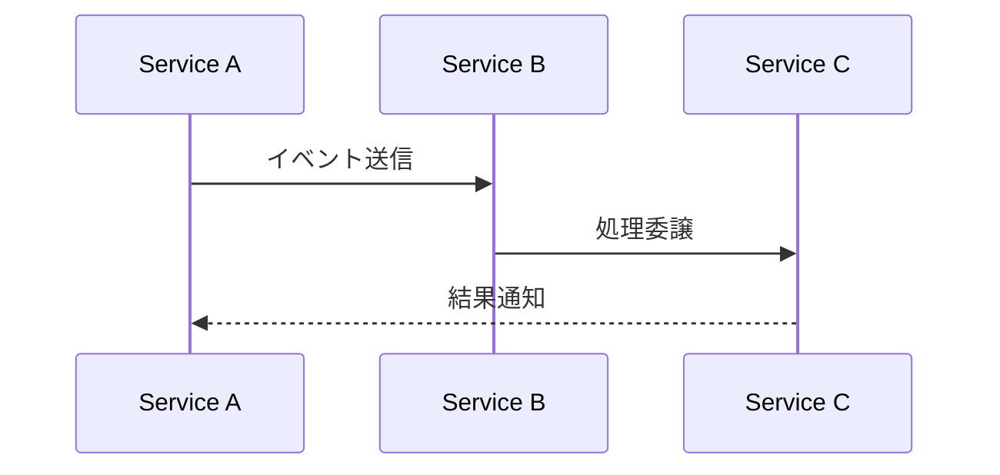

# 統合仕様: {usecase-name}

## 概要
{連携の概要}

## 関与サービス
- **送信側**: {service-name}
- **受信側**: {service-name}
- **仲介**: {service-name}（該当する場合）

## イベントフロー


## メッセージ形式
```json
{
  "eventType": "string",
  "payload": {},
  "metadata": {}
}
```

## エラー処理
- **リトライ戦略**: {戦略}
- **デッドレター**: {処理方法}
- **回復方法**: {手順}

## 監視項目
- メッセージ送信成功率
- レスポンス時間
- エラー発生率