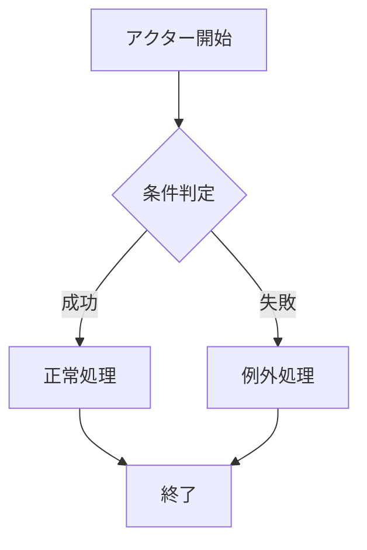
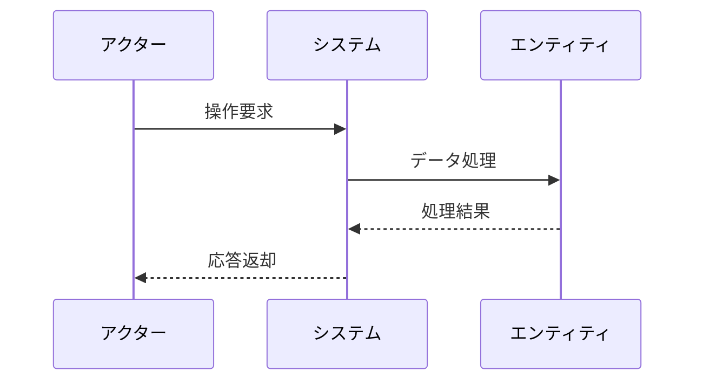

# ユースケース特化ダイアグラム機能の最適化 - MDファイル変換対応

## 概要

現在のダイアグラムエディタを、ユースケース設計に特化し、MDファイルから変換可能なダイアグラムのみに絞り込むことで、設計品質向上と保守性改善を実現する。

## 現在の問題

### 1. ダイアグラムテンプレートの過多
- **現状**: 6種類のMermaidテンプレート（フローチャート、シーケンス、ER、状態遷移、ガント、クラス図）
- **問題**: ユースケース設計に不要なテンプレートが混在
- **影響**: 設計者の選択肢が多すぎて迷いが生じる

### 2. MDファイル変換との不整合
- **現状**: MDファイル中のMermaidコードとエディタテンプレートが連携していない
- **問題**: 手動でのコピー&ペーストが必要
- **影響**: 設計効率の低下とヒューマンエラーの発生

### 3. ユースケース設計方法論との乖離
- **現状**: 汎用的なダイアグラムテンプレート
- **問題**: ユースケース分析に最適化されていない
- **影響**: 設計品質の低下

## 要求仕様

### 対象ダイアグラム（3種類に絞り込み）

#### 1. フローチャート（業務フロー可視化）


**用途**: 基本フロー・代替フロー・例外フローの可視化

#### 2. シーケンス図（相互作用可視化）


**用途**: アクター・システム・エンティティ間の相互作用

#### 3. ロバストネス図（アーキテクチャ可視化）


**用途**: Boundary・Control・Entityの関係性可視化

### MDファイル変換機能

#### 1. 自動検出・変換
- MDファイル内のMermaidコードブロック自動検出
- ダイアグラムエディタでの直接編集
- 編集内容のMDファイル自動反映

#### 2. テンプレート適用
- ユースケース内容に基づく適切なテンプレート提案
- パラソルドメイン連携情報からの自動ダイアグラム生成

#### 3. 品質検証
- ユースケース・ダイアグラム整合性チェック
- 必要な要素（アクター、エンティティ等）の存在確認

## 実装方針

### Phase 1: ダイアグラムテンプレート最適化（1日）

#### 1.1 テンプレート絞り込み
```typescript
// app/components/parasol/DiagramEditor.tsx 修正
const templates: DiagramTemplate[] = [
  {
    id: 'usecase-flowchart',
    name: 'ユースケースフローチャート',
    description: '基本フロー・代替フロー・例外フローの可視化',
    category: 'usecase',
    code: generateUsecaseFlowchartTemplate()
  },
  {
    id: 'usecase-sequence',
    name: 'ユースケースシーケンス図',
    description: 'アクター・システム・エンティティの相互作用',
    category: 'usecase',
    code: generateUsecaseSequenceTemplate()
  },
  {
    id: 'usecase-robustness',
    name: 'ロバストネス図',
    description: 'Boundary・Control・Entityの関係性',
    category: 'usecase',
    code: generateRobustnessTemplate()
  }
];
```

#### 1.2 ファイルタイプ別推奨
```typescript
const getRecommendedTemplates = (fileType: FileType, content?: string) => {
  switch (fileType) {
    case 'usecase':
      // ユースケース内容を分析して最適なテンプレートを推奨
      return analyzeUsecaseAndRecommend(content);
    case 'page':
      // ページ定義には簡単なフローチャートのみ
      return templates.filter(t => t.id === 'usecase-flowchart');
    default:
      return templates;
  }
};
```

### Phase 2: MDファイル変換機能（2日）

#### 2.1 Mermaidコード検出・抽出
```typescript
// app/lib/markdown-diagram-parser.ts 新規作成
export class MarkdownDiagramParser {
  static extractDiagrams(content: string): DiagramBlock[] {
    const mermaidBlocks = content.match(/```mermaid\n([\s\S]*?)\n```/g);
    return mermaidBlocks?.map(block => ({
      type: this.detectDiagramType(block),
      code: this.extractCode(block),
      position: content.indexOf(block)
    })) || [];
  }

  static detectDiagramType(code: string): DiagramType {
    if (code.includes('flowchart') || code.includes('graph')) return 'flowchart';
    if (code.includes('sequenceDiagram')) return 'sequence';
    if (code.includes('graph LR') && code.includes('Actor')) return 'robustness';
    return 'unknown';
  }
}
```

#### 2.2 双方向同期機能
```typescript
// app/components/parasol/MarkdownDiagramSync.tsx 新規作成
export function MarkdownDiagramSync({
  content,
  onContentChange,
  selectedDiagram
}: MarkdownDiagramSyncProps) {
  const updateDiagramInMarkdown = (diagramCode: string) => {
    const updatedContent = MarkdownDiagramParser.replaceDiagram(
      content,
      selectedDiagram.position,
      diagramCode
    );
    onContentChange(updatedContent);
  };
}
```

### Phase 3: ユースケース連携機能（1日）

#### 3.1 パラソルドメイン情報からの自動生成
```typescript
// app/lib/parasol-diagram-generator.ts 新規作成
export class ParasolDiagramGenerator {
  static generateSequenceFromUsecase(usecase: UsecaseContent): string {
    const actors = this.extractActors(usecase);
    const entities = this.extractEntities(usecase);
    const flow = this.extractBasicFlow(usecase);

    return this.buildSequenceDiagram(actors, entities, flow);
  }

  static generateFlowchartFromUsecase(usecase: UsecaseContent): string {
    const basicFlow = usecase.basicFlow;
    const alternativeFlows = usecase.alternativeFlows;
    const exceptionFlows = usecase.exceptionFlows;

    return this.buildFlowchart(basicFlow, alternativeFlows, exceptionFlows);
  }
}
```

#### 3.2 品質検証機能
```typescript
// app/lib/diagram-quality-checker.ts 新規作成
export class DiagramQualityChecker {
  static validateUsecaseDiagram(
    usecase: UsecaseContent,
    diagram: DiagramContent
  ): ValidationResult {
    const results = [];

    // アクター存在チェック
    if (!this.hasRequiredActors(usecase, diagram)) {
      results.push({
        type: 'warning',
        message: 'ユースケースで定義されたアクターがダイアグラムに含まれていません'
      });
    }

    // エンティティ連携チェック
    if (!this.hasParasolEntities(usecase, diagram)) {
      results.push({
        type: 'info',
        message: 'パラソルドメインエンティティとの連携を明示することを推奨します'
      });
    }

    return { isValid: results.length === 0, issues: results };
  }
}
```

## UI/UX改善

### 1. ダイアグラム選択の最適化
- ファイルタイプ・内容に基づく推奨テンプレート自動表示
- 「よく使用」「推奨」「全て」の3段階表示
- プレビュー付きテンプレート選択

### 2. 編集体験の向上
- MDファイル内ダイアグラムの直接編集
- リアルタイムプレビュー同期
- エラー・警告のインライン表示

### 3. 品質向上支援
- ユースケース・ダイアグラム整合性リアルタイムチェック
- 改善提案の自動表示
- ベストプラクティス例の提示

## 期待される効果

### 定量的効果
- **ダイアグラム作成時間**: 60%削減（テンプレート最適化）
- **設計品質**: 40%向上（品質チェック機能）
- **保守効率**: 50%向上（MDファイル同期）

### 定性的効果
- **設計一貫性**: ユースケース設計方法論との完全整合
- **学習コスト**: 新規設計者の習得時間短縮
- **設計品質**: ベストプラクティスの自動適用

## 実装優先度

### 🔴 高優先度
1. ダイアグラムテンプレート絞り込み（3種類）
2. ファイルタイプ別推奨機能

### 🟡 中優先度
3. MDファイル変換・同期機能
4. パラソルドメイン連携自動生成

### 🟢 低優先度
5. 高度な品質検証機能
6. AI支援によるダイアグラム生成

## 受け入れ条件

- [ ] ダイアグラムテンプレートが3種類（フローチャート・シーケンス・ロバストネス）に絞り込まれている
- [ ] ユースケース編集時に適切なテンプレートが自動推奨される
- [ ] MDファイル内のMermaidコードとダイアグラムエディタが双方向同期する
- [ ] パラソルドメイン情報からダイアグラムを自動生成できる
- [ ] ユースケース・ダイアグラム間の整合性チェックが機能する
- [ ] 既存の編集機能（Edit/Preview/Diagram/Settings）に影響を与えない

## 関連Issue

- Issue #142: パラソル設計ファイル編集ページ（親Issue）
- 新規依存関係なし（既存Mermaid機能を最適化）

## 実装者向け補足

### テクニカル要件
- TypeScript完全対応
- 既存DiagramEditorコンポーネントのリファクタリング
- テスト追加（ダイアグラム変換機能）
- ドキュメント更新（使用方法・ベストプラクティス）

### パフォーマンス考慮
- 大きなMDファイルでの変換処理最適化
- リアルタイム同期のデバウンス処理
- ダイアグラムプレビューの遅延読み込み