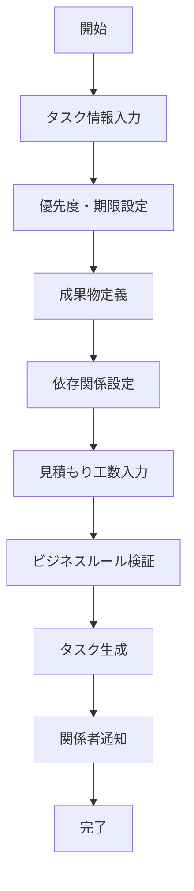
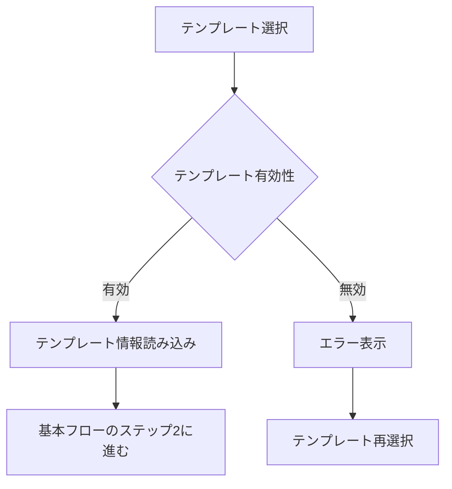
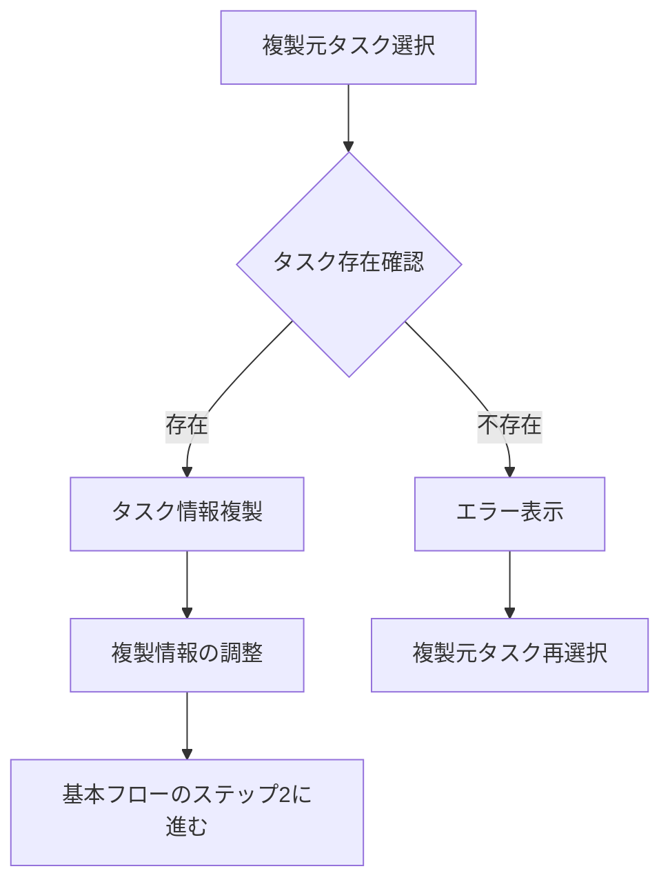
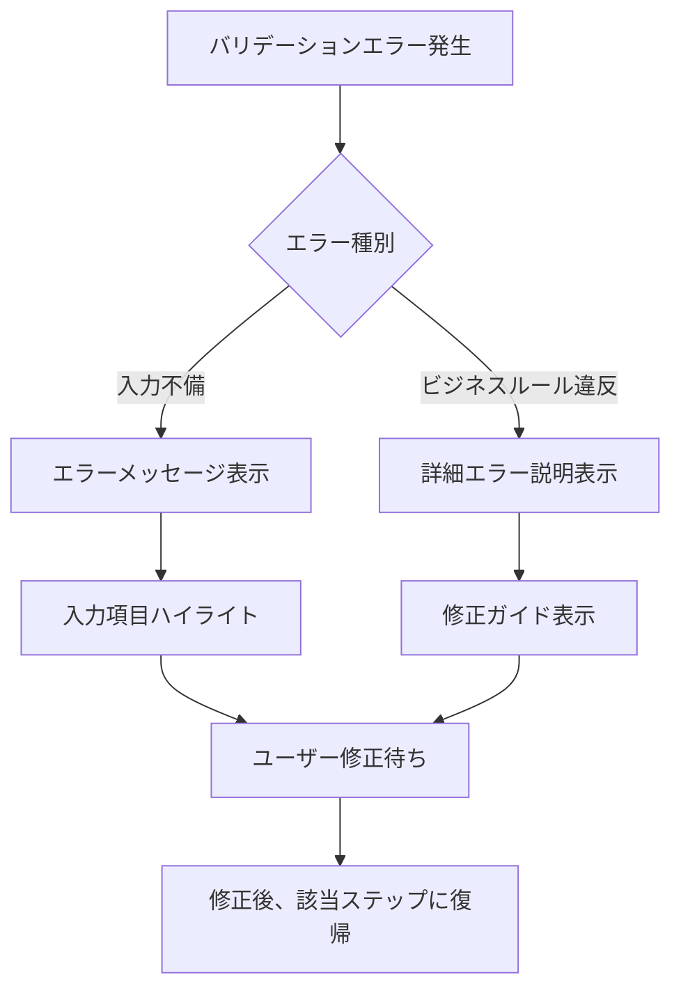
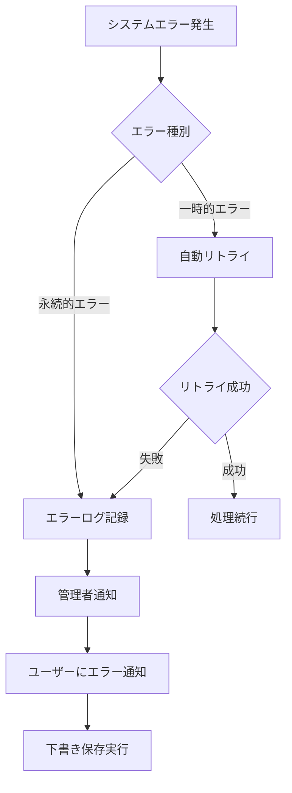

# Operation設計: op-001-create-task

## Operation ID: op-001-create-task

### 基本情報
- **Operation名**: タスク作成
- **所属Capability**: cap-001-task-lifecycle タスクライフサイクル管理能力
- **所属BC**: BC-001 タスク管理
- **操作タイプ**: Command
- **ビジネス価値**: 新しいタスクを適切に定義し、プロジェクトの進行を開始する

### 概要
プロジェクトの作業を具体的なタスクとして定義し、必要な情報を設定してチームでの実行を可能にする操作。作業内容の明確化、優先度と期限の設定、適切な情報提供により、担当者が効率的に作業を開始できる状態を作る。

### 操作の詳細

#### 目的
- プロジェクトの作業を具体的で実行可能なタスクに分割する
- タスクの詳細情報、優先度、期限を適切に設定する
- チームメンバーが理解しやすい形でタスクを定義する
- プロジェクト全体の進行を管理可能な単位に構造化する

#### スコープ
- **含む**:
  - タスク基本情報の定義（タイトル、説明、優先度、期限）
  - 成果物の明確化と品質基準の設定
  - 依存関係と前提条件の整理
  - 見積もり工数の設定
- **含まない**:
  - タスクの割り当て（op-002で実施）
  - 進捗の追跡（op-003で実施）
  - レビューの実施（op-005で実施）

#### トリガー
- **手動トリガー**: プロジェクトマネージャー、チームリーダーによる新規タスク作成要求
- **自動トリガー**: 上位タスク完了時の依存タスク自動生成
- **スケジュールトリガー**: 定期的なメンテナンスタスクの自動生成

### ステークホルダー

#### プライマリアクター
- **ロール**: プロジェクトマネージャー、チームリーダー
- **責任**:
  - タスクの適切な分割と定義
  - 優先度と期限の合理的な設定
  - 成果物の明確化
- **権限**: タスク作成権限（プロジェクトメンバーレベル以上）

#### セカンダリアクター
- **システム**: タスク管理システム、通知システム
- **外部サービス**: プロジェクト管理ツール、カレンダーシステム

#### 受益者
- チームメンバー（明確な作業指示）
- プロジェクト全体（進行管理の基盤）
- 顧客（価値提供の起点）

### プロセスフロー

#### 基本フロー

1. **タスク情報入力**: タスクの基本情報を入力
   - 入力: タイトル、説明、カテゴリ
   - 処理: 入力値の基本検証（必須項目、文字数制限）
   - 出力: 検証済みタスク基本情報

2. **優先度・期限設定**: 優先度と期限を設定
   - 入力: 優先度（High/Medium/Low）、開始日、期限日
   - 処理: 日程の妥当性検証、プロジェクト期間との整合性確認
   - 出力: 検証済み優先度・日程情報

3. **成果物定義**: 期待される成果物と品質基準を定義
   - 入力: 成果物リスト、品質基準、受け入れ条件
   - 処理: 成果物の具体性と測定可能性の確認
   - 出力: 明確化された成果物定義

4. **依存関係設定**: 他タスクとの依存関係を設定
   - 入力: 前提タスク、後続タスク、制約条件
   - 処理: 循環依存の検出、クリティカルパスの確認
   - 出力: 検証済み依存関係

5. **見積もり工数入力**: 必要工数を見積もり
   - 入力: 予想工数、スキルレベル要求、リソース種別
   - 処理: 過去実績との比較、妥当性確認
   - 出力: 検証済み工数見積もり

6. **ビジネスルール検証**: 全体的な整合性を検証
   - 入力: 全タスク情報
   - 処理: 重複チェック、命名規則確認、制約条件検証
   - 出力: 検証結果とエラーリスト

7. **タスク生成**: タスクエンティティを生成し永続化
   - 入力: 検証済み全情報
   - 処理: タスクID生成、エンティティ作成、データベース保存
   - 出力: 生成されたタスク

8. **関係者通知**: 関係者にタスク作成を通知
   - 入力: 生成されたタスク、通知対象者リスト
   - 処理: 通知メッセージ作成、配信
   - 出力: 通知完了確認

#### 代替フロー1: テンプレートから作成

- **分岐点**: 基本フロー ステップ1（タスク情報入力）
- **条件**: ユーザーがテンプレートからの作成を選択

**代替手順**:
1. 利用可能なテンプレート一覧を表示
2. ユーザーが適切なテンプレートを選択
3. テンプレート情報を読み込み、フォームに自動入力
4. 基本フロー ステップ2（優先度・期限設定）に進む

#### 代替フロー2: 既存タスクから複製

- **分岐点**: 基本フロー ステップ1（タスク情報入力）
- **条件**: ユーザーが既存タスクからの複製を選択

**代替手順**:
1. 複製可能なタスク一覧を表示
2. ユーザーが複製元タスクを選択
3. タスク情報を複製（ID、作成日時は除く）
4. タイトルに「コピー」を追加し、調整を促す
5. 基本フロー ステップ2（優先度・期限設定）に進む

#### 例外フロー1: バリデーションエラー

- **発生点**: 各検証ステップ（ステップ2, 4, 6）
- **条件**: 入力データが検証ルールに違反

**例外対応手順**:
1. エラーの種類と原因を特定
2. ユーザーフレンドリーなエラーメッセージを表示
3. 問題のある入力項目をハイライト
4. 修正方法のガイダンスを提供
5. ユーザーが修正後、検証を再実行

#### 例外フロー2: システムエラー

- **発生点**: データベース保存時、外部システム連携時
- **条件**: システム障害、ネットワーク断絶等

**例外対応手順**:
1. エラーの種類を判定（一時的 vs 永続的）
2. 一時的エラーの場合、3回まで自動リトライ
3. 永続的エラーの場合、エラーログを記録
4. 管理者に即座に通知
5. ユーザーに分かりやすいエラーメッセージを表示
6. 入力内容を下書きとして保存し、データ損失を防止

### データ仕様

#### 入力データ
| 項目名 | 型 | 必須 | 説明 | 制約 |
|-------|----|----|------|------|
| title | string | ○ | タスクタイトル | 1-100文字、重複不可 |
| description | string | ○ | タスク説明 | 1-2000文字 |
| category | enum | ○ | タスクカテゴリ | Development/Design/Testing/Documentation |
| priority | enum | ○ | 優先度 | High/Medium/Low |
| startDate | date | × | 開始予定日 | 本日以降、プロジェクト期間内 |
| dueDate | date | ○ | 期限日 | 開始日以降、プロジェクト期間内 |
| estimatedHours | number | ○ | 見積もり工数 | 0.5-160時間 |
| skillLevel | enum | × | 必要スキルレベル | Beginner/Intermediate/Advanced/Expert |
| deliverables | array | ○ | 成果物リスト | 1-10個、各100文字以内 |
| acceptanceCriteria | array | ○ | 受け入れ条件 | 1-10個、各200文字以内 |
| predecessorIds | array | × | 前提タスクID | 循環依存なし |
| tags | array | × | タグ | 最大10個、各20文字以内 |

#### 出力データ
| 項目名 | 型 | 説明 | 備考 |
|-------|----|----|------|
| taskId | uuid | 生成されたタスクID | システム自動生成 |
| status | enum | タスク状態 | 初期値: TODO |
| createdAt | datetime | 作成日時 | システム自動設定 |
| createdBy | uuid | 作成者ID | 現在のユーザーID |
| projectId | uuid | 所属プロジェクトID | コンテキストから取得 |
| version | number | バージョン番号 | 初期値: 1 |

#### 内部データ
| 項目名 | 型 | 説明 | ライフサイクル |
|-------|----|----|------------|
| validationErrors | array | 検証エラー一覧 | 検証中のみ |
| draftData | object | 下書きデータ | エラー時に一時保存 |
| auditLog | array | 操作履歴 | 永続保存 |

### ビジネスルール

#### 必須ルール
1. **タイトル一意性**: 同一プロジェクト内でタスクタイトルは重複不可
2. **期限妥当性**: 期限日は開始日以降、かつプロジェクト期間内である必要
3. **工数妥当性**: 見積もり工数は0.5時間以上、160時間（1ヶ月）以内
4. **依存関係整合性**: 循環依存は禁止、前提タスクは存在するタスクのみ

#### 制約条件
1. **同時作成制限**: 1ユーザーあたり同時に作成できるタスクは5個まで
2. **プロジェクト容量**: 1プロジェクトあたりのタスク総数は1000個まで
3. **権限制御**: タスク作成権限は「メンバー」レベル以上のユーザーのみ

#### バリデーション
1. **タイトル検証**: 空文字・空白のみ・特殊文字の禁止
2. **期限検証**: 過去日・休日・非営業日の警告表示
3. **工数検証**: 過去の類似タスクとの乖離チェック

### 品質要求

#### パフォーマンス
- **応答時間**: タスク作成完了まで3秒以内
- **スループット**: 1分間に50個のタスクを同時作成可能
- **同時実行数**: 100ユーザーが同時にタスク作成操作可能

#### 可用性
- **稼働率**: 99.5%（営業時間内）
- **復旧時間**: 障害発生時5分以内に復旧

#### セキュリティ
- **認証要求**: 有効なセッションとプロジェクトメンバー権限
- **認可要求**: タスク作成権限の確認
- **データ保護**: 入力データの暗号化保存

### UseCase関連

#### 関連UseCase
| UseCase ID | UseCase名 | 関係 | 説明 |
|-----------|----------|------|------|
| uc-001-task-creation | 新規タスク作成 | implements | このOperationが直接実現するUseCase |

#### 実現するUseCase
- **uc-001-task-creation**: 新規タスク作成 - プロジェクトマネージャーによるタスク定義プロセス

### 実装指針

#### 技術要求
- **使用技術**: TypeScript, Next.js Server Actions, Prisma ORM
- **フレームワーク**: React Hook Form + Zod（バリデーション）
- **ライブラリ**: date-fns（日付処理）, uuid（ID生成）

#### アーキテクチャ
- **パターン**: Command Pattern + Domain-Driven Design
- **層構造**: Presentation → Application → Domain → Infrastructure

#### 実装の考慮事項
1. **ドメインモデルの整合性**: Taskエンティティの不変条件を厳密に管理
2. **トランザクション境界**: タスク作成と関連データの整合性を保証
3. **エラーハンドリング**: ユーザーフレンドリーなエラーメッセージ

### テスト設計

#### テストシナリオ
1. **正常系テスト**:
   - 最小限の必須項目でのタスク作成
   - 全項目入力でのタスク作成
   - テンプレートからのタスク作成

2. **異常系テスト**:
   - 必須項目未入力
   - 文字数制限超過
   - 重複タイトル
   - 無効な期限日

3. **境界値テスト**:
   - タイトル文字数（1文字、100文字）
   - 工数（0.5時間、160時間）
   - 成果物数（1個、10個）

#### テストデータ
- **正常データセット**: 典型的なソフトウェア開発タスク
- **異常データセット**: SQL injection攻撃文字列、XSS攻撃文字列
- **境界値データセット**: 制限値ギリギリのデータ

### メトリクス

#### ビジネスメトリクス
- **作成成功率**: タスク作成の成功率（目標: 98%以上）
- **作成効率**: 1つのタスク作成にかかる平均時間（目標: 5分以内）
- **品質指標**: 作成後の修正率（目標: 10%以下）

#### 技術メトリクス
- **応答時間**: API応答時間（目標: 1.5秒以下）
- **エラー率**: システムエラー発生率（目標: 0.1%以下）
- **可用性**: 機能の稼働率（目標: 99.5%以上）

### 依存関係

#### 前提条件
- プロジェクトが作成済みであること
- ユーザーがプロジェクトメンバーとして登録済みであること
- タスク管理システムが正常に稼働していること

#### 他のOperationとの関係
- **後続Operation**: op-002-assign-task（タスク割り当て）
- **関連Operation**: op-003-update-progress（作成後の進捗更新）

### リスクと対策

#### 特定されたリスク
1. **過度な細分化**: タスクを細かく分割しすぎる
   - 対策: 最小工数（0.5時間）の設定と、ガイダンスの提供

2. **不明確な定義**: 成果物や受け入れ条件が曖昧
   - 対策: 具体例の提示と、チェックリストの提供

3. **期限設定の楽観性**: 非現実的な期限設定
   - 対策: 過去実績との比較表示と、警告メッセージ

### 更新履歴
- 2025-11-05: 初版作成（Issue #199対応、MVP版Phase 2.2） - Claude

---

## 実装チェックリスト

### フロントエンド
- [ ] タスク作成フォームのUI実装
- [ ] リアルタイムバリデーション
- [ ] テンプレート選択機能
- [ ] 既存タスク複製機能
- [ ] エラーハンドリングとフィードバック

### バックエンド
- [ ] Taskエンティティの実装
- [ ] バリデーションロジック
- [ ] ビジネスルール検証
- [ ] データベーススキーマ
- [ ] API エンドポイント

### テスト
- [ ] 単体テスト（ドメインロジック）
- [ ] 統合テスト（API）
- [ ] E2Eテスト（UI操作）
- [ ] パフォーマンステスト

このOperation設計により、エンジニアは直接実装に取り組めるレベルの詳細仕様が提供されています。