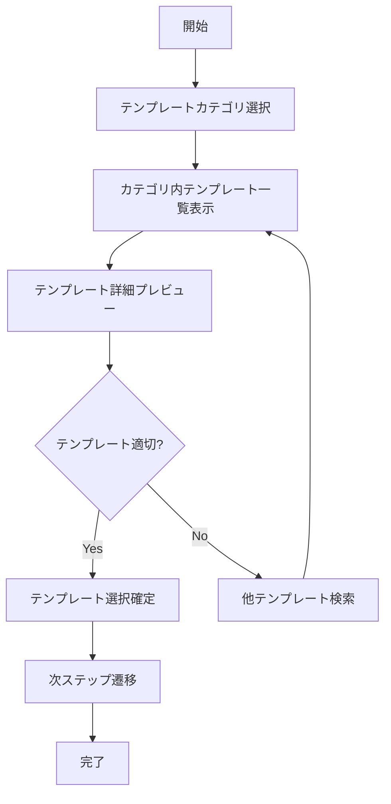
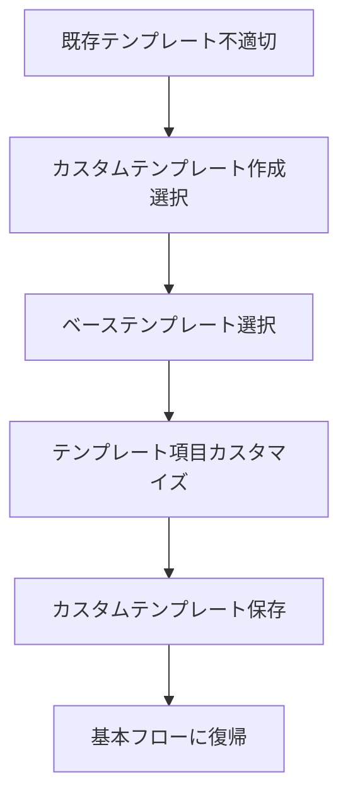
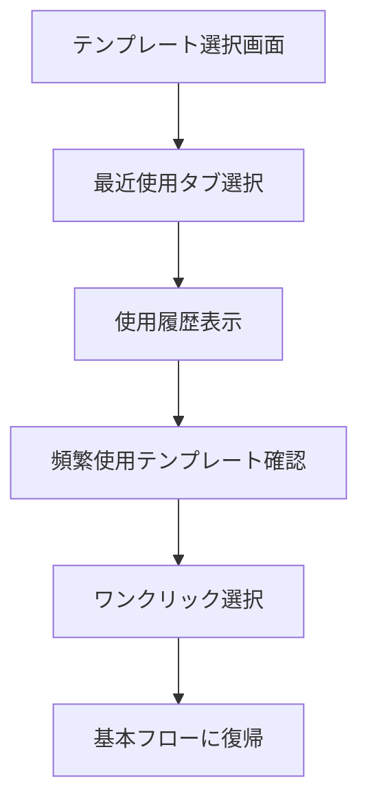
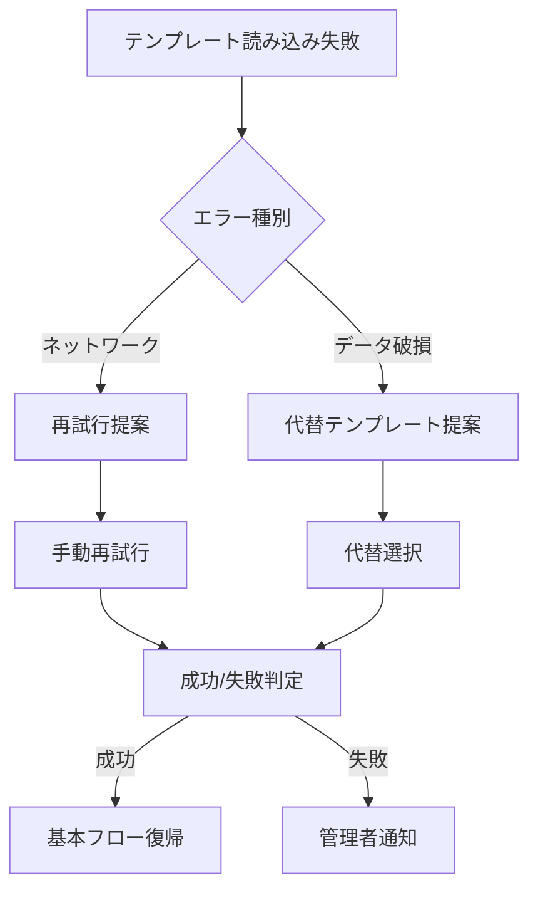

# UC-001: タスクテンプレート選択

## 概要

ユーザーが新しいタスクを作成する際に、目的に応じた適切なタスクテンプレートを選択するユースケース。

## アクター

- **プライマリ**: プロジェクトマネージャー、コンサルタント、チームリーダー
- **セカンダリ**: システム（テンプレート管理）

## 前提条件

- [ ] ユーザーが認証済み
- [ ] プロジェクトへの参加権限を有している
- [ ] タスクテンプレートが設定済み

## 事後条件

- [ ] 適切なタスクテンプレートが選択済み
- [ ] テンプレート内容がプレビュー表示
- [ ] 次のタスク作成ステップに遷移可能

## 基本フロー

### ステップ詳細

1. **カテゴリ選択**: ユーザーがタスクの目的に応じたカテゴリ（開発、設計、レビュー等）を選択
2. **一覧表示**: 選択カテゴリ内の利用可能なテンプレート一覧を表示
3. **詳細プレビュー**: 各テンプレートの構成要素（必須項目、推定工数等）をプレビュー
4. **適切性判断**: ユーザーがテンプレートの適切性を判断
5. **確定**: 最適なテンプレートを選択・確定

## 代替フロー1: カスタムテンプレート作成

**条件**: 既存テンプレートが要件に合わない場合

## 代替フロー2: 最近使用テンプレート選択

**条件**: ユーザーが過去に同様のタスクを作成している場合

## 例外フロー1: テンプレート読み込みエラー

## ビジネスルール

### BR-001: テンプレート表示優先度
- 最近使用したテンプレートを上位表示
- プロジェクト種別に適したテンプレートを推奨表示
- 組織内で高評価のテンプレートを強調表示

### BR-002: テンプレート適用制限
- プロジェクトフェーズに応じたテンプレートのみ表示
- ユーザーロールに応じた権限チェック
- 必須項目が設定されていないテンプレートは警告表示

## 非機能要件

### パフォーマンス
- テンプレート一覧の表示時間: 2秒以内
- プレビュー表示の応答時間: 1秒以内

### ユーザビリティ
- テンプレート検索機能の提供
- カテゴリ分類による直感的なナビゲーション
- テンプレート評価・フィードバック機能

## テストケース

### TC-001: 正常系 - 標準テンプレート選択
1. 開発カテゴリを選択
2. 「機能開発」テンプレートを選択
3. プレビューで内容確認
4. テンプレート確定

### TC-002: 代替系 - カスタムテンプレート
1. 既存テンプレート確認
2. 要件に合わないため「カスタム作成」選択
3. ベーステンプレート選択
4. 項目カスタマイズ実行
5. 新テンプレート保存・適用

### TC-003: 例外系 - ネットワークエラー
1. テンプレート読み込み中にネットワーク断
2. エラーメッセージ表示
3. 再試行ボタンクリック
4. 正常に読み込み完了

## 関連ページ

- **P-001**: タスクテンプレート選択ページ
- **P-002**: テンプレートプレビューページ
- **P-003**: カスタムテンプレート作成ページ

## メトリクス

- テンプレート選択完了率: 95%以上
- 平均選択時間: 30秒以内
- テンプレート満足度: 4.0/5.0以上
- カスタマイズ利用率: 20%以下

## 更新履歴

| バージョン | 更新日 | 更新者 | 更新内容 |
|-----------|--------|---------|----------|
| 1.0 | 2024-11-05 | Claude Code | 初版作成 |