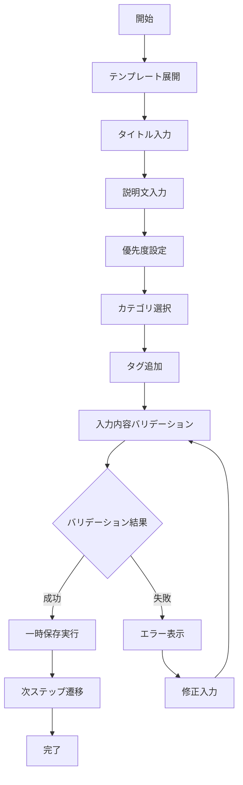
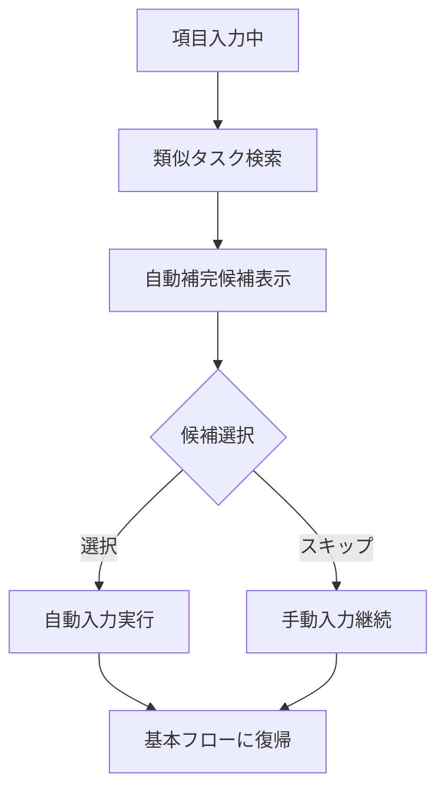
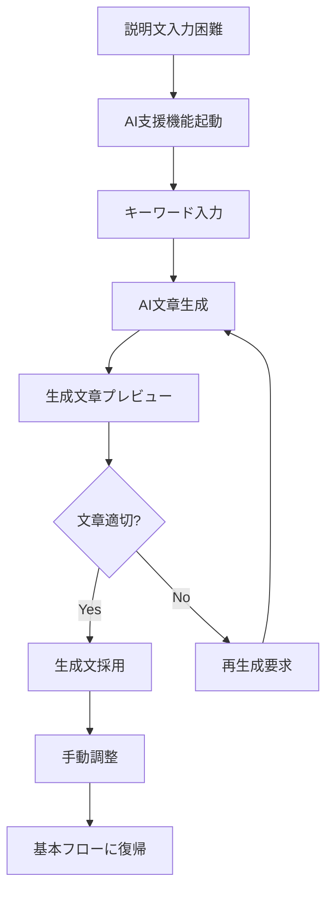
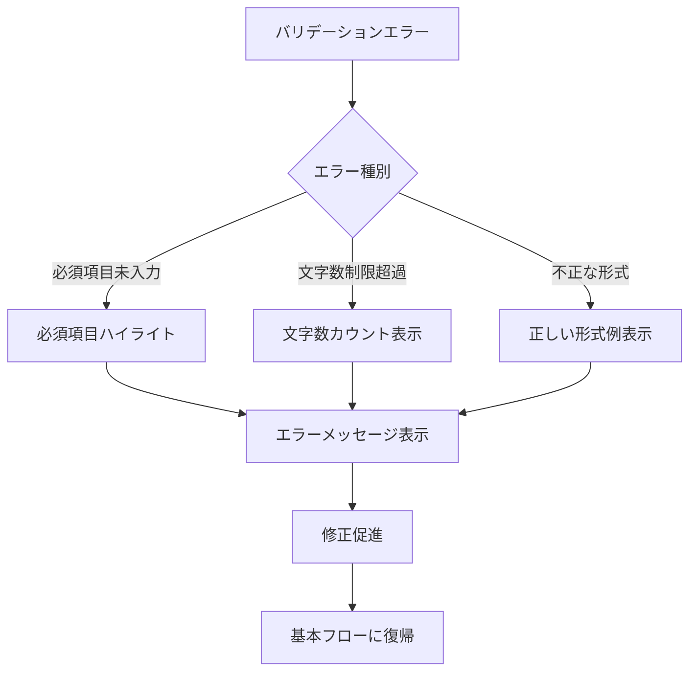
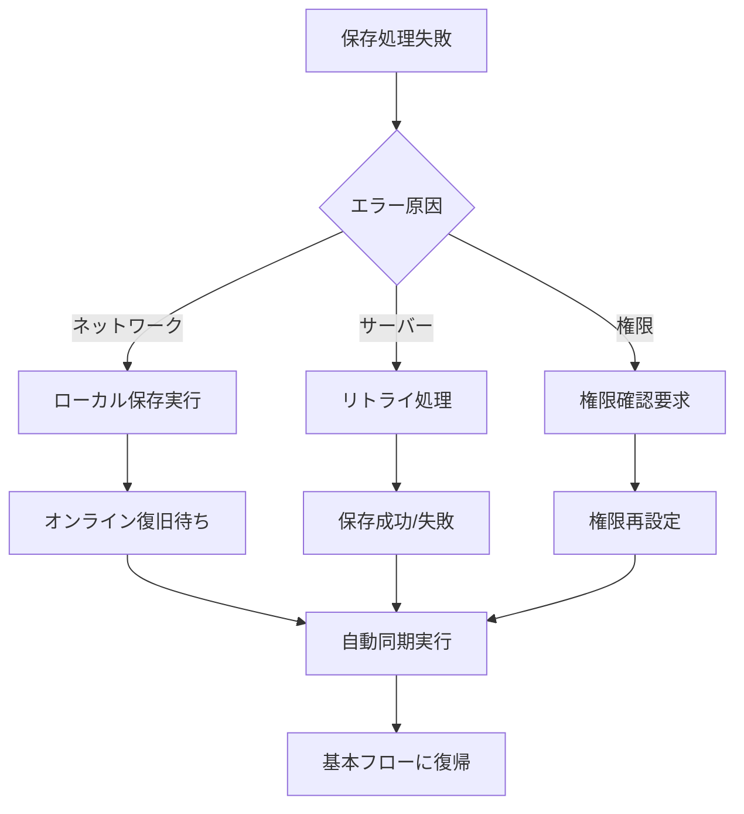

# UC-002: 基本情報入力

## 概要

選択されたタスクテンプレートに基づいて、タスクの基本情報（タイトル、説明、優先度等）を入力するユースケース。

## アクター

- **プライマリ**: プロジェクトマネージャー、コンサルタント、チームリーダー
- **セカンダリ**: システム（バリデーション、自動補完）

## 前提条件

- [ ] タスクテンプレートが選択済み
- [ ] ユーザーが認証済み
- [ ] プロジェクトコンテキストが設定済み

## 事後条件

- [ ] タスク基本情報が入力済み
- [ ] バリデーションが完了
- [ ] 一時保存が実行済み

## 基本フロー



### ステップ詳細

1. **テンプレート展開**: 選択されたテンプレートの項目がフォームに展開される
2. **タイトル入力**: 明確で具体的なタスクタイトルを入力
3. **説明文入力**: タスクの目的、範囲、成果物を詳細に記述
4. **優先度設定**: 緊急度と重要度を考慮した優先度を設定
5. **カテゴリ選択**: タスクの種別（開発、設計、テスト等）を選択
6. **タグ追加**: 検索・フィルタリング用のタグを追加
7. **バリデーション**: 入力内容の妥当性をチェック
8. **一時保存**: 入力内容を一時保存し、作業継続を保証

## 代替フロー1: 自動補完機能活用



**条件**: 過去に類似したタスクが存在する場合

## 代替フロー2: AI支援入力



**条件**: ユーザーが詳細な説明文の記述に困難を感じる場合

## 例外フロー1: 入力データ検証エラー



## 例外フロー2: システムエラー



## ビジネスルール

### BR-001: 必須項目定義
- タイトル: 5文字以上、100文字以内
- 説明: 20文字以上、2000文字以内
- 優先度: 高/中/低の3段階必須選択
- カテゴリ: プロジェクト定義カテゴリから選択必須

### BR-002: 自動補完ルール
- 同一プロジェクト内の類似タスクを優先表示
- 過去30日以内の作成タスクから学習
- ユーザー個人の入力パターンを学習・反映

### BR-003: AI支援制限
- 機密プロジェクトでは外部AI利用を制限
- 生成内容は必ずユーザー確認・編集を経る
- AI利用ログを監査対象として記録

## 非機能要件

### パフォーマンス
- フォーム表示時間: 1秒以内
- 自動補完候補表示: 0.5秒以内
- 一時保存実行時間: 2秒以内

### ユーザビリティ
- 入力途中での自動保存（30秒間隔）
- リアルタイムバリデーション
- 入力内容の文字数カウント表示

### セキュリティ
- 入力内容のサニタイゼーション
- SQLインジェクション対策
- 機密情報の暗号化保存

## テストケース

### TC-001: 正常系 - 基本情報完全入力
1. テンプレートから全項目が展開される
2. タイトル「顧客管理システム ログイン機能開発」入力
3. 詳細説明を100文字以上で入力
4. 優先度「高」を選択
5. カテゴリ「開発」を選択
6. タグ「認証, セキュリティ」を追加
7. バリデーション成功
8. 一時保存完了

### TC-002: 代替系 - 自動補完活用
1. タイトル入力開始「顧客管理...」
2. 類似タスク候補が表示される
3. 「顧客管理システム データベース設計」を選択
4. 自動入力された内容を確認・調整
5. 残り項目を入力完了

### TC-003: 例外系 - 必須項目未入力
1. タイトルのみ入力し次ステップ遷移試行
2. 必須項目（説明、優先度）未入力エラー
3. 該当項目がハイライト表示
4. エラーメッセージ確認
5. 必須項目入力完了
6. バリデーション成功

## 関連ページ

- **P-004**: 基本情報入力ページ
- **P-005**: 自動補完候補表示ページ
- **P-006**: バリデーションエラー表示ページ

## インターフェース定義

### TaskBasicInfo
```typescript
interface TaskBasicInfo {
  title: string;           // 5-100文字
  description: string;     // 20-2000文字
  priority: 'HIGH' | 'MEDIUM' | 'LOW';
  category: string;        // プロジェクト定義カテゴリ
  tags: string[];          // 最大10個
  templateId: string;      // 使用テンプレートID
  projectId: string;       // 所属プロジェクトID
}
```

### AutoComplete
```typescript
interface AutoCompleteCandidate {
  taskId: string;
  title: string;
  description: string;
  similarity: number;      // 0.0-1.0
  lastUsed: Date;
}
```

## メトリクス

- 入力完了率: 90%以上
- 平均入力時間: 3分以内
- 自動補完活用率: 40%以上
- バリデーションエラー発生率: 15%以下
- 一時保存成功率: 99%以上

## 更新履歴

| バージョン | 更新日 | 更新者 | 更新内容 |
|-----------|--------|---------|----------|
| 1.0 | 2024-11-05 | Claude Code | 初版作成 |