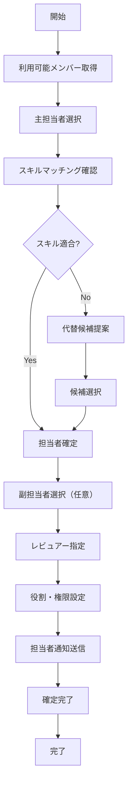
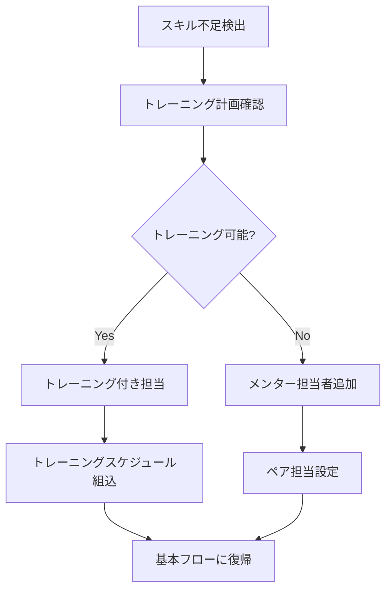
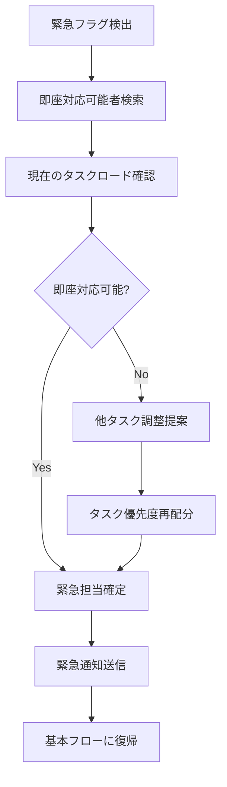
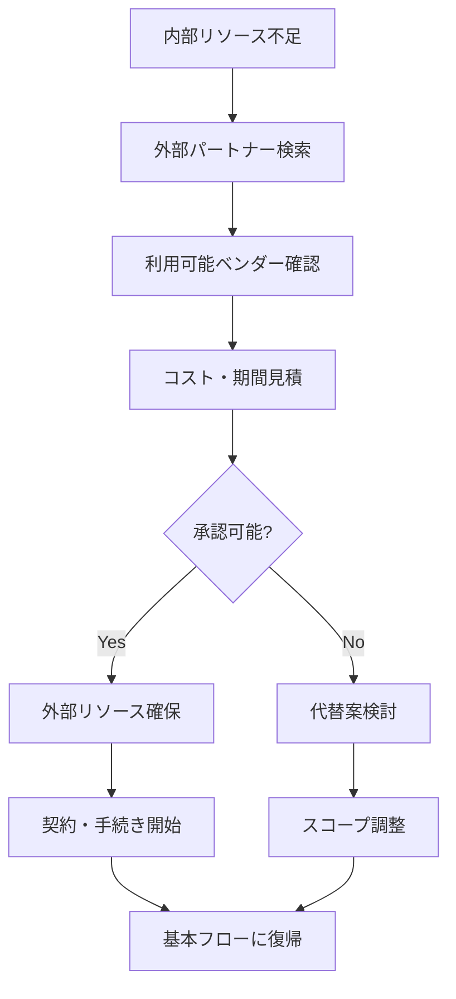
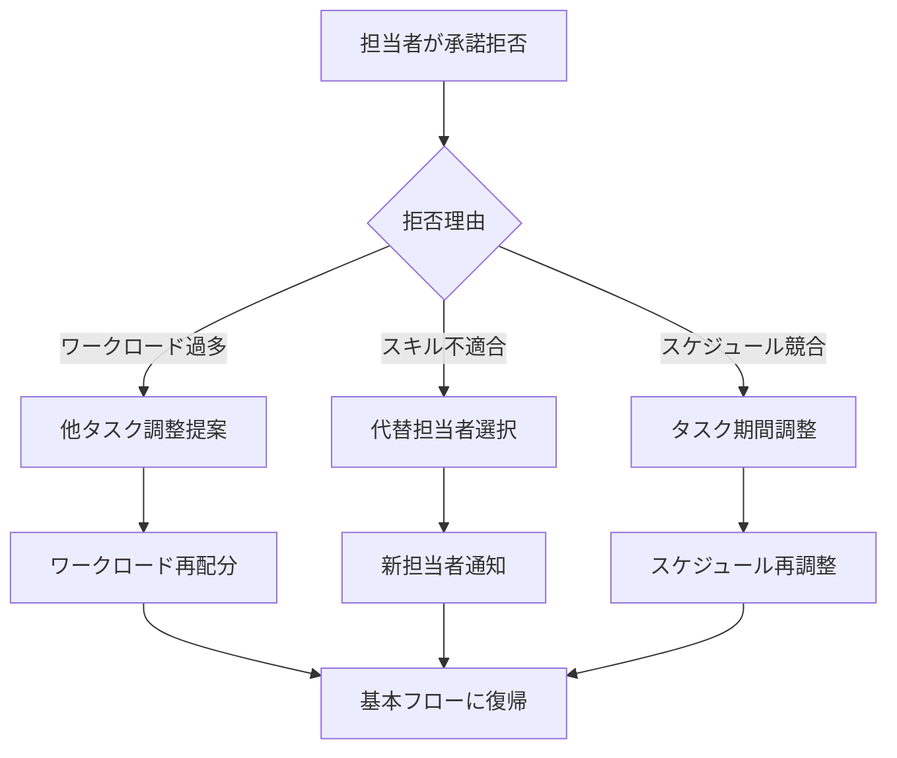
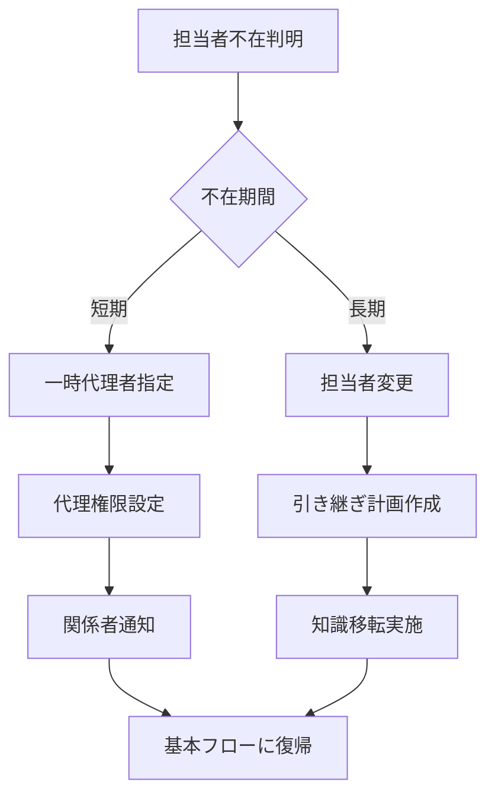

# UC-003: 担当者指定

## 概要

タスクの実行責任者と関係者を指定し、役割と権限を明確化するユースケース。

## アクター

- **プライマリ**: プロジェクトマネージャー、チームリーダー
- **セカンダリ**: システム（リソース管理、通知）、指定される担当者

## 前提条件

- [ ] タスク基本情報が入力済み
- [ ] プロジェクトメンバー情報が利用可能
- [ ] ユーザーに担当者指定権限がある

## 事後条件

- [ ] 主担当者が指定済み
- [ ] 副担当者（必要に応じて）が指定済み
- [ ] レビュアーが指定済み
- [ ] 担当者への通知が送信済み

## 基本フロー



### ステップ詳細

1. **メンバー取得**: プロジェクト参加メンバーの一覧と現在のワークロードを取得
2. **主担当者選択**: タスクの実行責任を持つメインの担当者を選択
3. **スキルマッチング**: 担当者のスキルとタスク要件の適合性を確認
4. **適合性判定**: システムがスキルマッチングの結果を評価
5. **担当者確定**: 選択された担当者の確定処理
6. **副担当者選択**: 複雑なタスクの場合、サポート担当者を選択
7. **レビュアー指定**: 成果物の品質チェック担当者を指定
8. **役割権限設定**: 各担当者の具体的な役割と権限を設定
9. **通知送信**: 関係者全員にタスク担当通知を送信

## 代替フロー1: スキル不足の場合



**条件**: 選択された担当者のスキルがタスク要件に若干不足している場合

## 代替フロー2: 緊急タスクの場合



**条件**: タスクが緊急として分類されている場合

## 代替フロー3: 外部リソース活用



**条件**: プロジェクト内部に適切なリソースが存在しない場合

## 例外フロー1: 担当者承諾拒否



## 例外フロー2: 担当者離任・休暇



## ビジネスルール

### BR-001: 担当者選択制約
- 主担当者は必須（1名）
- 副担当者は任意（最大2名）
- レビュアーは異なる部署から選択推奨
- プロジェクトマネージャーは自動で関係者に追加

### BR-002: スキルマッチング基準
- 必須スキル: 100%マッチ必要
- 推奨スキル: 70%以上マッチ推奨
- 経験年数: タスク複雑度に応じた最低基準
- 言語要件: プロジェクト要件に応じてチェック

### BR-003: ワークロード制限
- 1人あたり同時並行タスク: 最大5個
- 高優先度タスク: 最大3個まで
- 緊急タスク: 即座対応のため他タスク一時停止可

## 非機能要件

### パフォーマンス
- メンバー一覧表示: 1秒以内
- スキルマッチング計算: 2秒以内
- 担当者確定処理: 3秒以内

### ユーザビリティ
- 担当者検索・フィルタリング機能
- スキルマッチング度の視覚化
- ワークロード状況の色分け表示

### 通知
- 担当者への即座通知（メール、Slack等）
- 関係者への状況共有
- 承諾・拒否の回答期限設定

## テストケース

### TC-001: 正常系 - 適切な担当者指定
1. 利用可能メンバー一覧表示
2. 要求スキルに適合する担当者を選択
3. スキルマッチング95%を確認
4. 主担当者確定
5. レビュアー指定
6. 担当者に通知送信
7. 承諾確認完了

### TC-002: 代替系 - スキル不足対応
1. 担当者候補選択
2. スキルマッチング60%（不足）
3. トレーニング計画の提案表示
4. トレーニング付き担当として確定
5. メンター担当者自動提案
6. ペア担当として設定完了

### TC-003: 例外系 - 担当者承諾拒否
1. 担当者に通知送信
2. 担当者が「ワークロード過多」で拒否
3. 現在のタスク負荷確認
4. 他タスクの優先度調整提案
5. 調整後に再度担当要請
6. 承諾確認完了

## 関連ページ

- **P-007**: 担当者選択ページ
- **P-008**: スキルマッチング表示ページ
- **P-009**: 役割・権限設定ページ
- **P-010**: 担当者通知確認ページ

## インターフェース定義

### TaskAssignment
```typescript
interface TaskAssignment {
  taskId: string;
  primaryAssignee: AssigneeInfo;
  secondaryAssignees: AssigneeInfo[];
  reviewers: AssigneeInfo[];
  createdBy: string;
  assignedAt: Date;
  acceptanceDeadline: Date;
}

interface AssigneeInfo {
  userId: string;
  role: 'PRIMARY' | 'SECONDARY' | 'REVIEWER';
  skillMatch: number;          // 0.0-1.0
  currentWorkload: number;     // 0-100%
  estimatedCapacity: number;   // hours/week
  acceptanceStatus: 'PENDING' | 'ACCEPTED' | 'REJECTED';
}
```

### SkillMatching
```typescript
interface SkillMatchResult {
  overall: number;             // 0.0-1.0
  requiredSkills: SkillMatch[];
  recommendedSkills: SkillMatch[];
  missingSkills: string[];
  trainingOptions: TrainingOption[];
}

interface SkillMatch {
  skillName: string;
  required: boolean;
  userLevel: number;           // 1-5
  requiredLevel: number;       // 1-5
  match: number;               // 0.0-1.0
}
```

## メトリクス

- 担当者確定成功率: 95%以上
- 平均担当者選択時間: 2分以内
- スキルマッチング精度: 85%以上
- 担当者承諾率: 90%以上
- 通知送信成功率: 99%以上

## 更新履歴

| バージョン | 更新日 | 更新者 | 更新内容 |
|-----------|--------|---------|----------|
| 1.0 | 2024-11-05 | Claude Code | 初版作成 |