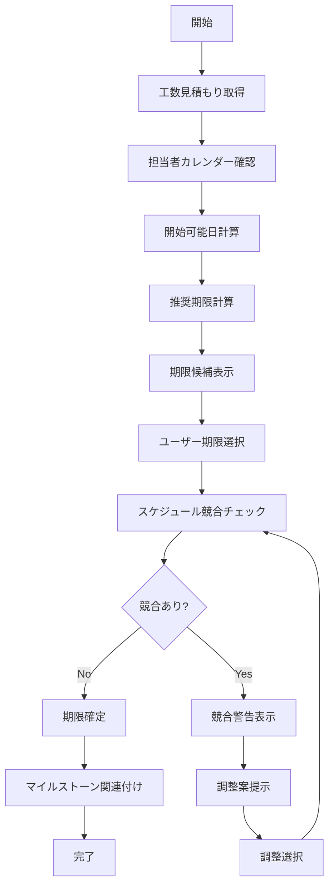
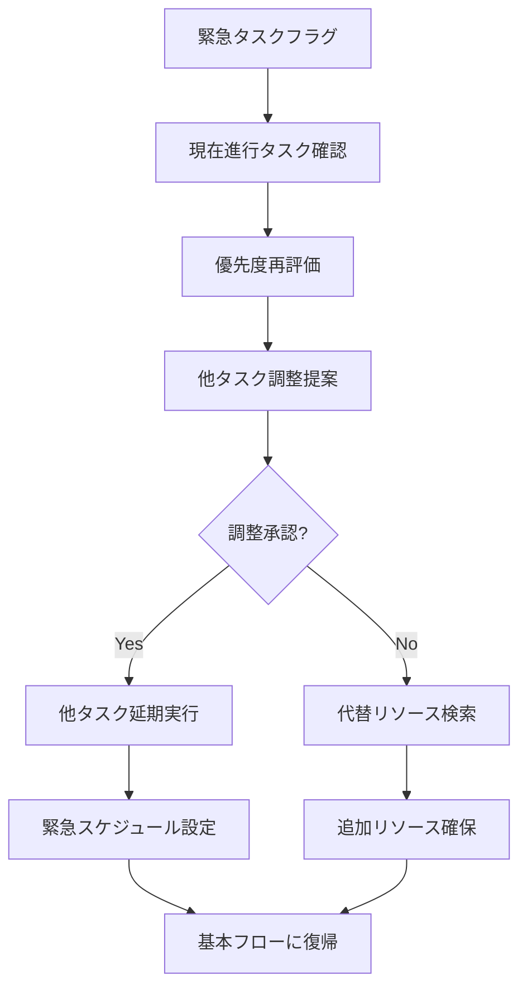
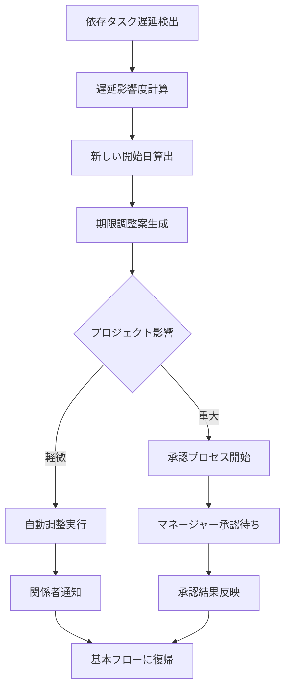
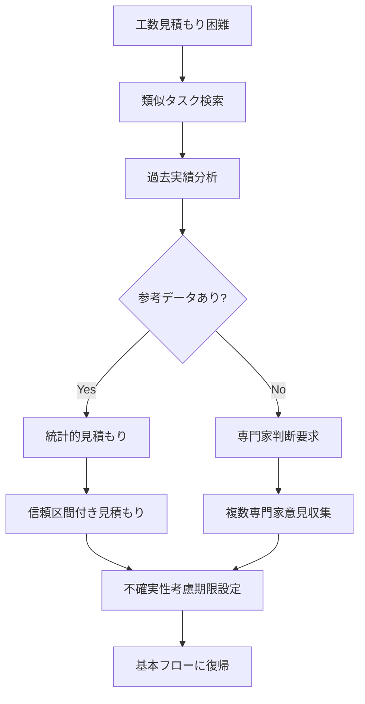
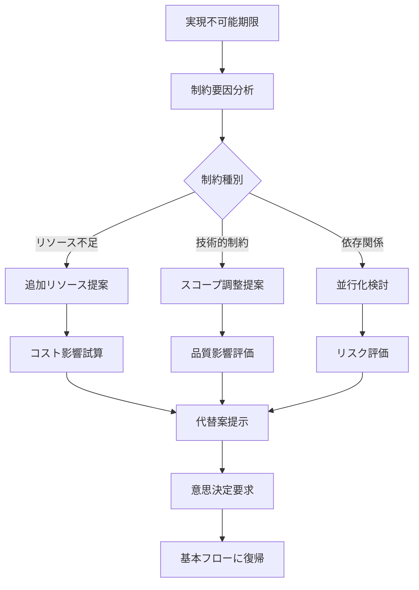
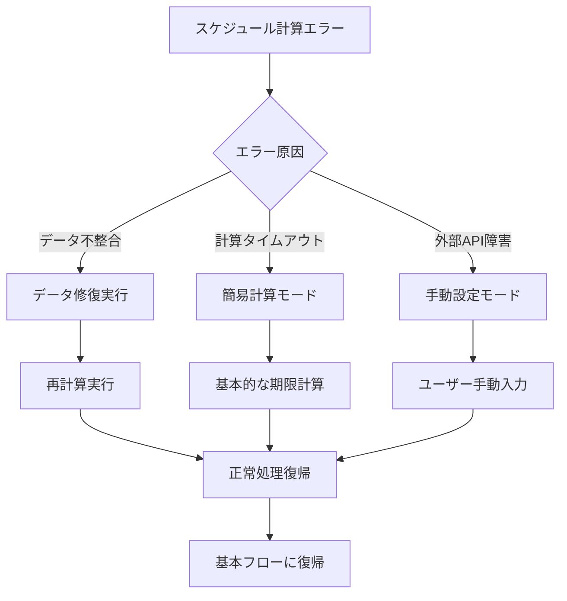

# UC-004: 期限設定

## 概要

タスクの適切な期限を設定し、プロジェクトスケジュールとの整合性を確保するユースケース。

## アクター

- **プライマリ**: プロジェクトマネージャー、チームリーダー
- **セカンダリ**: システム（スケジュール管理、リソース計算）

## 前提条件

- [ ] タスク基本情報が入力済み
- [ ] 担当者が指定済み
- [ ] プロジェクトスケジュールが設定済み
- [ ] 工数見積もりが利用可能

## 事後条件

- [ ] 開始予定日が設定済み
- [ ] 完了期限が設定済み
- [ ] マイルストーンとの関連付け完了
- [ ] スケジュール競合がチェック済み

## 基本フロー



### ステップ詳細

1. **工数見積もり取得**: タスクの想定工数をテンプレートや過去実績から取得
2. **カレンダー確認**: 担当者の稼働可能日と既存タスクのスケジュールを確認
3. **開始可能日計算**: 依存タスクと担当者の空き状況から最早開始日を計算
4. **推奨期限計算**: 工数と稼働率を考慮した現実的な完了期限を算出
5. **期限候補表示**: 推奨期限、余裕を持った期限、タイトな期限の選択肢を提示
6. **期限選択**: ユーザーが最適と判断する期限を選択
7. **競合チェック**: 他タスクやリソースとの競合を検証
8. **期限確定**: 競合がない場合の期限確定処理
9. **マイルストーン関連付け**: プロジェクトマイルストーンとの関連を設定

## 代替フロー1: 緊急タスクの場合



**条件**: タスクが緊急として分類されている場合

## 代替フロー2: 依存タスクの遅延



**条件**: 前提となる依存タスクが遅延している場合

## 代替フロー3: 工数見積もり不確実



**条件**: 新技術や未経験領域でのタスクの場合

## 例外フロー1: 不可能な期限要求



## 例外フロー2: システム障害



## ビジネスルール

### BR-001: 期限設定制約
- 最短期限: 作業時間として最低4時間は確保
- 最長期限: プロジェクト終了日を超えない
- 営業日ベース: 土日祝日は作業日としてカウントしない
- バッファ設定: 見積もり工数の20%のバッファを推奨

### BR-002: 優先度による調整
- 高優先度: 他タスクの調整を優先的に検討
- 中優先度: 標準的なスケジューリング
- 低優先度: 他タスクの隙間時間を活用

### BR-003: マイルストーン連携
- マイルストーン期限の2日前までにタスク完了
- クリティカルパス上のタスクは遅延不可
- マイルストーン変更時は関連タスクも自動調整

## 非機能要件

### パフォーマンス
- スケジュール計算処理: 3秒以内
- 競合チェック処理: 2秒以内
- 期限候補表示: 1秒以内

### 精度
- 工数見積もり精度: ±20%以内
- 期限予測精度: 85%以上
- 競合検出精度: 95%以上

### ユーザビリティ
- カレンダー形式での期限選択
- ガントチャートでの依存関係表示
- 期限調整時の影響範囲可視化

## テストケース

### TC-001: 正常系 - 標準期限設定
1. 工数見積もり8時間のタスク
2. 担当者の稼働率80%確認
3. 開始可能日: 翌日
4. 推奨期限: 開始から2日後
5. 競合なしを確認
6. 期限確定完了

### TC-002: 代替系 - 緊急タスク対応
1. 緊急フラグ付きタスク作成
2. 現在進行中タスクとの競合検出
3. 他タスク延期提案表示
4. マネージャー承認取得
5. 緊急スケジュール確定
6. 関係者への影響通知

### TC-003: 例外系 - 不可能期限対応
1. 1週間の作業を1日で完了要求
2. 実現不可能判定
3. 制約要因（工数不足）表示
4. 追加リソース投入案提示
5. コスト2倍の影響試算
6. 代替案選択による期限再設定

## 関連ページ

- **P-011**: 期限設定ページ
- **P-012**: スケジュール競合表示ページ
- **P-013**: 工数見積もり確認ページ
- **P-014**: マイルストーン関連付けページ

## インターフェース定義

### TaskSchedule
```typescript
interface TaskSchedule {
  taskId: string;
  estimatedHours: number;
  startDate: Date;
  dueDate: Date;
  workingDaysOnly: boolean;
  bufferHours: number;
  confidence: number;         // 0.0-1.0
  dependencies: TaskDependency[];
  milestones: string[];
}

interface TaskDependency {
  dependentTaskId: string;
  dependencyType: 'FINISH_TO_START' | 'START_TO_START' | 'FINISH_TO_FINISH';
  lagDays: number;
}
```

### ScheduleConflict
```typescript
interface ScheduleConflict {
  conflictType: 'RESOURCE' | 'DEPENDENCY' | 'MILESTONE';
  conflictingTaskId: string;
  conflictPeriod: {
    start: Date;
    end: Date;
  };
  severity: 'LOW' | 'MEDIUM' | 'HIGH' | 'CRITICAL';
  resolutionOptions: ResolutionOption[];
}

interface ResolutionOption {
  type: 'RESCHEDULE' | 'REASSIGN' | 'ADD_RESOURCE' | 'ADJUST_SCOPE';
  description: string;
  impact: {
    cost: number;
    timeline: number;
    quality: number;
  };
}
```

## メトリクス

- 期限設定成功率: 95%以上
- 期限予測精度: 85%以上
- 平均設定時間: 2分以内
- スケジュール競合検出率: 95%以上
- 期限遵守率: 80%以上（設定後の実績）

## 更新履歴

| バージョン | 更新日 | 更新者 | 更新内容 |
|-----------|--------|---------|----------|
| 1.0 | 2024-11-05 | Claude Code | 初版作成 |