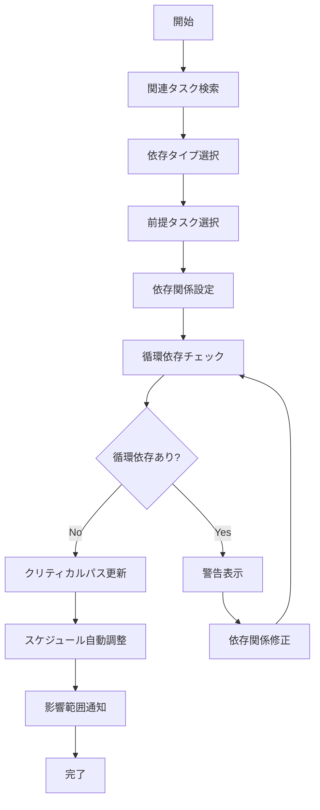
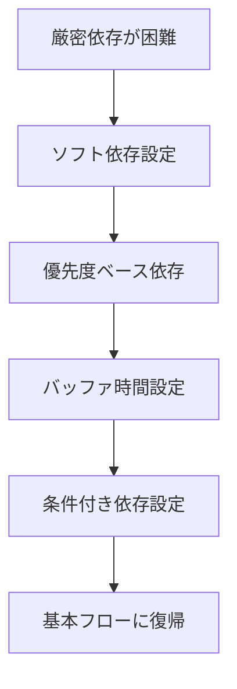
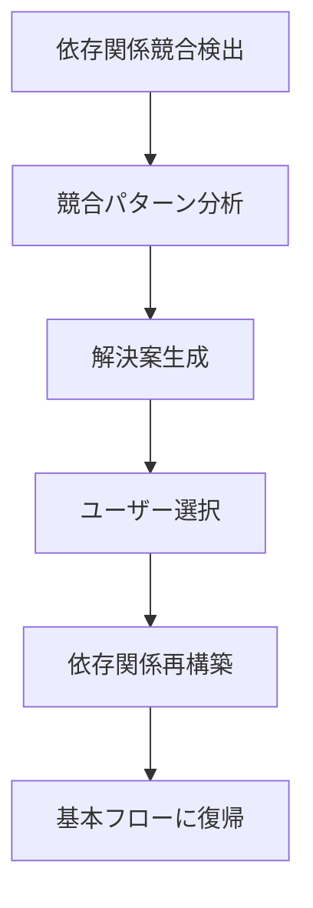

# UC-005: 依存関係設定

## 概要

タスク間の依存関係を定義し、適切な実行順序とスケジューリングを確保するユースケース。

## アクター

- **プライマリ**: プロジェクトマネージャー、テクニカルリード
- **セカンダリ**: システム（依存関係管理、スケジュール調整）

## 前提条件

- [ ] タスク基本情報が入力済み
- [ ] 関連する他タスクが存在
- [ ] プロジェクト構造が定義済み

## 事後条件

- [ ] 前提タスクが設定済み
- [ ] 後続タスクが設定済み
- [ ] 依存関係の整合性がチェック済み
- [ ] スケジュールが自動調整済み

## 基本フロー



## 代替フロー1: 柔軟な依存関係



## 例外フロー1: 依存関係競合



## インターフェース定義

```typescript
interface TaskDependency {
  sourceTaskId: string;
  targetTaskId: string;
  dependencyType: 'FINISH_TO_START' | 'START_TO_START' | 'FINISH_TO_FINISH' | 'START_TO_FINISH';
  lagTime: number; // days
  leadTime: number; // days
  isCritical: boolean;
  flexibility: 'STRICT' | 'FLEXIBLE' | 'SOFT';
}
```

## 関連ページ

- **P-015**: 依存関係設定ページ
- **P-016**: 依存関係可視化ページ

## メトリクス

- 依存関係設定成功率: 95%以上
- 循環依存検出精度: 100%
- スケジュール調整時間: 5秒以内

## 更新履歴

| バージョン | 更新日 | 更新者 | 更新内容 |
|-----------|--------|---------|----------|
| 1.0 | 2024-11-05 | Claude Code | 初版作成 |