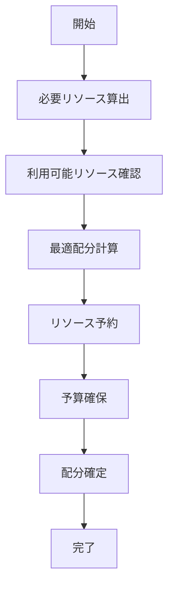

# UC-006: リソース配分

## 概要

タスク実行に必要なリソース（人員、機材、予算等）を適切に配分し、プロジェクト全体の効率性を最大化するユースケース。

## アクター

- **プライマリ**: プロジェクトマネージャー、リソースマネージャー
- **セカンダリ**: システム（リソース管理、予算管理）

## 前提条件

- [ ] タスクの工数見積もりが完了
- [ ] 担当者が指定済み
- [ ] 利用可能リソースが登録済み

## 事後条件

- [ ] 人的リソースが配分済み
- [ ] 物的リソースが予約済み
- [ ] 予算が割り当て済み
- [ ] リソース競合が解決済み

## 基本フロー



## インターフェース定義

```typescript
interface ResourceAllocation {
  taskId: string;
  humanResources: HumanResource[];
  physicalResources: PhysicalResource[];
  budgetAllocation: BudgetAllocation;
  allocationDate: Date;
  validUntil: Date;
}

interface HumanResource {
  userId: string;
  allocatedHours: number;
  hourlyRate: number;
  role: string;
}
```

## 関連ページ

- **P-017**: リソース配分ページ
- **P-018**: リソース競合解決ページ

## メトリクス

- リソース配分効率: 90%以上
- 予算超過率: 5%以下

## 更新履歴

| バージョン | 更新日 | 更新者 | 更新内容 |
|-----------|--------|---------|----------|
| 1.0 | 2024-11-05 | Claude Code | 初版作成 |