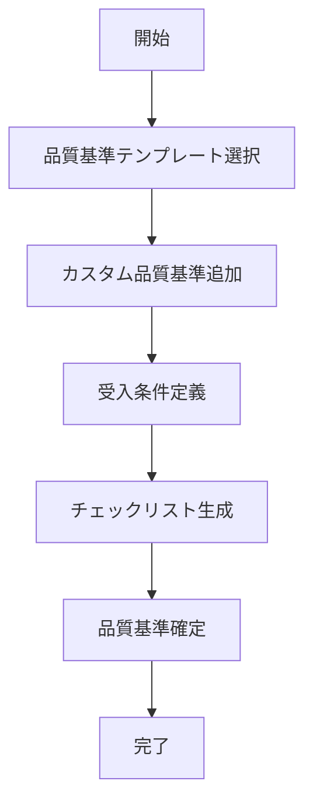

# UC-007: 品質基準設定

## 概要

タスクの成果物に対する品質基準と受入条件を明確に定義するユースケース。

## アクター

- **プライマリ**: プロジェクトマネージャー、品質管理者
- **セカンダリ**: システム（品質チェック）

## 前提条件

- [ ] タスクの成果物が明確
- [ ] 品質基準テンプレートが利用可能

## 事後条件

- [ ] 品質基準が設定済み
- [ ] 受入条件が明確化済み
- [ ] チェックリストが生成済み

## 基本フロー



## インターフェース定義

```typescript
interface QualityCriteria {
  taskId: string;
  criteria: QualityItem[];
  acceptanceCriteria: AcceptanceCriterion[];
  checklistItems: ChecklistItem[];
}

interface QualityItem {
  name: string;
  description: string;
  measurable: boolean;
  threshold: number;
  unit: string;
}
```

## 関連ページ

- **P-019**: 品質基準設定ページ

## 更新履歴

| バージョン | 更新日 | 更新者 | 更新内容 |
|-----------|--------|---------|----------|
| 1.0 | 2024-11-05 | Claude Code | 初版作成 |