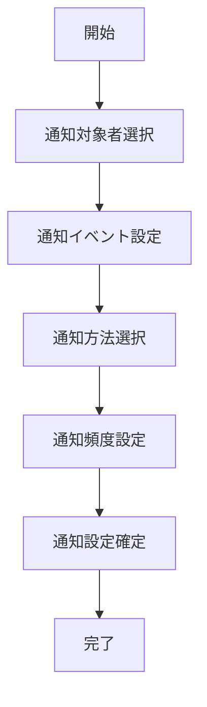

# UC-008: 通知設定

## 概要

タスクの進捗状況や重要な変更について、関係者への適切な通知設定を行うユースケース。

## アクター

- **プライマリ**: プロジェクトマネージャー、タスク作成者
- **セカンダリ**: システム（通知管理）

## 前提条件

- [ ] タスクの関係者が明確
- [ ] 通知チャネルが設定済み

## 事後条件

- [ ] 通知対象者が設定済み
- [ ] 通知タイミングが設定済み
- [ ] 通知方法が設定済み

## 基本フロー



## インターフェース定義

```typescript
interface NotificationSettings {
  taskId: string;
  recipients: NotificationRecipient[];
  events: NotificationEvent[];
  channels: NotificationChannel[];
  frequency: NotificationFrequency;
}
```

## 関連ページ

- **P-020**: 通知設定ページ

## 更新履歴

| バージョン | 更新日 | 更新者 | 更新内容 |
|-----------|--------|---------|----------|
| 1.0 | 2024-11-05 | Claude Code | 初版作成 |