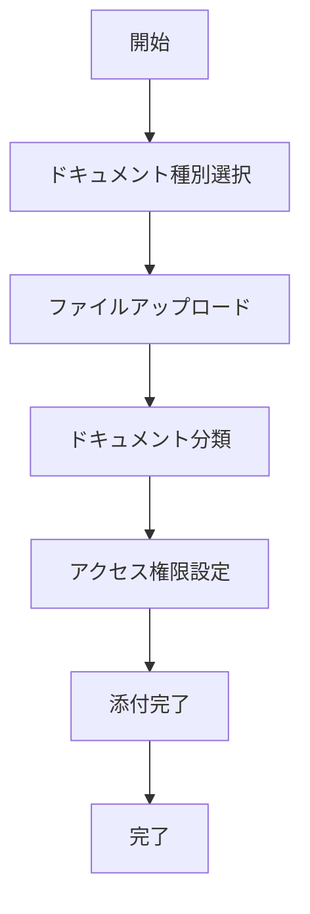

# UC-009: ドキュメント添付

## 概要

タスクに関連する資料、仕様書、参考文書等を添付し、担当者が必要な情報にアクセスできるよう整理するユースケース。

## アクター

- **プライマリ**: タスク作成者、プロジェクトマネージャー
- **セカンダリ**: システム（ファイル管理）

## 前提条件

- [ ] 添付すべきドキュメントが準備済み
- [ ] ファイルストレージが利用可能

## 事後条件

- [ ] 関連ドキュメントが添付済み
- [ ] アクセス権限が設定済み
- [ ] ドキュメント分類が完了

## 基本フロー



## インターフェース定義

```typescript
interface DocumentAttachment {
  taskId: string;
  documents: TaskDocument[];
  totalSize: number;
  uploadedBy: string;
  uploadedAt: Date;
}

interface TaskDocument {
  documentId: string;
  fileName: string;
  fileType: string;
  size: number;
  category: DocumentCategory;
  accessLevel: AccessLevel;
}
```

## 関連ページ

- **P-021**: ドキュメント添付ページ

## 更新履歴

| バージョン | 更新日 | 更新者 | 更新内容 |
|-----------|--------|---------|----------|
| 1.0 | 2024-11-05 | Claude Code | 初版作成 |