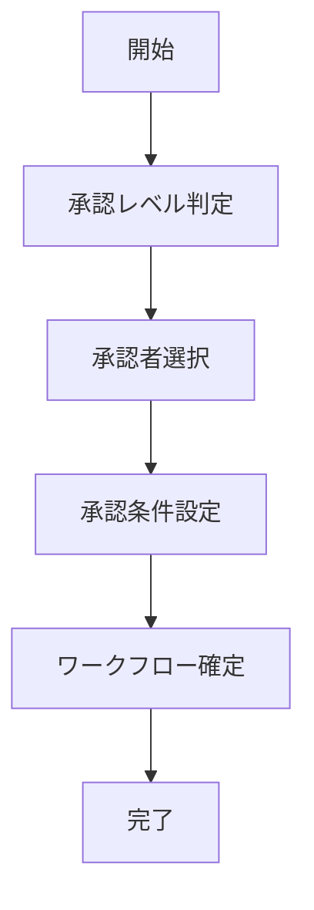

# UC-010: 承認ワークフロー設定

## 概要

タスクの開始や成果物に対する承認プロセスを設定し、適切なガバナンスを確保するユースケース。

## アクター

- **プライマリ**: プロジェクトマネージャー、承認者
- **セカンダリ**: システム（ワークフロー管理）

## 前提条件

- [ ] 承認が必要なタスクとして分類済み
- [ ] 承認者の権限が設定済み

## 事後条件

- [ ] 承認ワークフローが設定済み
- [ ] 承認者が指定済み
- [ ] 承認条件が明確化済み

## 基本フロー



## インターフェース定義

```typescript
interface ApprovalWorkflow {
  taskId: string;
  approvers: Approver[];
  approvalSteps: ApprovalStep[];
  requiresAll: boolean;
  escalationRules: EscalationRule[];
}
```

## 関連ページ

- **P-022**: 承認ワークフロー設定ページ

## 更新履歴

| バージョン | 更新日 | 更新者 | 更新内容 |
|-----------|--------|---------|----------|
| 1.0 | 2024-11-05 | Claude Code | 初版作成 |