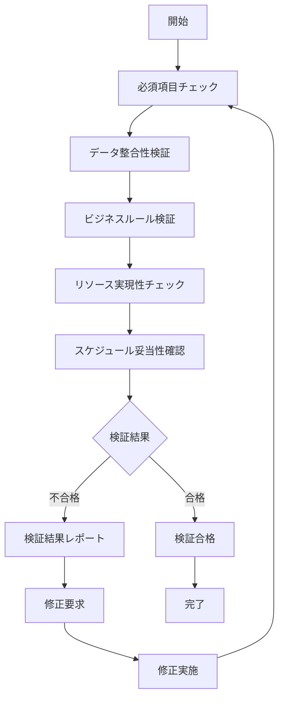

# UC-011: タスク検証

## 概要

作成されたタスクの整合性、実現可能性、プロジェクト要件適合性を総合的に検証するユースケース。

## アクター

- **プライマリ**: システム（自動検証）、プロジェクトマネージャー
- **セカンダリ**: 品質管理者、リスク管理者

## 前提条件

- [ ] タスクの全項目が入力済み
- [ ] 検証ルールが設定済み

## 事後条件

- [ ] タスクの整合性が確認済み
- [ ] 検証結果がレポート済み
- [ ] 必要な修正が特定済み

## 基本フロー



## インターフェース定義

```typescript
interface TaskValidation {
  taskId: string;
  validationResults: ValidationResult[];
  overallStatus: 'PASSED' | 'FAILED' | 'WARNING';
  validatedAt: Date;
  validatedBy: string;
}

interface ValidationResult {
  rule: string;
  status: 'PASSED' | 'FAILED' | 'WARNING';
  message: string;
  severity: 'LOW' | 'MEDIUM' | 'HIGH' | 'CRITICAL';
}
```

## 関連ページ

- **P-023**: タスク検証ページ

## 更新履歴

| バージョン | 更新日 | 更新者 | 更新内容 |
|-----------|--------|---------|----------|
| 1.0 | 2024-11-05 | Claude Code | 初版作成 |