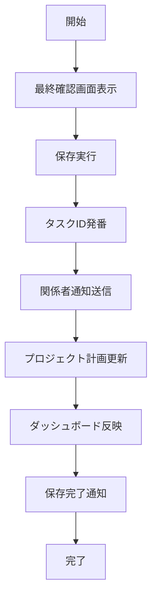
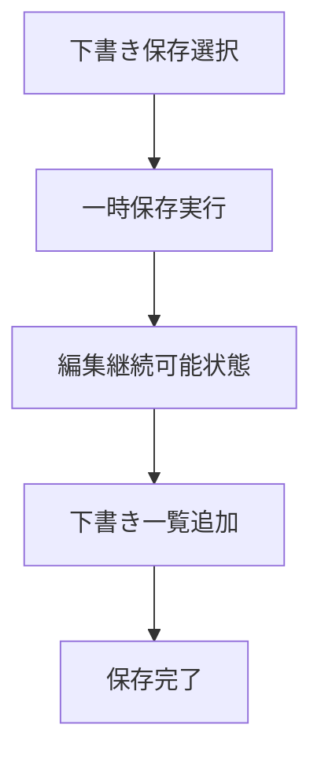

# UC-012: タスク保存・公開

## 概要

検証が完了したタスクを正式に保存し、関係者に公開してプロジェクト実行を開始するユースケース。

## アクター

- **プライマリ**: タスク作成者、プロジェクトマネージャー
- **セカンダリ**: システム（データ管理、通知）

## 前提条件

- [ ] タスク検証が完了済み
- [ ] 必要な承認が取得済み

## 事後条件

- [ ] タスクが正式保存済み
- [ ] 関係者への通知が完了
- [ ] タスクが実行可能状態

## 基本フロー



## 代替フロー1: 下書き保存



## インターフェース定義

```typescript
interface TaskPublication {
  taskId: string;
  status: 'DRAFT' | 'PUBLISHED' | 'ACTIVE';
  publishedAt: Date;
  publishedBy: string;
  notificationsSent: NotificationLog[];
  projectImpact: ProjectImpact;
}

interface ProjectImpact {
  scheduleChange: boolean;
  resourceChange: boolean;
  budgetChange: boolean;
  milestoneImpact: string[];
}
```

## 関連ページ

- **P-024**: 最終確認・保存ページ

## メトリクス

- タスク保存成功率: 99.5%以上
- 通知送信成功率: 99%以上
- 平均保存処理時間: 3秒以内

## 更新履歴

| バージョン | 更新日 | 更新者 | 更新内容 |
|-----------|--------|---------|----------|
| 1.0 | 2024-11-05 | Claude Code | 初版作成 |