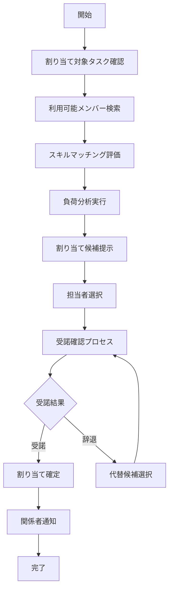
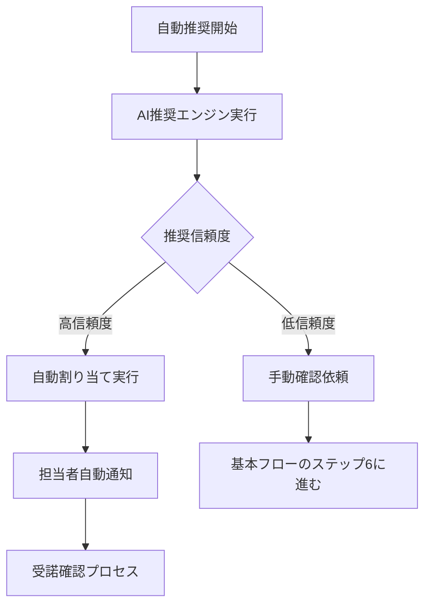
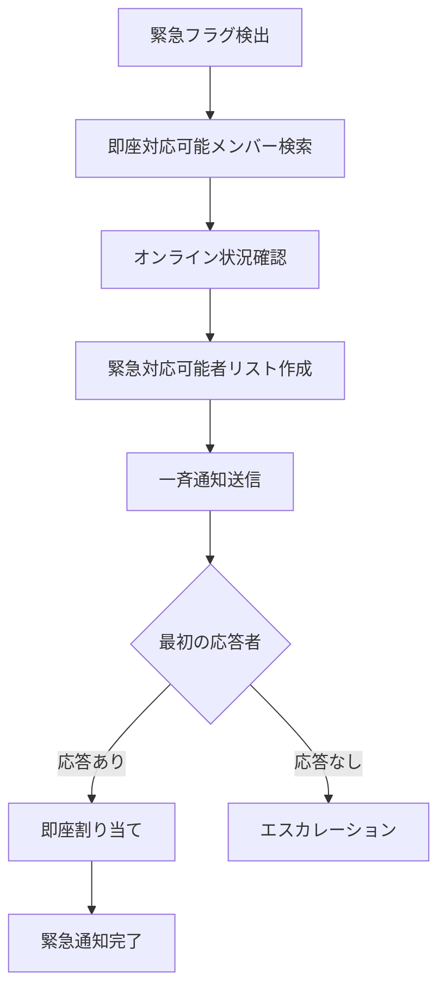
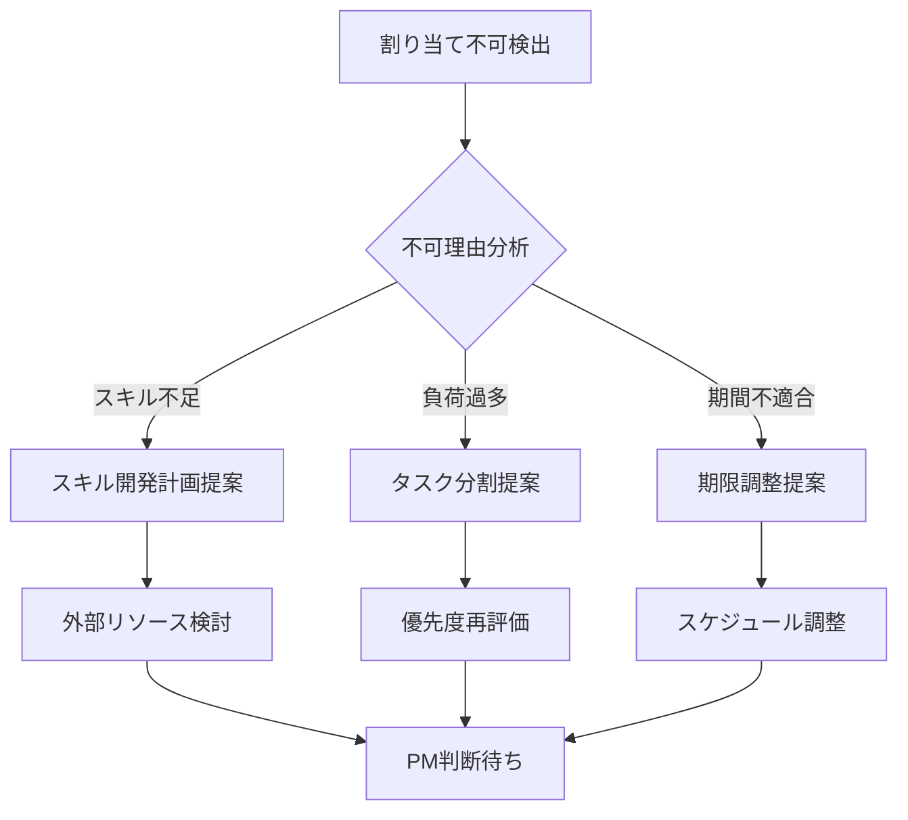
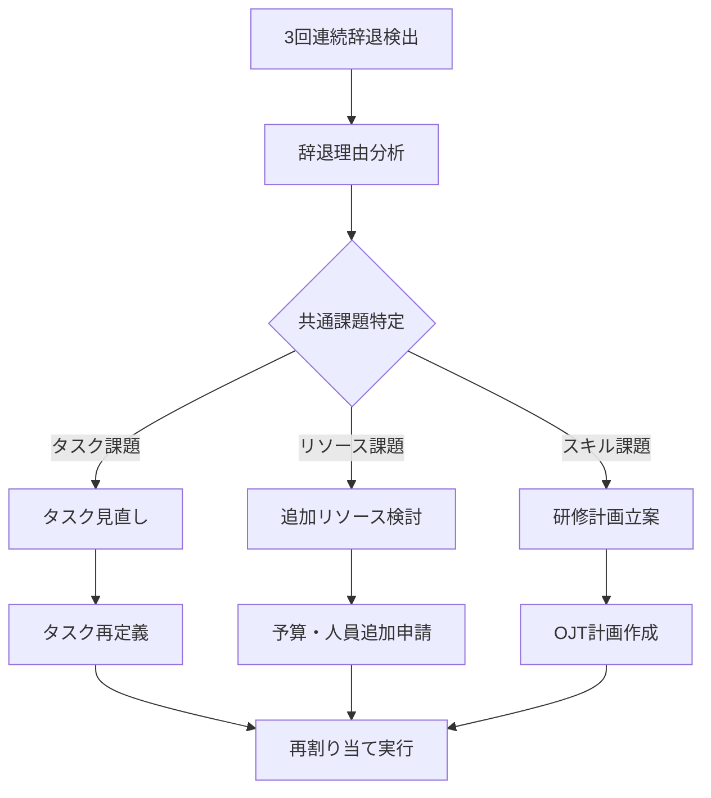

# Operation設計: op-002-assign-task

## Operation ID: op-002-assign-task

### 基本情報
- **Operation名**: タスク割り当て
- **所属Capability**: cap-001-task-lifecycle タスクライフサイクル管理能力
- **所属BC**: BC-001 タスク管理
- **操作タイプ**: Command
- **ビジネス価値**: 作成されたタスクを最適なチームメンバーに割り当て、実行責任を明確化し効率的なプロジェクト進行を実現

### 概要
op-001で作成されたタスクを、スキル、経験、現在の負荷状況を考慮して最適なチームメンバーに割り当てる操作。適切な人選により、タスクの品質向上と期限内完了を確保し、チーム全体の負荷分散とスキル活用を最適化する。

### 操作の詳細

#### 目的
- 作成されたタスクを適切なチームメンバーに割り当てる
- スキルマッチングによる品質向上と効率化を実現
- チーム全体の負荷分散を最適化
- 担当者の明確化により責任の所在を確定
- メンバーのスキル向上機会を提供

#### スコープ
- **含む**:
  - 利用可能メンバーの検索と評価
  - スキルマッチングと負荷分析
  - 割り当て候補の提示と推奨理由の説明
  - 担当者決定と受諾確認プロセス
  - 割り当て結果の記録と通知
- **含まない**:
  - タスクの作成・修正（op-001で実施）
  - 進捗の追跡（op-003で実施）
  - タスクの完了処理（op-004で実施）

#### トリガー
- **手動トリガー**: PMによる新規作成タスクの割り当て指示
- **自動トリガー**: 割り当て待ちタスクの定期的な割り当て提案
- **スケジュールトリガー**: メンバーの空き状況変化時の再割り当て提案

### ステークホルダー

#### プライマリアクター
- **ロール**: プロジェクトマネージャー、チームリーダー
- **責任**:
  - 適切なメンバー選択と割り当て決定
  - チーム負荷バランスの管理
  - スキル開発機会の提供
- **権限**: タスク割り当て権限（リーダーレベル以上）

#### セカンダリアクター
- **被割り当て者**: チームメンバー（割り当て受諾・辞退権限あり）
- **システム**: 負荷分析システム、スキル管理システム
- **外部サービス**: カレンダーシステム、HR情報システム

#### 受益者
- 担当者（適切なスキルレベルのタスク割り当て）
- プロジェクト全体（最適化された人的リソース活用）
- 組織（メンバーのスキル向上）

### プロセスフロー

#### 基本フロー


1. **割り当て対象タスク確認**: 割り当てるタスクの詳細を確認
   - 入力: タスクID、タスク詳細情報
   - 処理: タスク存在確認、割り当て可能状態の検証
   - 出力: 検証済みタスク情報

2. **利用可能メンバー検索**: 割り当て可能なメンバーを検索
   - 入力: プロジェクトメンバーリスト、期間情報
   - 処理: 在籍状況確認、稼働可能期間チェック
   - 出力: 利用可能メンバーリスト

3. **スキルマッチング評価**: メンバーのスキルとタスク要求の適合性評価
   - 入力: メンバースキル情報、タスク要求スキル
   - 処理: スキルレベル比較、経験値評価、学習機会の判定
   - 出力: スキル適合度スコア

4. **負荷分析実行**: メンバーの現在負荷と追加可能工数を分析
   - 入力: 現在のタスク負荷、稼働予定、休暇情報
   - 処理: 総工数計算、空き時間分析、過負荷リスク評価
   - 出力: 負荷状況と推奨工数

5. **割り当て候補提示**: 最適な候補を推奨理由と共に提示
   - 入力: スキル適合度、負荷状況、過去実績
   - 処理: 総合評価スコア計算、ランキング作成
   - 出力: 推奨順候補リスト

6. **担当者選択**: PMが最終的な担当者を決定
   - 入力: 候補リスト、PM判断基準
   - 処理: 戦略的考慮（スキル育成、チームバランス等）
   - 出力: 選択された担当者

7. **受諾確認プロセス**: 選択された担当者に割り当て確認
   - 入力: 担当者情報、タスク詳細
   - 処理: 通知送信、確認期限設定、回答待ち
   - 出力: 受諾・辞退の回答

8. **割り当て確定**: 受諾後にタスクの担当者を正式決定
   - 入力: 受諾確認、担当者情報
   - 処理: タスクエンティティ更新、割り当て履歴記録
   - 出力: 更新されたタスク

9. **関係者通知**: 割り当て結果を関係者に通知
   - 入力: 更新されたタスク、通知対象者
   - 処理: 通知メッセージ作成、配信
   - 出力: 通知完了確認

#### 代替フロー1: 自動推奨割り当て


- **分岐点**: 基本フロー ステップ6（担当者選択）
- **条件**: AI推奨機能が有効で、明確な最適候補が存在

**代替手順**:
1. 機械学習アルゴリズムによる最適候補の自動選出
2. 推奨信頼度スコアの評価
3. 高信頼度の場合、自動割り当てを実行
4. 担当者に自動割り当て通知と受諾確認を送信

#### 代替フロー2: 緊急割り当て


- **分岐点**: 基本フロー ステップ1（タスク確認）
- **条件**: タスクに緊急フラグが設定されている

**代替手順**:
1. 緊急対応可能なメンバーをリアルタイム検索
2. オンライン状況とレスポンス履歴を確認
3. 対応可能者に一斉通知を送信
4. 最初に応答したメンバーに即座割り当て

#### 例外フロー1: 全員が割り当て不可


- **発生点**: ステップ5（割り当て候補提示）
- **条件**: 利用可能なメンバーが存在しない、または適合度が基準以下

**例外対応手順**:
1. 割り当て不可の根本原因を分析
2. 対処方針を複数提案（スキル開発、タスク分割、期限調整）
3. 外部リソースやコンサルタント活用の検討
4. PMによる最終判断を求める

#### 例外フロー2: 割り当て辞退の連続


- **発生点**: ステップ8（受諾確認プロセス）
- **条件**: 連続して3回以上の辞退が発生

**例外対応手順**:
1. 辞退理由の分析と共通パターンの特定
2. 根本原因に応じた対策の立案
3. タスク自体の見直しまたはリソース強化
4. 問題解決後の再割り当て実行

### データ仕様

#### 入力データ
| 項目名 | 型 | 必須 | 説明 | 制約 |
|-------|----|----|------|------|
| taskId | uuid | ○ | 割り当て対象タスクID | 存在するタスク、未割り当て状態 |
| assignmentType | enum | ○ | 割り当て方式 | Manual/Auto/Emergency |
| preferredStartDate | date | × | 希望開始日 | タスク開始日以降 |
| assignmentNote | string | × | 割り当て理由・備考 | 最大500文字 |
| urgencyLevel | enum | × | 緊急度 | Low/Medium/High/Critical |
| skillDevelopmentFlag | boolean | × | スキル開発機会フラグ | デフォルト: false |
| excludeMembers | array | × | 除外メンバーリスト | 理由付きで最大5名 |

#### 出力データ
| 項目名 | 型 | 説明 | 備考 |
|-------|----|----|------|
| assignmentId | uuid | 割り当てID | システム自動生成 |
| assignedMemberId | uuid | 割り当てられたメンバーID | 確定後設定 |
| assignmentStatus | enum | 割り当て状態 | Pending/Confirmed/Rejected |
| assignedAt | datetime | 割り当て日時 | システム自動設定 |
| assignedBy | uuid | 割り当て実行者ID | 現在のユーザーID |
| acceptanceDeadline | datetime | 受諾期限 | 通常24時間後 |
| matchingScore | number | スキル適合度スコア | 0-100の範囲 |
| workloadImpact | object | 負荷影響分析結果 | 詳細な負荷情報 |

#### 内部データ
| 項目名 | 型 | 説明 | ライフサイクル |
|-------|----|----|------------|
| candidateAnalysis | array | 候補者分析結果 | 割り当て完了まで |
| skillMatrix | object | スキルマッチング詳細 | ログとして永続保存 |
| loadBalanceReport | object | 負荷分散レポート | 月次で集約保存 |

### ビジネスルール

#### 必須ルール
1. **担当者唯一性**: 1つのタスクには同時に1人の担当者のみ割り当て可能
2. **負荷上限**: 1人のメンバーの総工数は週40時間を超えない
3. **スキル適合性**: 必須スキルを満たさない場合は警告表示必須
4. **受諾期限**: 割り当て通知から24時間以内に受諾・辞退の回答必須

#### 制約条件
1. **同時割り当て制限**: 1人のメンバーに対する同時未受諾割り当ては3件まで
2. **緊急対応頻度**: 1週間に緊急割り当てを受けられるのは2回まで
3. **スキル開発比率**: 各メンバーのスキル開発タスクは全体の20%以内

#### バリデーション
1. **メンバー有効性**: 割り当て対象がアクティブなプロジェクトメンバー
2. **期間整合性**: タスク期間とメンバーの稼働可能期間の重複確認
3. **権限確認**: 割り当て実行者の権限レベル確認

### 品質要求

#### パフォーマンス
- **応答時間**: 候補者検索・分析完了まで5秒以内
- **スループット**: 同時に20件のタスク割り当て処理が可能
- **同時実行数**: 50人のPMが同時に割り当て操作可能

#### 可用性
- **稼働率**: 99.7%（割り当て機能の高可用性要求）
- **復旧時間**: 障害発生時3分以内に復旧

#### セキュリティ
- **認証要求**: 有効なセッションとPM・TL権限
- **認可要求**: 割り当て権限とプロジェクトアクセス権
- **データ保護**: メンバー情報の匿名化、アクセスログ保持

### UseCase関連

#### 関連UseCase
| UseCase ID | UseCase名 | 関係 | 説明 |
|-----------|----------|------|------|
| uc-002-task-assignment | タスク割り当て | implements | このOperationが直接実現するUseCase |
| uc-011-resource-allocation | リソース配分 | includes | 負荷分散の観点で関連 |

#### 実現するUseCase
- **uc-002-task-assignment**: タスク割り当て - PMによる最適な人員配置プロセス

### 実装指針

#### 技術要求
- **使用技術**: TypeScript, Next.js Server Actions, Prisma ORM
- **フレームワーク**: React Hook Form, SWR（データフェッチング）
- **ライブラリ**: date-fns（日付処理）, lodash（データ操作）

#### アーキテクチャ
- **パターン**: Strategy Pattern（割り当てアルゴリズム）+ Observer Pattern（通知）
- **層構造**: Presentation → Application → Domain → Infrastructure

#### 実装の考慮事項
1. **スキルマッチングアルゴリズム**: 重み付きスコアリングシステム
2. **負荷分散計算**: リアルタイム工数計算とボトルネック検出
3. **通知システム**: 非同期通知処理とリトライ機構

### テスト設計

#### テストシナリオ
1. **正常系テスト**:
   - 最適候補への正常割り当て
   - 複数候補からの選択割り当て
   - 自動推奨による割り当て

2. **異常系テスト**:
   - 全員割り当て不可の状況
   - 連続する割り当て辞退
   - 権限不足での割り当て試行

3. **境界値テスト**:
   - 負荷上限ギリギリでの割り当て
   - スキル適合度境界値での判定
   - 受諾期限ギリギリでの回答

#### テストデータ
- **正常データセット**: 様々なスキルレベルのメンバー構成
- **異常データセット**: 極端な負荷状況、スキル不足状況
- **境界値データセット**: 制限値付近でのリアルなシナリオ

### メトリクス

#### ビジネスメトリクス
- **割り当て成功率**: 初回割り当ての受諾率（目標: 85%以上）
- **最適化効果**: スキルマッチングによる品質向上率（目標: 20%向上）
- **負荷分散効果**: チーム内工数分散の均等性（目標: 標準偏差20%以内）
- **スキル開発効果**: メンバーのスキル向上度（目標: 四半期10%向上）

#### 技術メトリクス
- **マッチング精度**: AI推奨の適合率（目標: 80%以上）
- **処理時間**: 候補分析完了時間（目標: 3秒以内）
- **システム負荷**: CPU使用率（目標: 70%以下）

### 依存関係

#### 前提条件
- op-001-create-taskでタスクが作成済みであること
- プロジェクトメンバーが登録され、スキル情報が整備されていること
- カレンダー情報と稼働状況が同期されていること

#### 他のOperationとの関係
- **前提Operation**: op-001-create-task（タスク作成）
- **後続Operation**: op-003-update-progress（割り当て後の進捗管理）

### リスクと対策

#### 特定されたリスク
1. **スキルマッチングの過信**: AIスコアを過度に信頼する
   - 対策: 人間の判断を重視し、AIは参考情報として位置づけ

2. **負荷計算の不正確性**: 実際の工数と見積もりの乖離
   - 対策: 過去実績の継続的学習と調整機能

3. **割り当て辞退の頻発**: メンバーの意欲低下やタスク品質問題
   - 対策: 辞退理由の詳細分析と根本原因への対処

### 更新履歴
- 2025-11-05: 初版作成（Issue #199対応、MVP版Phase 2.2） - Claude

---

## スキルマッチングアルゴリズム詳細

### マッチングスコア計算式
```typescript
interface SkillMatchingScore {
  technicalSkillMatch: number;    // 技術スキル適合度 (40%)
  experienceLevel: number;        // 経験レベル適合度 (30%)
  domainKnowledge: number;        // ドメイン知識適合度 (20%)
  learningOpportunity: number;    // 学習機会評価 (10%)
  totalScore: number;             // 総合スコア (0-100)
}

const calculateMatchingScore = (
  memberSkills: MemberSkill[],
  taskRequirements: TaskRequirement[]
): SkillMatchingScore => {
  // 重み付きスコア計算ロジック
}
```

### 負荷分散計算
```typescript
interface WorkloadAnalysis {
  currentWorkload: number;        // 現在の工数負荷 (時間)
  availableCapacity: number;      // 利用可能キャパシティ (時間)
  riskLevel: 'Low' | 'Medium' | 'High';  // 過負荷リスクレベル
  recommendedHours: number;       // 推奨追加工数
}
```

## 割り当て候補ランキング

### 総合評価基準
1. **スキル適合度** (40%): 技術要件との適合性
2. **負荷バランス** (25%): 現在の工数負荷状況
3. **過去実績** (20%): 類似タスクでの成功率
4. **学習機会** (10%): メンバーの成長機会
5. **チーム貢献** (5%): プロジェクト全体への貢献度

この設計により、データ駆動の最適な人員配置が実現されます。