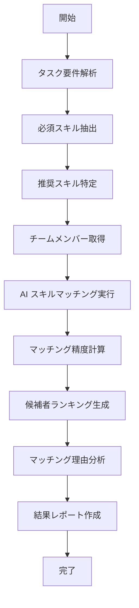

# UC-013: スキルマッチング分析

## 概要

AI駆動によるスキルマッチング分析を実行し、タスク要件に最適な担当者候補を特定するユースケース。

## アクター

- **プライマリ**: プロジェクトマネージャー、リソースマネージャー
- **セカンダリ**: AI分析エンジン、スキル管理システム

## 前提条件

- [ ] タスクの技術要件が明確
- [ ] チームメンバーのスキルプロファイルが更新済み
- [ ] AIマッチングエンジンが利用可能

## 事後条件

- [ ] スキルマッチング結果が生成済み
- [ ] 候補者ランキングが算出済み
- [ ] マッチング理由が明確化済み

## 基本フロー



## インターフェース定義

```typescript
interface SkillMatchingResult {
  taskId: string;
  candidates: CandidateMatch[];
  analysisMetrics: AnalysisMetrics;
  recommendationReason: string;
  confidence: number; // 0.0-1.0
  generatedAt: Date;
}

interface CandidateMatch {
  userId: string;
  overallScore: number; // 0-100
  skillBreakdown: SkillScore[];
  availabilityScore: number;
  workloadScore: number;
  experienceScore: number;
  collaborationScore: number;
}
```

## 関連ページ

- **P-025**: スキルマッチング結果ページ
- **P-026**: 候補者詳細分析ページ

## メトリクス

- マッチング精度: 90%以上
- 分析処理時間: 3秒以内
- 候補者満足度: 4.2/5.0以上

## 更新履歴

| バージョン | 更新日 | 更新者 | 更新内容 |
|-----------|--------|---------|----------|
| 1.0 | 2024-11-05 | Claude Code | 初版作成 |