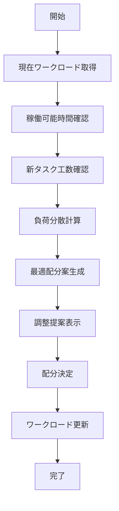

# UC-014: ワークロードバランシング

## 概要

チームメンバーのワークロードを分析し、最適な負荷分散を実現する担当者配置を決定するユースケース。

## アクター

- **プライマリ**: プロジェクトマネージャー、リソースマネージャー
- **セカンダリ**: システム（リソース管理、スケジュール管理）

## 前提条件

- [ ] 現在のタスク配分状況が把握済み
- [ ] メンバーの稼働可能時間が設定済み
- [ ] タスクの工数見積もりが完了

## 事後条件

- [ ] 最適な負荷分散案が提示済み
- [ ] ワークロード調整が実行済み
- [ ] バランシング結果が記録済み

## 基本フロー



## インターフェース定義

```typescript
interface WorkloadBalance {
  teamId: string;
  currentDistribution: MemberWorkload[];
  proposedDistribution: MemberWorkload[];
  balanceScore: number; // 0-100
  adjustmentRecommendations: Adjustment[];
}

interface MemberWorkload {
  userId: string;
  currentHours: number;
  maxCapacity: number;
  utilizationRate: number; // 0.0-1.0
  upcomingTasks: string[];
  burnoutRisk: 'LOW' | 'MEDIUM' | 'HIGH';
}
```

## 関連ページ

- **P-027**: ワークロードダッシュボードページ
- **P-028**: 負荷調整提案ページ

## 更新履歴

| バージョン | 更新日 | 更新者 | 更新内容 |
|-----------|--------|---------|----------|
| 1.0 | 2024-11-05 | Claude Code | 初版作成 |