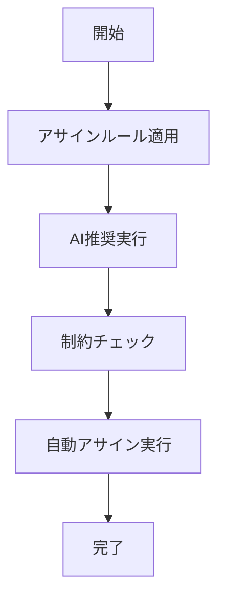

# UC-015: 自動アサイン実行

## 概要
AIとルールエンジンを活用した自動タスクアサインメントの実行と検証。

## アクター
- **プライマリ**: システム（自動化エンジン）
- **セカンダリ**: プロジェクトマネージャー

## 基本フロー


## インターフェース定義
```typescript
interface AutoAssignment {
  taskId: string;
  assignedUserId: string;
  confidence: number;
  autoRules: string[];
  overrideRequired: boolean;
}
```

## 更新履歴
| バージョン | 更新日 | 更新者 | 更新内容 |
|-----------|--------|---------|----------|
| 1.0 | 2024-11-05 | Claude Code | 初版作成 |