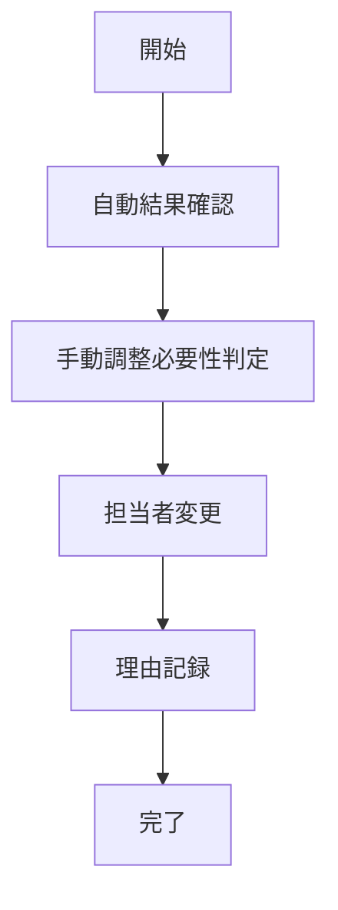

# UC-016: 手動オーバーライド

## 概要
自動アサインメント結果を人間の判断で調整・変更するユースケース。

## アクター
- **プライマリ**: プロジェクトマネージャー、チームリーダー

## 基本フロー


## インターフェース定義
```typescript
interface ManualOverride {
  originalAssignment: string;
  newAssignment: string;
  overrideReason: string;
  approvedBy: string;
}
```

## 更新履歴
| バージョン | 更新日 | 更新者 | 更新内容 |
|-----------|--------|---------|----------|
| 1.0 | 2024-11-05 | Claude Code | 初版作成 |