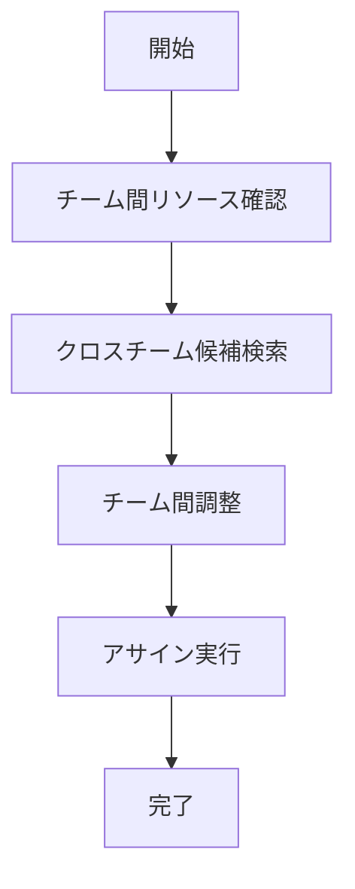

# UC-017: クロスチーム アサインメント

## 概要
複数チーム間でのリソース共有とタスクアサインメントを最適化するユースケース。

## 基本フロー

## 更新履歴
| バージョン | 更新日 | 更新者 | 更新内容 |
|-----------|--------|---------|----------|
| 1.0 | 2024-11-05 | Claude Code | 初版作成 |