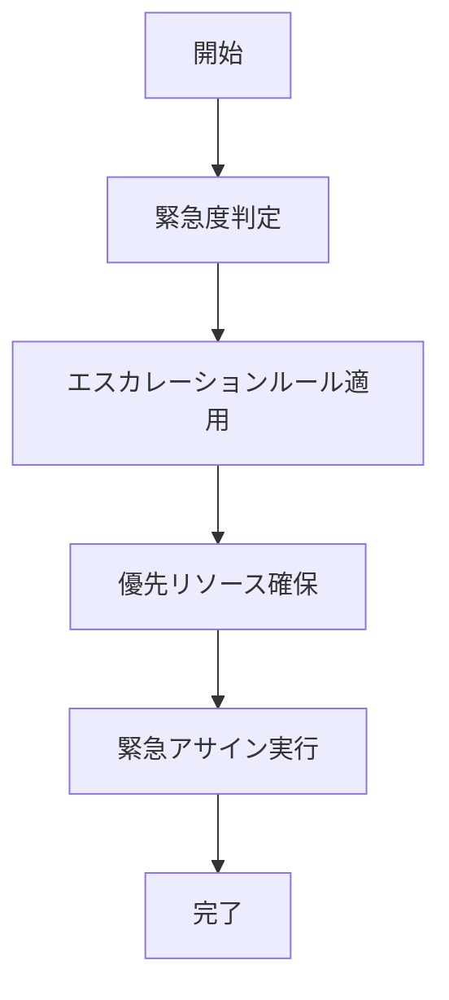

# UC-018: エスカレーション アサインメント

## 概要
緊急度や重要度の高いタスクに対する優先的なリソース配置とエスカレーション処理。

## 基本フロー

## 更新履歴
| バージョン | 更新日 | 更新者 | 更新内容 |
|-----------|--------|---------|----------|
| 1.0 | 2024-11-05 | Claude Code | 初版作成 |