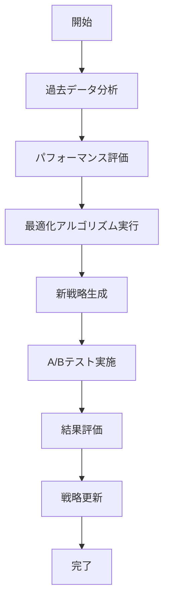

# UC-025: アサインメント最適化

## 概要
機械学習を活用したアサインメント戦略の継続的最適化と学習。

## アクター
- **プライマリ**: MLエンジン、システム管理者
- **セカンダリ**: プロジェクトマネージャー

## 基本フロー


## インターフェース定義
```typescript
interface AssignmentOptimization {
  optimizationId: string;
  algorithmVersion: string;
  performanceMetrics: OptimizationMetrics;
  recommendedChanges: OptimizationChange[];
  confidenceScore: number;
  implementationPlan: ImplementationStep[];
}

interface OptimizationMetrics {
  assignmentAccuracy: number;
  taskCompletionRate: number;
  teamSatisfaction: number;
  resourceUtilization: number;
  costEfficiency: number;
}
```

## 関連ページ
- **P-029**: 最適化ダッシュボードページ
- **P-030**: A/Bテスト結果ページ

## メトリクス
- 最適化精度向上: 5%以上/月
- アサインメント効率: 95%以上
- 学習サイクル完了時間: 24時間以内

## 更新履歴
| バージョン | 更新日 | 更新者 | 更新内容 |
|-----------|--------|---------|----------|
| 1.0 | 2024-11-05 | Claude Code | 初版作成 |