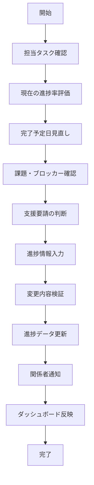
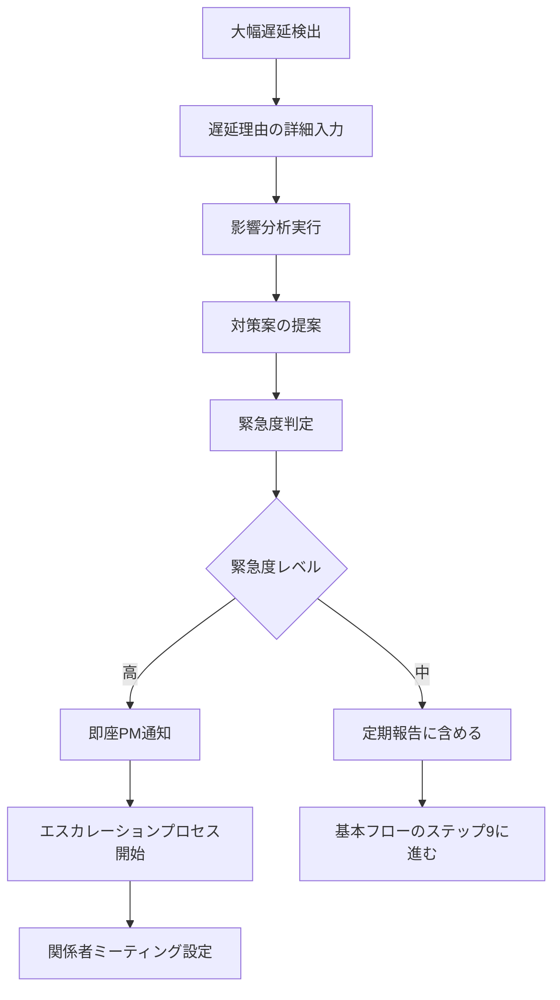
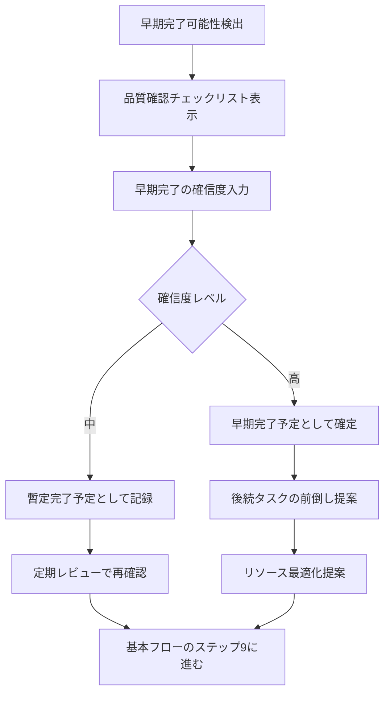
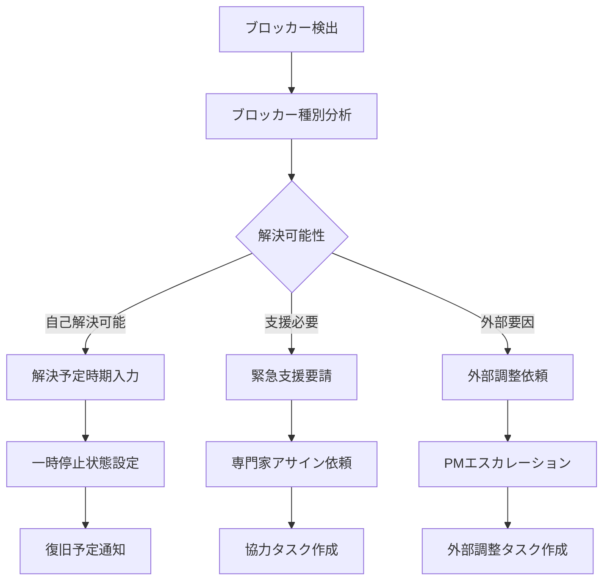
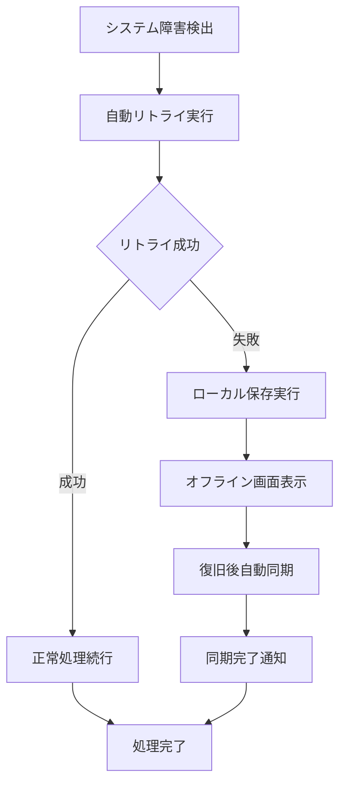

# Operation設計: op-003-update-progress

## Operation ID: op-003-update-progress

### 基本情報
- **Operation名**: 進捗更新
- **所属Capability**: cap-002-task-collaboration タスクコラボレーション能力
- **所属BC**: BC-001 タスク管理
- **操作タイプ**: Command
- **ビジネス価値**: タスクの進捗状況をリアルタイムで透明化し、チーム協力とプロジェクト成功を促進する

### 概要
割り当てられたタスクの進捗状況を継続的に更新し、関係者に透明性を提供する操作。作業の進行状況、発見された課題、予想される完了時期を共有することで、チーム全体の協力を促進し、問題の早期発見・対処を可能にする。

### 操作の詳細

#### 目的
- タスクの現在の進行状況を正確に記録・共有する
- 課題やブロッカーを早期に識別し、支援を求める
- 完了予定日の見直しと調整を行う
- チーム全体のプロジェクト可視性を向上させる
- 継続的な改善のためのデータを蓄積する

#### スコープ
- **含む**:
  - 進捗率の更新と根拠の説明
  - 完了予定日の見直しと調整
  - 課題・ブロッカー・リスクの報告
  - 必要な支援や協力の要請
  - 進捗に関するコメントと詳細説明
- **含まない**:
  - タスクの完了処理（op-004で実施）
  - 他メンバーの進捗評価（op-005で実施）
  - プロジェクト全体の進捗分析（op-007で実施）

#### トリガー
- **手動トリガー**: 担当者による定期的な進捗報告
- **自動トリガー**: 予定完了日の2日前の自動リマインダー
- **スケジュールトリガー**: 毎日終業時の進捗確認プロンプト

### ステークホルダー

#### プライマリアクター
- **ロール**: タスク担当者（チームメンバー）
- **責任**:
  - 正確で誠実な進捗状況の報告
  - 課題の早期発見と報告
  - 支援要請のタイムリーな実施
- **権限**: 自分が担当するタスクの進捗更新権限

#### セカンダリアクター
- **関係者**: プロジェクトマネージャー、チームリーダー、他のチームメンバー
- **システム**: 通知システム、ダッシュボード更新システム
- **外部サービス**: カレンダーシステム、時間管理ツール

#### 受益者
- プロジェクトマネージャー（プロジェクト全体の把握）
- チームメンバー（相互支援の機会）
- ステークホルダー（透明性のある進捗確認）

### プロセスフロー

#### 基本フロー


1. **担当タスク確認**: 更新対象のタスク詳細を確認
   - 入力: タスクID、現在のタスク状態
   - 処理: タスク存在確認、担当者権限検証
   - 出力: 検証済みタスク情報

2. **現在の進捗率評価**: 作業の完了度を客観的に評価
   - 入力: 作業内容、成果物の進行状況
   - 処理: 進捗率の算出、前回からの変化量計算
   - 出力: 現在の進捗率（0-100%）

3. **完了予定日見直し**: 現在の進行速度に基づく完了予測
   - 入力: 現在の進捗率、残作業量、稼働予定
   - 処理: 完了予測日の計算、元の期限との比較
   - 出力: 更新された完了予定日

4. **課題・ブロッカー確認**: 進行を阻害する要因の特定
   - 入力: 現在の作業状況、遭遇している問題
   - 処理: 問題の分類、影響度評価、解決策の検討
   - 出力: 課題リストと優先度

5. **支援要請の判断**: 必要な協力や支援の特定
   - 入力: 課題の内容、自分で解決可能性
   - 処理: 支援必要性の判定、適切な支援者の特定
   - 出力: 支援要請の内容と対象者

6. **進捗情報入力**: 進捗に関する詳細情報を入力
   - 入力: 進捗率、予定日、課題、支援要請、コメント
   - 処理: 入力データの形式検証、必須項目チェック
   - 出力: 検証済み進捗データ

7. **変更内容検証**: 前回からの変更内容の妥当性確認
   - 入力: 新しい進捗データ、前回の進捗データ
   - 処理: 変化の妥当性チェック、異常値の検出
   - 出力: 検証結果と警告事項

8. **進捗データ更新**: タスクエンティティの進捗情報を更新
   - 入力: 検証済み進捗データ
   - 処理: データベース更新、履歴の記録
   - 出力: 更新されたタスク

9. **関係者通知**: 進捗更新を関係者に通知
   - 入力: 更新されたタスク、通知設定
   - 処理: 通知対象者の決定、メッセージ作成、配信
   - 出力: 通知完了確認

10. **ダッシュボード反映**: プロジェクト全体のダッシュボードを更新
    - 入力: 更新されたタスク進捗
    - 処理: 集計データの再計算、グラフ・チャートの更新
    - 出力: 更新されたダッシュボード

#### 代替フロー1: 大幅な遅延報告


- **分岐点**: 基本フロー ステップ4（完了予定日見直し）
- **条件**: 完了予定日が元の期限から3日以上遅延する場合

**代替手順**:
1. 遅延の根本原因と詳細理由を入力
2. プロジェクト全体への影響を自動分析
3. 可能な対策案を複数提案
4. 緊急度レベルを自動判定
5. 高緊急度の場合、PMに即座に通知してエスカレーション

#### 代替フロー2: 早期完了報告


- **分岐点**: 基本フロー ステップ4（完了予定日見直し）
- **条件**: 完了予定日が元の期限から2日以上早い場合

**代替手順**:
1. 品質が担保されていることを確認
2. 早期完了への確信度を評価
3. 高確信度の場合、リソース最適化を提案
4. 後続タスクの前倒し可能性を検討

#### 例外フロー1: ブロッカーによる作業停止


- **発生点**: ステップ5（課題・ブロッカー確認）
- **条件**: 作業継続が不可能なブロッカーが発生

**例外対応手順**:
1. ブロッカーの種別を詳細分析
2. 解決可能性に応じた対応策を選択
3. 一時停止状態の設定と復旧予定の共有
4. 必要に応じて協力タスクや調整タスクを新規作成

#### 例外フロー2: システム障害による更新失敗


- **発生点**: ステップ8（進捗データ更新）
- **条件**: ネットワーク障害、サーバー障害等

**例外対応手順**:
1. 3回まで自動リトライを実行
2. 失敗時はローカルストレージに一時保存
3. オフライン対応画面を表示
4. システム復旧後に自動同期を実行

### データ仕様

#### 入力データ
| 項目名 | 型 | 必須 | 説明 | 制約 |
|-------|----|----|------|------|
| taskId | uuid | ○ | 更新対象タスクID | 担当タスクのみ |
| progressPercentage | number | ○ | 進捗率 | 0-100の整数 |
| estimatedCompletionDate | date | ○ | 完了予定日 | 本日以降 |
| workLog | string | ○ | 作業ログ | 10-1000文字 |
| issuesEncountered | array | × | 遭遇した課題 | 最大10件 |
| blockers | array | × | ブロッカー | 最大5件、深刻度付き |
| helpRequests | array | × | 支援要請 | 最大3件、対象者指定 |
| qualityNotes | string | × | 品質に関する備考 | 最大500文字 |
| nextSteps | string | × | 次の作業予定 | 最大300文字 |
| confidenceLevel | enum | × | 完了予測の確信度 | High/Medium/Low |

#### 出力データ
| 項目名 | 型 | 説明 | 備考 |
|-------|----|----|------|
| progressUpdateId | uuid | 進捗更新ID | システム自動生成 |
| updatedAt | datetime | 更新日時 | システム自動設定 |
| previousProgress | number | 前回の進捗率 | 比較用 |
| progressDelta | number | 進捗変化量 | 前回との差分 |
| estimatedDaysToComplete | number | 完了までの推定日数 | 自動計算 |
| riskLevel | enum | リスクレベル | Low/Medium/High/Critical |
| notificationsSent | array | 送信された通知 | 通知ログ |

#### 内部データ
| 項目名 | 型 | 説明 | ライフサイクル |
|-------|----|----|------------|
| progressHistory | array | 進捗履歴 | 永続保存 |
| trendAnalysis | object | 進捗トレンド分析 | リアルタイム計算 |
| alertsTriggered | array | 発生したアラート | アラート解除まで |

### ビジネスルール

#### 必須ルール
1. **進捗の単調性**: 進捗率は前回値以上である必要（例外承認あり）
2. **更新頻度**: 48時間以内に1回以上の進捗更新必須
3. **完了予定妥当性**: 完了予定日は現在の進捗率と整合性必須
4. **ブロッカー報告**: ブロッカー発生時は24時間以内の報告必須

#### 制約条件
1. **更新権限**: 担当者本人のみが進捗更新可能
2. **過去分修正**: 過去7日以内の進捗のみ修正可能
3. **一日の更新回数**: 1日最大5回まで更新可能

#### バリデーション
1. **進捗率検証**: 大幅な進捗後退（10%以上）は理由入力必須
2. **日程検証**: 完了予定日の大幅変更（3日以上）は承認必須
3. **コメント品質**: 作業ログは具体性を持った内容であること

### 品質要求

#### パフォーマンス
- **応答時間**: 進捗更新完了まで2秒以内
- **スループット**: 同時に100人が進捗更新可能
- **リアルタイム性**: ダッシュボード反映まで10秒以内

#### 可用性
- **稼働率**: 99.8%（進捗更新機能の超高可用性要求）
- **オフライン対応**: ネットワーク断絶時もローカル保存可能

#### セキュリティ
- **認証要求**: 有効なセッションと担当者権限
- **認可要求**: 自分のタスクのみ更新可能
- **データ保護**: 進捗履歴の改ざん防止

### UseCase関連

#### 関連UseCase
| UseCase ID | UseCase名 | 関係 | 説明 |
|-----------|----------|------|------|
| uc-003-progress-update | 進捗更新 | implements | このOperationが直接実現するUseCase |
| uc-007-progress-monitoring | 進捗監視 | provides_data | 監視データを提供 |

#### 実現するUseCase
- **uc-003-progress-update**: 進捗更新 - 担当者による継続的な進捗共有プロセス

### 実装指針

#### 技術要求
- **使用技術**: TypeScript, Next.js Server Actions, Prisma ORM
- **フレームワーク**: React Hook Form, React Query（キャッシュ管理）
- **ライブラリ**: date-fns（日付計算）, recharts（進捗可視化）

#### アーキテクチャ
- **パターン**: Event Sourcing（進捗履歴）+ CQRS（更新と参照の分離）
- **層構造**: Presentation → Application → Domain → Infrastructure

#### 実装の考慮事項
1. **リアルタイム同期**: WebSocketによる即座のダッシュボード更新
2. **オフライン対応**: Service Workerによるローカル保存機能
3. **進捗予測**: 機械学習による完了日予測の改善

### テスト設計

#### テストシナリオ
1. **正常系テスト**:
   - 通常の進捗更新（順調な進行）
   - 早期完了の報告
   - 軽微な遅延の報告

2. **異常系テスト**:
   - 大幅な進捗後退
   - ブロッカーによる作業停止
   - システム障害時の動作

3. **境界値テスト**:
   - 進捗率0%と100%での更新
   - 更新頻度の上限・下限
   - 完了予定日の極端な変更

#### テストデータ
- **正常データセット**: 様々な進捗パターンの履歴
- **異常データセット**: ブロッカー、遅延、品質問題のシナリオ
- **境界値データセット**: 制限値での動作確認

### メトリクス

#### ビジネスメトリクス
- **更新頻度**: 平均更新間隔（目標: 24時間以内）
- **予測精度**: 完了予定日の的中率（目標: 80%以上）
- **透明性指標**: 進捗可視性による問題発見率（目標: 30%向上）
- **協力効果**: 支援要請による問題解決率（目標: 90%以上）

#### 技術メトリクス
- **更新成功率**: 進捗更新の成功率（目標: 99.5%以上）
- **同期遅延**: ダッシュボード反映時間（目標: 5秒以内）
- **オフライン対応率**: ネットワーク障害時の保存成功率（目標: 95%以上）

### 依存関係

#### 前提条件
- op-002-assign-taskでタスクが割り当て済みであること
- 担当者がタスクの詳細と要件を理解していること
- 進捗測定の基準が明確に定義されていること

#### 他のOperationとの関係
- **前提Operation**: op-002-assign-task（タスク割り当て）
- **後続Operation**: op-004-complete-task（完了処理への準備）
- **連携Operation**: op-007-monitor-progress（監視データ提供）

### リスクと対策

#### 特定されたリスク
1. **進捗の主観性**: 担当者による進捗評価のばらつき
   - 対策: 進捗評価基準の明確化と、成果物ベースの評価

2. **更新の負担感**: 頻繁な進捗報告による作業中断
   - 対策: 簡潔な入力フォームと、音声入力等の効率化

3. **楽観的報告**: 問題を隠した楽観的な進捗報告
   - 対策: 匿名フィードバック機能と、客観的指標の併用

### 更新履歴
- 2025-11-05: 初版作成（Issue #199対応、MVP版Phase 2.2） - Claude

---

## 進捗トレンド分析アルゴリズム

### 完了予測計算式
```typescript
interface ProgressTrend {
  velocityTrend: number;          // 進捗速度のトレンド
  consistencyScore: number;       // 進捗の一貫性スコア
  estimatedCompletion: Date;      // 予測完了日
  confidenceInterval: number;     // 予測の信頼区間
}

const calculateCompletionEstimate = (
  progressHistory: ProgressUpdate[],
  currentProgress: number
): ProgressTrend => {
  // 線形回帰による完了日予測
  // 最近7日間の進捗を重視した重み付き計算
}
```

### リスクレベル判定
```typescript
enum RiskLevel {
  LOW = 'Low',        // 順調な進行
  MEDIUM = 'Medium',  // 軽微な遅延・課題
  HIGH = 'High',      // 重大な遅延・ブロッカー
  CRITICAL = 'Critical' // 緊急対応必要
}

const assessRiskLevel = (
  progressDelta: number,
  blockers: Blocker[],
  scheduleVariance: number
): RiskLevel => {
  // 複数要因による総合的なリスク評価
}
```

## 通知ルール

### 通知対象と条件
1. **プロジェクトマネージャー**: 全ての進捗更新
2. **チームリーダー**: 遅延・ブロッカー・支援要請
3. **関連メンバー**: 支援要請・依存タスクへの影響
4. **ステークホルダー**: 重要タスクの大幅変更

この設計により、透明性の高い協力的なタスク進行が実現されます。