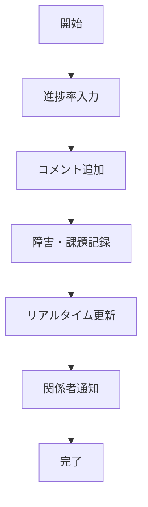

# UC-026: リアルタイム進捗更新

## 概要
担当者がタスクの進捗状況をリアルタイムで更新し、関係者に即座に共有するユースケース。

## 基本フロー


## インターフェース定義
```typescript
interface ProgressUpdate {
  taskId: string;
  progressPercentage: number; // 0-100
  updateComment: string;
  blockers: Blocker[];
  estimatedCompletion: Date;
  updatedBy: string;
  updatedAt: Date;
}
```

## 更新履歴
| バージョン | 更新日 | 更新者 | 更新内容 |
|-----------|--------|---------|----------|
| 1.0 | 2024-11-05 | Claude Code | 初版作成 |