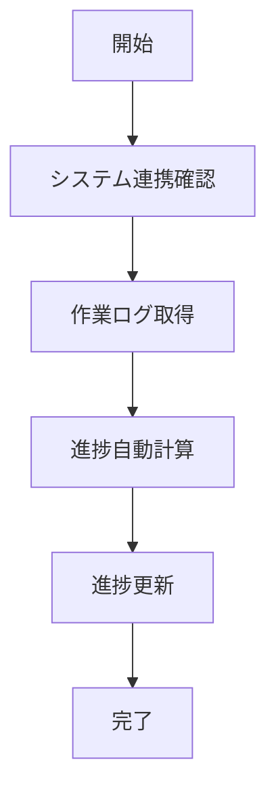

# UC-027: 自動進捗検出

## 概要
システム連携により作業進捗を自動検出・更新するユースケース。

## 基本フロー

```mermaid
graph TD
    A[開始] --> B[システム連携確認]
    B --> C[作業ログ取得]
    C --> D[進捗自動計算]
    D --> E[進捗更新]
    E --> F[完了]
```

## 更新履歴
| バージョン | 更新日 | 更新者 | 更新内容 |
|-----------|--------|---------|----------|
| 1.0 | 2024-11-05 | Claude Code | 初版作成 |