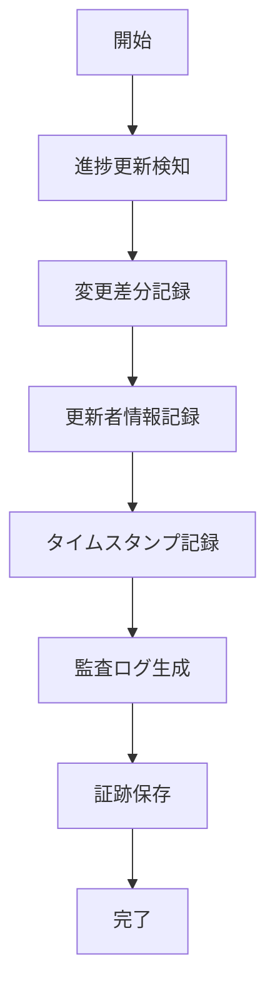

# UC-038: 進捗監査証跡

## 概要
進捗更新の完全な監査証跡の記録と管理。

## アクター
- **プライマリ**: システム（監査システム）
- **セカンダリ**: 監査担当者、コンプライアンス管理者

## 基本フロー


## インターフェース定義
```typescript
interface ProgressAuditTrail {
  auditId: string;
  taskId: string;
  changeType: 'PROGRESS_UPDATE' | 'MILESTONE_ACHIEVED' | 'BLOCKER_ADDED' | 'STATUS_CHANGE';
  previousState: ProgressSnapshot;
  newState: ProgressSnapshot;
  changedBy: string;
  changeReason: string;
  timestamp: Date;
  ipAddress: string;
  userAgent: string;
}

interface ProgressSnapshot {
  progressPercentage: number;
  status: TaskStatus;
  milestones: MilestoneStatus[];
  blockers: Blocker[];
  estimatedCompletion: Date;
}
```

## 関連ページ
- **P-031**: 監査証跡閲覧ページ
- **P-032**: コンプライアンスレポートページ

## メトリクス
- 監査記録完全性: 100%
- 証跡検索応答時間: 2秒以内
- データ保持期間: 7年間

## 更新履歴
| バージョン | 更新日 | 更新者 | 更新内容 |
|-----------|--------|---------|----------|
| 1.0 | 2024-11-05 | Claude Code | 初版作成 |