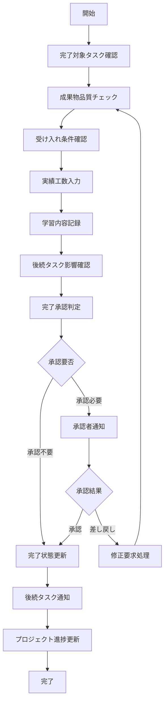
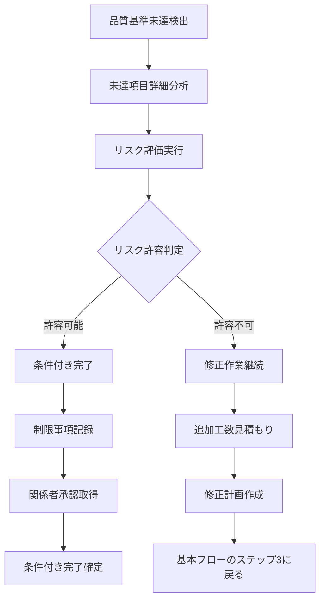
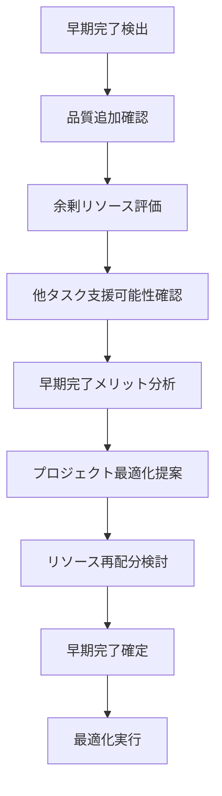
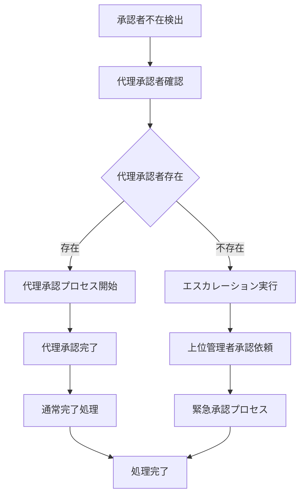
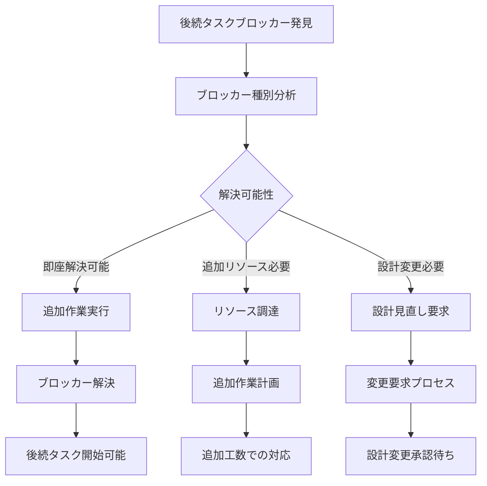

# Operation設計: op-004-complete-task

## Operation ID: op-004-complete-task

### 基本情報
- **Operation名**: タスク完了
- **所属Capability**: cap-001-task-lifecycle タスクライフサイクル管理能力
- **所属BC**: BC-001 タスク管理
- **操作タイプ**: Command
- **ビジネス価値**: タスクを完了状態にし、成果物を確定して品質を保証することで、プロジェクトの確実な進行を実現する

### 概要
進行中のタスクを正式に完了状態にする操作。成果物の品質確認、受け入れ条件の充足確認、実績工数の記録を行い、後続タスクの開始可能性を確保する。タスクライフサイクルの最終段階として、価値の確実な提供と継続的改善のためのデータ蓄積を実現する。

### 操作の詳細

#### 目的
- タスクの成果物が要求品質を満たすことを確認する
- 受け入れ条件の完全な充足を検証する
- 実績工数と学習内容を正確に記録する
- 後続タスクの開始条件を整備する
- プロジェクト全体の進捗を確実に前進させる

#### スコープ
- **含む**:
  - 成果物の品質確認と最終チェック
  - 受け入れ条件の充足状況確認
  - 実績工数の記録と分析
  - 学習内容・改善点の文書化
  - 後続タスクの開始可能性確認
- **含まない**:
  - 詳細なレビュープロセス（op-005で実施）
  - 他タスクへの影響分析（op-007で実施）
  - 長期的なパフォーマンス分析（op-008で実施）

#### トリガー
- **手動トリガー**: 担当者による完了宣言
- **自動トリガー**: 進捗率100%到達時の完了確認プロンプト
- **スケジュールトリガー**: 期限日到達時の完了状況確認

### ステークホルダー

#### プライマリアクター
- **ロール**: タスク担当者（チームメンバー）
- **責任**:
  - 成果物の品質確保
  - 受け入れ条件の完全充足
  - 正確な実績工数報告
- **権限**: 自分が担当するタスクの完了権限

#### セカンダリアクター
- **承認者**: プロジェクトマネージャー、チームリーダー（必要に応じて）
- **依存タスク担当者**: 後続タスクの担当者
- **システム**: 依存関係管理システム、通知システム

#### 受益者
- プロジェクト全体（確実な進捗と品質確保）
- 後続タスク担当者（開始条件の明確化）
- 組織（学習データの蓄積）

### プロセスフロー

#### 基本フロー


1. **完了対象タスク確認**: 完了予定のタスク詳細を確認
   - 入力: タスクID、現在のタスク状態
   - 処理: タスク存在確認、担当者権限検証、完了可能状態の確認
   - 出力: 検証済みタスク情報

2. **成果物品質チェック**: 定義された成果物の品質を確認
   - 入力: 作成された成果物、品質基準
   - 処理: 品質チェックリストの実行、自動品質検証
   - 出力: 品質確認結果

3. **受け入れ条件確認**: 設定された受け入れ条件の充足確認
   - 入力: 受け入れ条件リスト、実際の成果
   - 処理: 各条件の充足状況チェック、未充足項目の特定
   - 出力: 受け入れ条件充足状況

4. **実績工数入力**: 実際に要した工数を正確に記録
   - 入力: 実働時間、作業内容の詳細
   - 処理: 見積もり工数との比較、差異要因の分析
   - 出力: 実績工数データ

5. **学習内容記録**: タスク実行中の学習と改善点を記録
   - 入力: 学んだこと、改善提案、ベストプラクティス
   - 処理: 知識の体系化、今後のタスクへの活用方法整理
   - 出力: 学習・改善レポート

6. **後続タスク影響確認**: 後続タスクへの影響を確認
   - 入力: 依存関係情報、後続タスクリスト
   - 処理: 開始条件の充足確認、影響範囲の分析
   - 出力: 後続タスク開始可能性

7. **完了承認判定**: 承認が必要かどうかを判定
   - 入力: タスクの重要度、複雑度、品質リスク
   - 処理: 承認ルールの適用、承認者の特定
   - 出力: 承認要否と承認者情報

8. **完了状態更新**: タスクを正式に完了状態に更新
   - 入力: 承認済みタスク情報
   - 処理: ステータス更新、完了日時記録、履歴保存
   - 出力: 更新されたタスク

9. **後続タスク通知**: 後続タスクの担当者に開始可能を通知
   - 入力: 後続タスクリスト、担当者情報
   - 処理: 通知メッセージ作成、配信
   - 出力: 通知完了確認

10. **プロジェクト進捗更新**: プロジェクト全体の進捗を更新
    - 入力: 完了したタスク、プロジェクト情報
    - 処理: 進捗率再計算、マイルストーン達成確認
    - 出力: 更新されたプロジェクト進捗

#### 代替フロー1: 品質基準未達での完了


- **分岐点**: 基本フロー ステップ3（成果物品質チェック）
- **条件**: 品質基準の一部が未達成だが、プロジェクト制約により完了が必要

**代替手順**:
1. 未達成項目の詳細分析と影響度評価
2. プロジェクト全体への影響とリスクを評価
3. 許容可能なリスクの場合、条件付き完了を検討
4. 制限事項と今後の対応計画を明記

#### 代替フロー2: 早期完了（前倒し完了）


- **分岐点**: 基本フロー ステップ1（タスク確認）
- **条件**: 予定より大幅に早期の完了が可能

**代替手順**:
1. 早期完了の品質に問題がないことを追加確認
2. 余剰となるリソースの有効活用を検討
3. プロジェクト全体の最適化機会を分析
4. 他タスクへの支援や前倒し可能性を提案

#### 例外フロー1: 承認者不在による完了遅延


- **発生点**: ステップ8（完了承認判定）
- **条件**: 必要な承認者が不在で承認が得られない

**例外対応手順**:
1. 事前に定義された代理承認者の確認
2. 代理承認者が不在の場合、エスカレーション
3. 緊急承認プロセスによる迅速な対応
4. 承認遅延によるプロジェクト影響の最小化

#### 例外フロー2: 後続タスクのブロッカー発見


- **発生点**: ステップ7（後続タスク影響確認）
- **条件**: 完了によって後続タスクのブロッカーが発見される

**例外対応手順**:
1. ブロッカーの種別と解決可能性を分析
2. 即座解決可能な場合は追加作業で対応
3. 大きな変更が必要な場合は設計見直しを要求
4. プロジェクト全体への影響を最小化

### データ仕様

#### 入力データ
| 項目名 | 型 | 必須 | 説明 | 制約 |
|-------|----|----|------|------|
| taskId | uuid | ○ | 完了対象タスクID | 担当タスクのみ |
| deliverables | array | ○ | 完成した成果物 | 定義された成果物と一致 |
| qualityCheckResults | object | ○ | 品質チェック結果 | 各項目の合格/不合格 |
| acceptanceCriteriaStatus | array | ○ | 受け入れ条件充足状況 | 全条件の確認必須 |
| actualHours | number | ○ | 実績工数 | 0.1-1000時間 |
| workDetails | string | ○ | 作業詳細 | 100-2000文字 |
| lessonsLearned | string | × | 学習内容 | 最大1000文字 |
| improvements | string | × | 改善提案 | 最大500文字 |
| completionNote | string | × | 完了時備考 | 最大300文字 |
| qualityOverride | boolean | × | 品質基準例外承認 | デフォルト: false |

#### 出力データ
| 項目名 | 型 | 説明 | 備考 |
|-------|----|----|------|
| completionId | uuid | 完了記録ID | システム自動生成 |
| completedAt | datetime | 完了日時 | システム自動設定 |
| actualDuration | number | 実際の期間（日） | 開始日からの実日数 |
| efficiencyRatio | number | 効率比率 | 見積もり/実績 |
| qualityScore | number | 品質スコア | 0-100の評価 |
| nextAvailableDate | date | 担当者の次回稼働可能日 | リソース管理用 |
| dependentTasksUnblocked | array | 開始可能になった後続タスク | タスクIDリスト |

#### 内部データ
| 項目名 | 型 | 説明 | ライフサイクル |
|-------|----|----|------------|
| completionHistory | array | 完了プロセス履歴 | 永続保存 |
| qualityMetrics | object | 詳細品質メトリクス | 分析用に保存 |
| performanceData | object | パフォーマンス分析データ | 改善用に活用 |

### ビジネスルール

#### 必須ルール
1. **成果物完全性**: 定義された全ての成果物が提出必須
2. **受け入れ条件充足**: 100%の受け入れ条件充足が原則（例外承認あり）
3. **工数記録精度**: 実績工数は0.1時間単位で正確に記録
4. **品質基準遵守**: 定義された品質基準の遵守（例外承認プロセスあり）

#### 制約条件
1. **完了権限**: 担当者本人のみが完了処理可能
2. **承認期限**: 承認が必要な場合、48時間以内に承認/差し戻し必須
3. **修正回数**: 品質未達による差し戻しは3回まで

#### バリデーション
1. **進捗率検証**: 完了時の進捗率は100%である必要
2. **期限検証**: 大幅な遅延（7日以上）は理由説明必須
3. **品質検証**: 品質基準未達の場合は例外承認理由必須

### 品質要求

#### パフォーマンス
- **応答時間**: 完了処理完了まで3秒以内
- **スループット**: 同時に50件のタスク完了処理が可能
- **承認処理**: 承認フロー完了まで5秒以内

#### 可用性
- **稼働率**: 99.7%（完了処理機能の高可用性要求）
- **データ整合性**: 完了状態の不整合ゼロ

#### セキュリティ
- **認証要求**: 有効なセッションと担当者権限
- **認可要求**: 自分のタスクのみ完了可能
- **データ保護**: 完了履歴の改ざん防止

### UseCase関連

#### 関連UseCase
| UseCase ID | UseCase名 | 関係 | 説明 |
|-----------|----------|------|------|
| uc-004-task-completion | タスク完了 | implements | このOperationが直接実現するUseCase |
| uc-012-quality-assurance | 品質保証 | includes | 品質確認プロセスを含む |

#### 実現するUseCase
- **uc-004-task-completion**: タスク完了 - 担当者による確実な完了プロセス

### 実装指針

#### 技術要求
- **使用技術**: TypeScript, Next.js Server Actions, Prisma ORM
- **フレームワーク**: React Hook Form, React Query
- **ライブラリ**: date-fns（期間計算）, validator（データ検証）

#### アーキテクチャ
- **パターン**: State Machine Pattern（タスク状態管理）+ Chain of Responsibility（承認チェーン）
- **層構造**: Presentation → Application → Domain → Infrastructure

#### 実装の考慮事項
1. **状態管理**: タスクの状態遷移を厳密に管理
2. **トランザクション**: 完了処理と依存関係更新の原子性保証
3. **通知**: 関係者への確実な通知配信

### テスト設計

#### テストシナリオ
1. **正常系テスト**:
   - 通常の完了処理（承認なし）
   - 承認が必要な重要タスクの完了
   - 早期完了の処理

2. **異常系テスト**:
   - 品質基準未達での完了試行
   - 承認者不在での完了処理
   - 後続タスクのブロッカー発見

3. **境界値テスト**:
   - 実績工数の極端な値
   - 品質スコアの境界値
   - 承認期限ギリギリでの処理

#### テストデータ
- **正常データセット**: 様々な複雑度のタスク完了シナリオ
- **異常データセット**: 品質問題、承認問題のケース
- **境界値データセット**: 制限値での動作確認

### メトリクス

#### ビジネスメトリクス
- **完了品質**: 初回完了の受け入れ率（目標: 95%以上）
- **期限遵守率**: 期限内完了の割合（目標: 90%以上）
- **効率性**: 見積もり工数に対する実績比率（目標: 110%以内）
- **学習効果**: 改善提案の採用率（目標: 70%以上）

#### 技術メトリクス
- **完了処理時間**: 平均完了処理時間（目標: 2秒以内）
- **承認処理時間**: 平均承認時間（目標: 12時間以内）
- **データ整合性**: 完了状態の整合性（目標: 100%）

### 依存関係

#### 前提条件
- op-003-update-progressで進捗が適切に管理されていること
- タスクの成果物と受け入れ条件が明確に定義されていること
- 品質基準とチェック項目が整備されていること

#### 他のOperationとの関係
- **前提Operation**: op-003-update-progress（進捗更新）
- **連携Operation**: op-005-review-task（詳細レビュー）
- **後続Operation**: op-007-monitor-progress（完了データの監視活用）

### リスクと対策

#### 特定されたリスク
1. **品質の妥協**: 期限圧迫による品質基準の軽視
   - 対策: 品質例外承認プロセスの厳格化と、影響度の明確化

2. **完了の偽装**: 実際は未完了だが完了として処理
   - 対策: 客観的な成果物確認と、後続タスクでの検証

3. **学習機会の損失**: 完了急ぎによる振り返り不足
   - 対策: 学習内容記録の必須化と、定期的な振り返り会の実施

### 更新履歴
- 2025-11-05: 初版作成（Issue #199対応、MVP版Phase 2.2） - Claude

---

## 品質チェック自動化

### 品質スコア計算式
```typescript
interface QualityAssessment {
  technicalQuality: number;      // 技術的品質 (40%)
  functionalCompleteness: number; // 機能完全性 (30%)
  documentationQuality: number;   // ドキュメント品質 (20%)
  testCoverage: number;          // テストカバレッジ (10%)
  overallScore: number;          // 総合スコア (0-100)
}

const calculateQualityScore = (
  deliverables: Deliverable[],
  acceptanceCriteria: AcceptanceCriteria[]
): QualityAssessment => {
  // 重み付きスコア計算ロジック
}
```

### 承認フローエンジン
```typescript
enum ApprovalType {
  NONE = 'None',           // 承認不要
  PEER = 'Peer',          // 同僚承認
  LEAD = 'Lead',          // リーダー承認
  MANAGER = 'Manager',    // マネージャー承認
}

const determineApprovalRequirement = (
  task: Task,
  qualityScore: number,
  riskLevel: RiskLevel
): ApprovalType => {
  // タスクの特性に基づく承認要件決定
}
```

## 完了効果の測定

### プロジェクト進捗への影響
1. **直接効果**: 完了タスクによる進捗率向上
2. **連鎖効果**: 後続タスクの開始可能化
3. **品質効果**: プロジェクト全体の品質向上
4. **学習効果**: チーム全体の知識蓄積

この設計により、確実で高品質なタスク完了が実現されます。