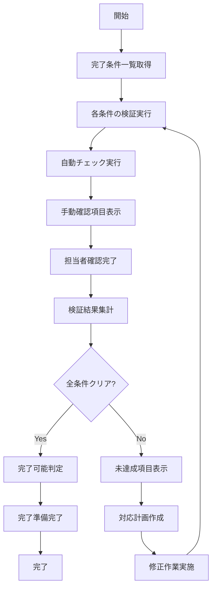
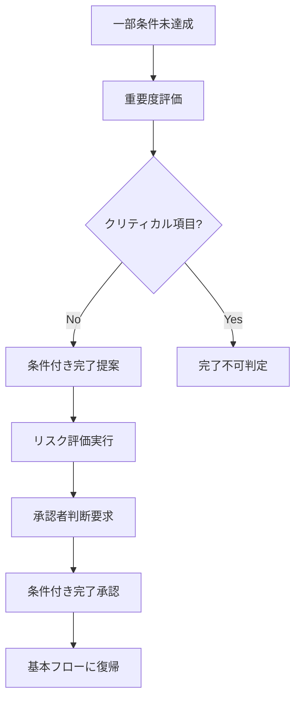
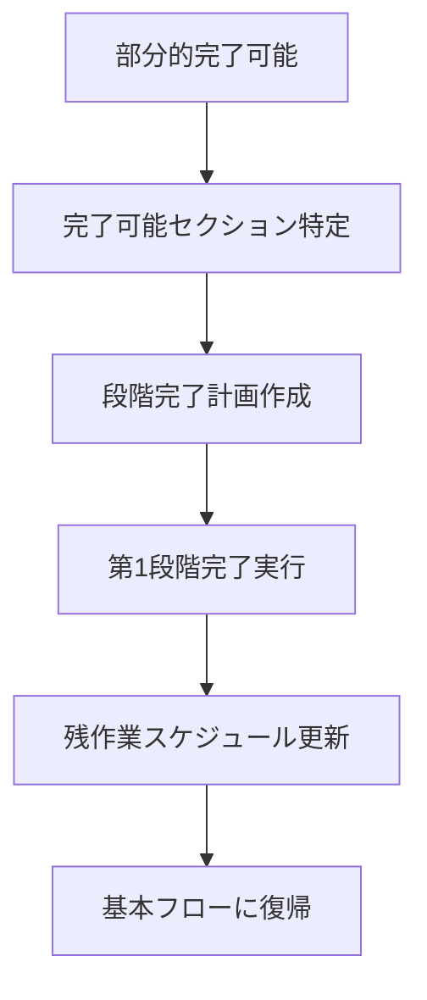
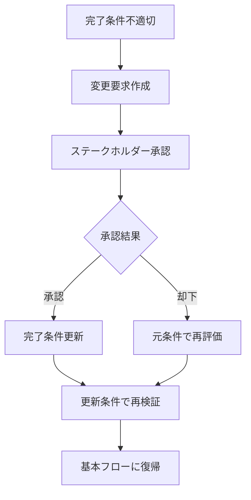
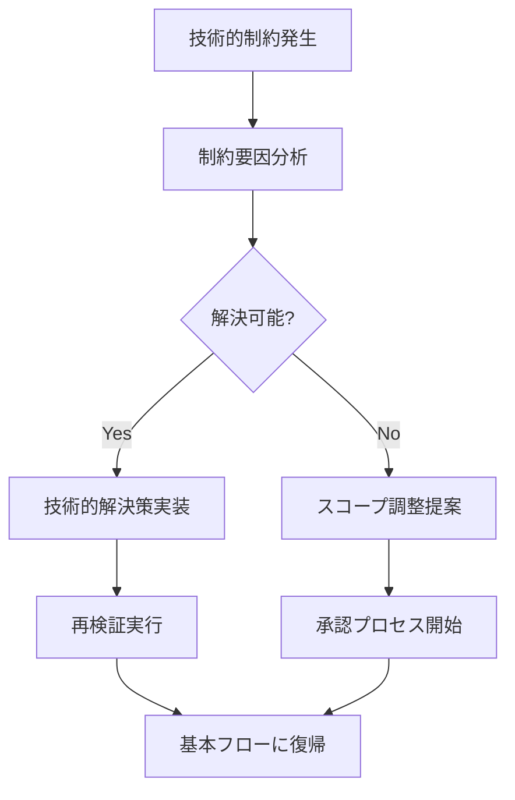

# UC-039: 完了条件確認

## 概要

タスクの完了申請前に、事前に定義された完了条件と受入基準を体系的にチェックするユースケース。

## アクター

- **プライマリ**: タスク担当者、プロジェクトマネージャー
- **セカンダリ**: システム（自動検証）、品質管理者

## 前提条件

- [ ] タスクの進捗が90%以上
- [ ] 完了条件が事前に定義済み
- [ ] 成果物が提出可能状態

## 事後条件

- [ ] 全完了条件がチェック済み
- [ ] 未達成項目が特定済み
- [ ] 完了可能性が判定済み

## 基本フロー



### ステップ詳細

1. **完了条件取得**: タスク作成時に定義された受入条件とチェックリストを取得
2. **条件検証**: 各完了条件を順次チェック・検証
3. **自動チェック**: システムが自動で検証可能な項目（品質メトリクス等）を実行
4. **手動確認**: 担当者による目視確認が必要な項目を表示
5. **確認完了**: 担当者が全ての手動確認項目をチェック
6. **結果集計**: 自動・手動チェックの結果を統合
7. **完了判定**: 全条件クリアの可否を判定
8. **対応計画**: 未達成項目に対する対応計画を作成

## 代替フロー1: 条件付き完了



**条件**: 非クリティカルな完了条件が未達成の場合

## 代替フロー2: 段階的完了



**条件**: タスクが複数のサブタスクに分割可能で、一部が完了可能な場合

## 例外フロー1: 完了条件変更要求



## 例外フロー2: 技術的制約による未達成



## ビジネスルール

### BR-001: 完了条件の分類
- **必須条件**: 100%達成が必要、例外なし
- **推奨条件**: 80%以上達成推奨、承認者判断で例外可
- **オプション条件**: 達成が望ましいが、未達成でも完了可

### BR-002: 自動検証項目
- コード品質メトリクス（カバレッジ、複雑度等）
- パフォーマンス基準（応答時間、スループット等）
- セキュリティチェック（脆弱性スキャン結果）
- ドキュメント完成度（必須セクションの存在確認）

### BR-003: 承認権限
- 通常完了: 担当者の確認で完了可能
- 条件付き完了: プロジェクトマネージャーの承認必要
- スコープ変更を伴う完了: ステークホルダーの承認必要

## 非機能要件

### パフォーマンス
- 完了条件チェック処理: 10秒以内
- 自動検証実行時間: 30秒以内
- 検証結果表示: 2秒以内

### 信頼性
- 自動検証精度: 95%以上
- 検証結果の一貫性: 99%以上
- システム可用性: 99.9%以上

### ユーザビリティ
- 完了条件の進捗表示（プログレスバー）
- 未達成項目の優先度表示
- ワンクリックでの再検証機能

## テストケース

### TC-001: 正常系 - 全条件クリア
1. 進捗100%のタスクで完了条件確認開始
2. 5つの完了条件が定義済みを確認
3. 自動検証で3項目がPASS
4. 手動確認で2項目をチェック
5. 全条件クリアを確認
6. 完了可能判定を受信

### TC-002: 代替系 - 条件付き完了
1. 完了条件確認実行
2. 推奨条件1項目が未達成（80%達成）
3. 非クリティカル項目として判定
4. リスク評価を実行（低リスク）
5. 条件付き完了を提案
6. プロジェクトマネージャーが承認
7. 条件付き完了として処理

### TC-003: 例外系 - 技術的制約
1. 完了条件確認実行
2. パフォーマンス基準（必須条件）が未達成
3. 技術的制約（外部API制限）が原因と判定
4. 解決困難として評価
5. スコープ調整提案を生成
6. ステークホルダー承認プロセス開始

## 関連ページ

- **P-033**: 完了条件確認ページ
- **P-034**: 自動検証結果表示ページ
- **P-035**: 未達成項目対応計画ページ
- **P-036**: 条件付き完了承認ページ

## インターフェース定義

### CompletionCriteria
```typescript
interface CompletionCriteria {
  taskId: string;
  criteria: CompletionCriterion[];
  overallStatus: 'PENDING' | 'VERIFIED' | 'FAILED' | 'CONDITIONAL';
  verificationResults: VerificationResult[];
  verifiedAt: Date;
  verifiedBy: string;
}

interface CompletionCriterion {
  criterionId: string;
  title: string;
  description: string;
  type: 'MANDATORY' | 'RECOMMENDED' | 'OPTIONAL';
  verificationMethod: 'AUTOMATIC' | 'MANUAL' | 'HYBRID';
  acceptanceThreshold: number; // 0.0-1.0
  currentProgress: number; // 0.0-1.0
  status: 'NOT_STARTED' | 'IN_PROGRESS' | 'COMPLETED' | 'FAILED';
}
```

### VerificationResult
```typescript
interface VerificationResult {
  criterionId: string;
  verificationMethod: 'AUTOMATIC' | 'MANUAL';
  result: 'PASS' | 'FAIL' | 'WARNING';
  score: number; // 0.0-1.0
  evidence: Evidence[];
  verifiedAt: Date;
  verifiedBy: string;
  comments: string;
}

interface Evidence {
  type: 'DOCUMENT' | 'TEST_RESULT' | 'METRICS' | 'SCREENSHOT';
  url: string;
  description: string;
  timestamp: Date;
}
```

## メトリクス

- 完了条件確認成功率: 95%以上
- 平均検証時間: 5分以内
- 自動検証精度: 95%以上
- 条件付き完了承認率: 80%以上
- 完了後の品質問題発生率: 5%以下

## 更新履歴

| バージョン | 更新日 | 更新者 | 更新内容 |
|-----------|--------|---------|----------|
| 1.0 | 2024-11-05 | Claude Code | 初版作成 |