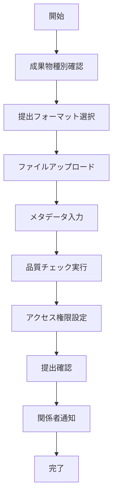

# UC-040: 成果物提出

## 概要

タスクの成果物を適切な形式で提出し、関係者がアクセス・レビューできる状態にするユースケース。

## アクター

- **プライマリ**: タスク担当者
- **セカンダリ**: システム（ストレージ管理）、レビュアー、品質管理者

## 前提条件

- [ ] 完了条件確認が完了済み
- [ ] 成果物が完成済み
- [ ] 提出要件が明確

## 事後条件

- [ ] 成果物が正式提出済み
- [ ] 関係者がアクセス可能
- [ ] 提出記録が作成済み

## 基本フロー



## インターフェース定義

```typescript
interface DeliverableSubmission {
  submissionId: string;
  taskId: string;
  deliverables: Deliverable[];
  submittedBy: string;
  submittedAt: Date;
  reviewRequirements: ReviewRequirement[];
  accessPermissions: AccessPermission[];
}

interface Deliverable {
  deliverableId: string;
  type: 'DOCUMENT' | 'CODE' | 'DESIGN' | 'REPORT' | 'OTHER';
  title: string;
  description: string;
  files: DeliverableFile[];
  qualityMetrics: QualityMetrics;
  version: string;
}
```

## 関連ページ

- **P-037**: 成果物提出ページ
- **P-038**: 品質チェック結果ページ

## メトリクス

- 提出成功率: 99%以上
- 平均提出処理時間: 3分以内
- 品質チェック通過率: 90%以上

## 更新履歴

| バージョン | 更新日 | 更新者 | 更新内容 |
|-----------|--------|---------|----------|
| 1.0 | 2024-11-05 | Claude Code | 初版作成 |