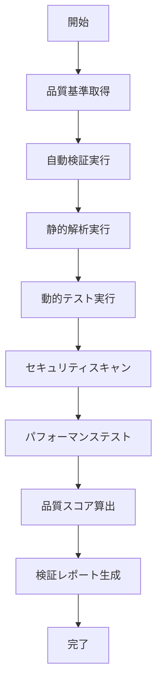

# UC-041: 品質検証

## 概要

提出された成果物の品質を多角的に検証し、品質基準への適合性を確認するユースケース。

## アクター

- **プライマリ**: システム（自動検証）、品質管理者
- **セカンダリ**: タスク担当者、レビュアー

## 前提条件

- [ ] 成果物が提出済み
- [ ] 品質基準が定義済み
- [ ] 検証ツールが利用可能

## 事後条件

- [ ] 品質検証が完了済み
- [ ] 検証結果が記録済み
- [ ] 品質スコアが算出済み

## 基本フロー



## インターフェース定義

```typescript
interface QualityVerification {
  verificationId: string;
  deliverableId: string;
  verificationResults: VerificationTest[];
  overallScore: number; // 0-100
  qualityGrade: 'A' | 'B' | 'C' | 'D' | 'F';
  verifiedAt: Date;
  verificationDuration: number; // minutes
}

interface VerificationTest {
  testType: 'STATIC_ANALYSIS' | 'UNIT_TEST' | 'SECURITY_SCAN' | 'PERFORMANCE';
  testName: string;
  status: 'PASS' | 'FAIL' | 'WARNING';
  score: number; // 0-100
  details: TestDetail[];
}
```

## 関連ページ

- **P-039**: 品質検証結果ページ
- **P-040**: 詳細分析レポートページ

## 更新履歴

| バージョン | 更新日 | 更新者 | 更新内容 |
|-----------|--------|---------|----------|
| 1.0 | 2024-11-05 | Claude Code | 初版作成 |