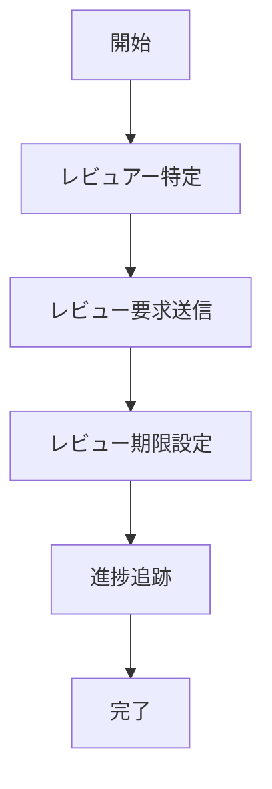

# UC-042: 最終レビュー要求

## 概要
タスク完了前の最終レビューを関係者に要求し、承認プロセスを開始するユースケース。

## 基本フロー


## インターフェース定義
```typescript
interface FinalReviewRequest {
  requestId: string;
  taskId: string;
  reviewers: ReviewerAssignment[];
  reviewDeadline: Date;
  reviewScope: ReviewScope;
  requestedBy: string;
}
```

## 更新履歴
| バージョン | 更新日 | 更新者 | 更新内容 |
|-----------|--------|---------|----------|
| 1.0 | 2024-11-05 | Claude Code | 初版作成 |