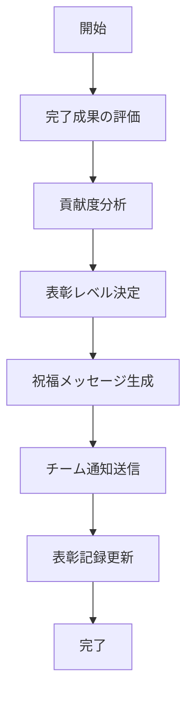

# UC-050: 完了祝福と表彰

## 概要
タスク完了の祝福とチームメンバーの貢献に対する表彰の実施。

## アクター
- **プライマリ**: プロジェクトマネージャー、チームリーダー
- **セカンダリ**: システム（通知管理）、人事システム

## 基本フロー


## インターフェース定義
```typescript
interface CelebrationAndRecognition {
  taskId: string;
  achievementLevel: 'EXCELLENT' | 'GOOD' | 'STANDARD';
  contributors: ContributorRecognition[];
  celebrationMessage: string;
  recognitionActions: RecognitionAction[];
  celebratedAt: Date;
}

interface ContributorRecognition {
  userId: string;
  contributionType: 'LEADERSHIP' | 'TECHNICAL' | 'COLLABORATION' | 'INNOVATION';
  recognitionLevel: 'OUTSTANDING' | 'COMMENDABLE' | 'NOTABLE';
  achievementDescription: string;
  rewardPoints: number;
}
```

## 関連ページ
- **P-041**: 完了祝福ページ
- **P-042**: チーム表彰ページ

## メトリクス
- チーム満足度向上: 15%以上
- 表彰記録完全性: 100%
- 祝福メッセージ送信成功率: 99%以上

## 更新履歴
| バージョン | 更新日 | 更新者 | 更新内容 |
|-----------|--------|---------|----------|
| 1.0 | 2024-11-05 | Claude Code | 初版作成 |