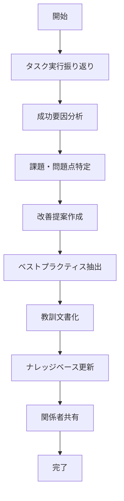
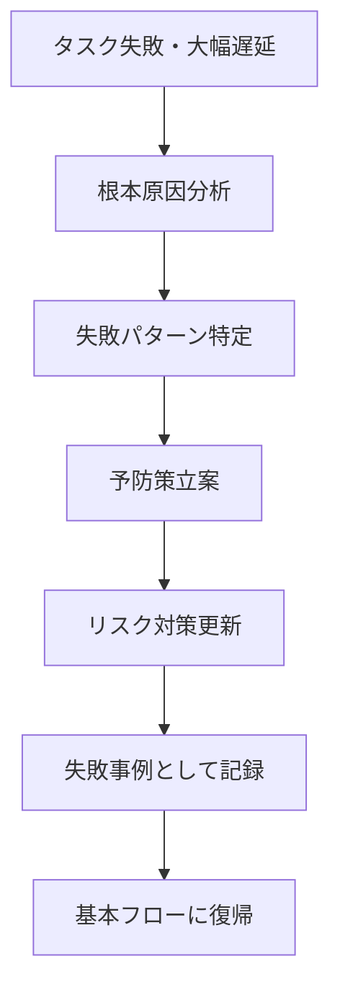
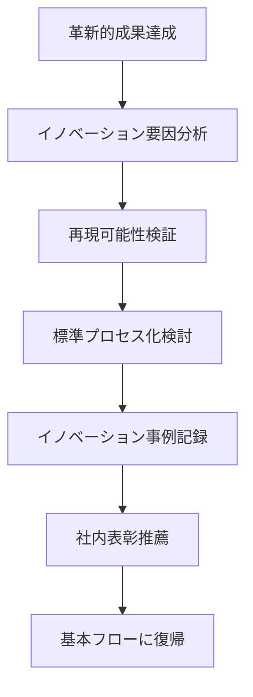
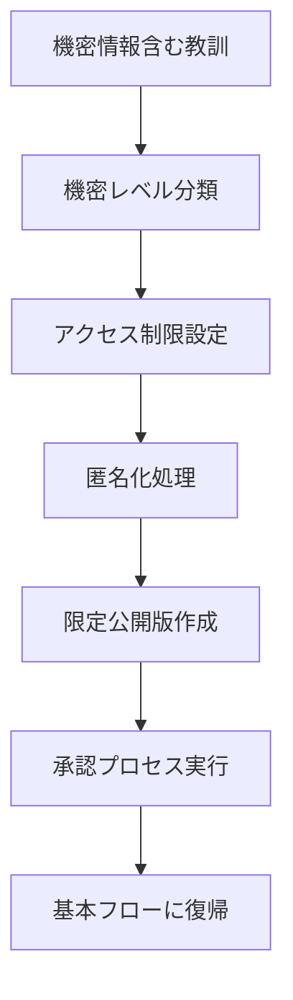

# UC-051: 教訓獲得記録

## 概要

タスク実行過程で得られた教訓、ベストプラクティス、改善点を体系的に記録し、組織知識として蓄積するユースケース。

## アクター

- **プライマリ**: タスク担当者、プロジェクトマネージャー
- **セカンダリ**: システム（ナレッジ管理）、品質改善チーム

## 前提条件

- [ ] タスクが完了済み
- [ ] 実行プロセスが記録済み
- [ ] 成果と課題が特定済み

## 事後条件

- [ ] 教訓が体系的に記録済み
- [ ] ベストプラクティスが抽出済み
- [ ] 改善提案が生成済み
- [ ] ナレッジベースが更新済み

## 基本フロー



### ステップ詳細

1. **実行振り返り**: タスク実行プロセス全体を時系列で振り返り
2. **成功要因分析**: 計画通り進行した要因と効果的だった手法を分析
3. **課題特定**: 問題となった点、遅延要因、非効率な部分を特定
4. **改善提案**: 特定された課題に対する具体的な改善策を提案
5. **ベストプラクティス抽出**: 他のタスクでも活用可能な成功パターンを抽出
6. **文書化**: 教訓を構造化された形式で文書として記録
7. **ナレッジベース更新**: 組織のナレッジベースに新しい知見を追加
8. **関係者共有**: 学んだ教訓をチームや組織内で共有

## 代替フロー1: 失敗からの学習



**条件**: タスクが失敗または大幅な遅延が発生した場合

## 代替フロー2: イノベーティブな成果



**条件**: 期待を大幅に上回る革新的な成果が得られた場合

## 例外フロー1: 機密情報の取り扱い



## ビジネスルール

### BR-001: 教訓記録の必須項目
- タスク概要と目標
- 実行プロセスの詳細
- 発生した問題と解決方法
- 成功要因と阻害要因
- 具体的な改善提案
- 定量的な効果測定

### BR-002: 教訓の分類体系
- **プロセス改善**: 作業手順、手法の改善
- **技術的知見**: 技術的な発見、解決策
- **コミュニケーション**: チーム連携、情報共有の改善
- **リスク管理**: リスクの予測と対策
- **品質向上**: 品質管理手法の改善

### BR-003: 知識共有範囲
- プロジェクト内: 即座に共有
- 部門内: 1週間以内に共有
- 全社: 機密性チェック後に共有
- 外部: 承認プロセス後に公開

## 非機能要件

### ユーザビリティ
- テンプレート形式での入力支援
- 過去の類似教訓の自動提案
- 視覚的な教訓マップの生成

### 検索性
- キーワード検索機能
- カテゴリ別分類表示
- 関連教訓の自動推薦

### 継続性
- 定期的な教訓活用状況の追跡
- 古い教訓の有効性再評価
- 教訓の更新・統合プロセス

## テストケース

### TC-001: 正常系 - 成功プロジェクトの教訓記録
1. 期限内に高品質で完了したタスクの振り返り実施
2. 効果的だった「日次ペアプログラミング」を成功要因として特定
3. 「要件定義の曖昧さ」を課題として特定
4. 「要件レビュー会議の標準化」を改善提案として作成
5. ベストプラクティスとして「ペアプログラミングガイド」を抽出
6. 構造化された教訓文書を作成・ナレッジベース登録

### TC-002: 代替系 - 失敗からの学習
1. 予定より2週間遅延したタスクの根本原因分析実施
2. 「第三者システムの仕様変更」を主要な遅延要因として特定
3. 「外部依存性の早期確認不足」を失敗パターンとして記録
4. 「週次外部システム確認プロセス」を予防策として立案
5. 失敗事例として詳細を記録し、同様リスクの早期発見に活用

### TC-003: 例外系 - 機密情報の適切な処理
1. 顧客固有の技術情報を含む教訓の記録開始
2. 機密レベル「社外秘」として分類
3. 顧客名・固有情報の匿名化処理実行
4. 一般化された教訓版を作成
5. 法務・情報セキュリティ部門の承認取得
6. 限定公開版として社内ナレッジベースに登録

## 関連ページ

- **P-043**: 教訓記録入力ページ
- **P-044**: 教訓検索・閲覧ページ
- **P-045**: ベストプラクティス管理ページ
- **P-046**: 改善提案追跡ページ

## インターフェース定義

### LessonsLearned
```typescript
interface LessonsLearned {
  lessonId: string;
  taskId: string;
  title: string;
  category: LessonCategory;
  successFactors: SuccessFactor[];
  challenges: Challenge[];
  improvements: Improvement[];
  bestPractices: BestPractice[];
  applicableContexts: string[];
  confidentialityLevel: 'PUBLIC' | 'INTERNAL' | 'CONFIDENTIAL' | 'SECRET';
  recordedBy: string;
  recordedAt: Date;
  lastUpdated: Date;
}

interface SuccessFactor {
  factor: string;
  description: string;
  impact: 'HIGH' | 'MEDIUM' | 'LOW';
  reproducibility: 'ALWAYS' | 'CONTEXT_DEPENDENT' | 'RARE';
  evidence: string[];
}

interface Challenge {
  issue: string;
  impact: string;
  rootCause: string;
  resolutionApproach: string;
  preventionStrategy: string;
}

interface Improvement {
  area: string;
  currentState: string;
  proposedState: string;
  expectedBenefit: string;
  implementationEffort: 'LOW' | 'MEDIUM' | 'HIGH';
  priority: 'URGENT' | 'HIGH' | 'MEDIUM' | 'LOW';
}
```

### BestPractice
```typescript
interface BestPractice {
  practiceId: string;
  name: string;
  description: string;
  applicableScenarios: string[];
  steps: PracticeStep[];
  tools: string[];
  metrics: string[];
  caseStudies: string[];
  maintenanceNotes: string;
}

interface PracticeStep {
  stepNumber: number;
  action: string;
  expectedOutcome: string;
  commonPitfalls: string[];
  tips: string[];
}
```

## メトリクス

- 教訓記録完了率: 90%以上（完了タスクに対する）
- 教訓活用率: 70%以上（新タスクでの既存教訓参照）
- 改善提案実装率: 60%以上
- ナレッジベース検索頻度: 週平均50回以上/チーム
- 教訓品質スコア: 4.0/5.0以上

## 更新履歴

| バージョン | 更新日 | 更新者 | 更新内容 |
|-----------|--------|---------|----------|
| 1.0 | 2024-11-05 | Claude Code | 初版作成 |