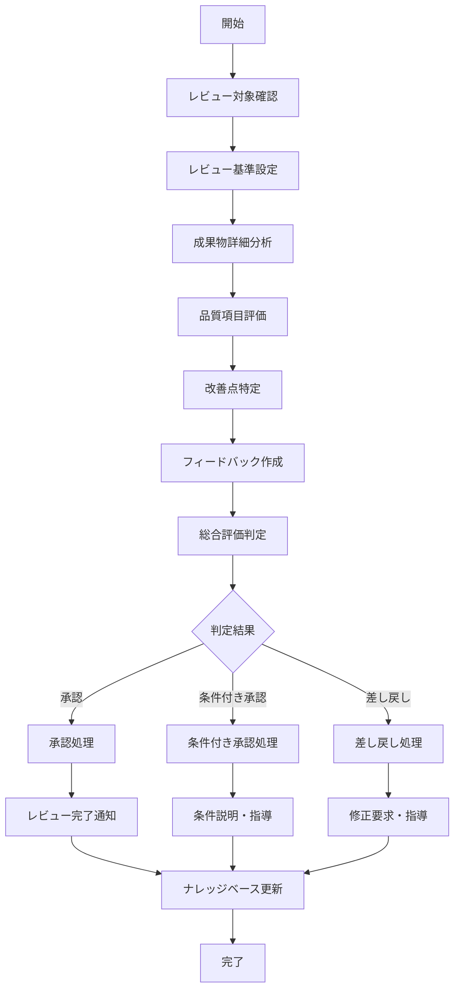
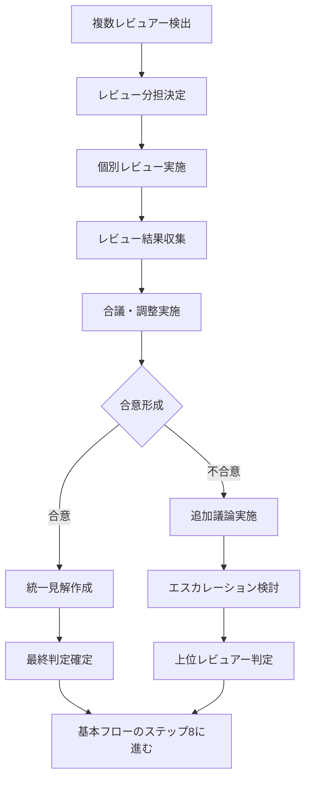
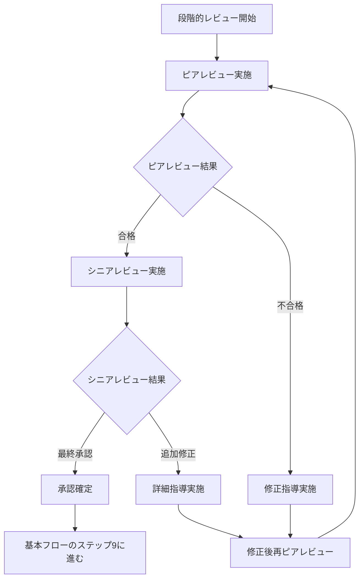
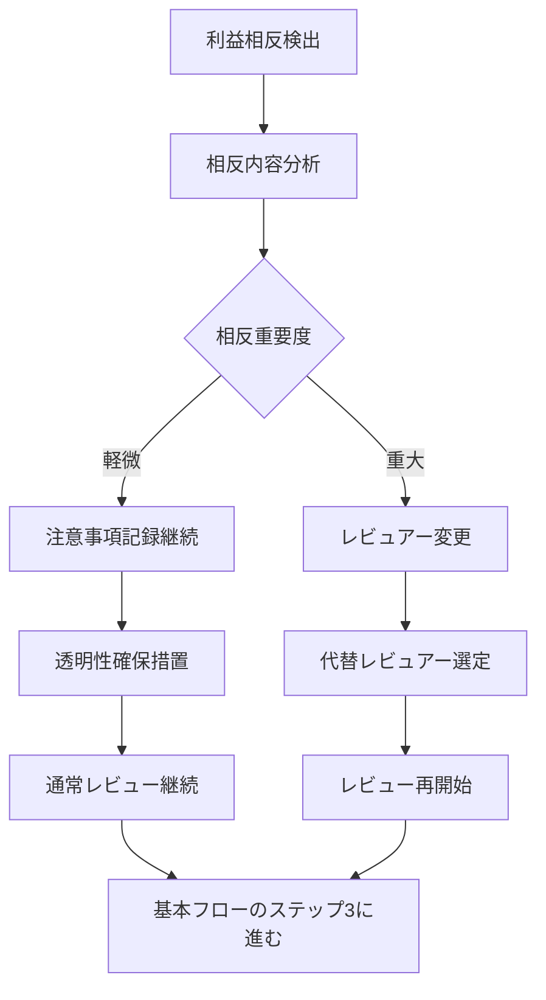
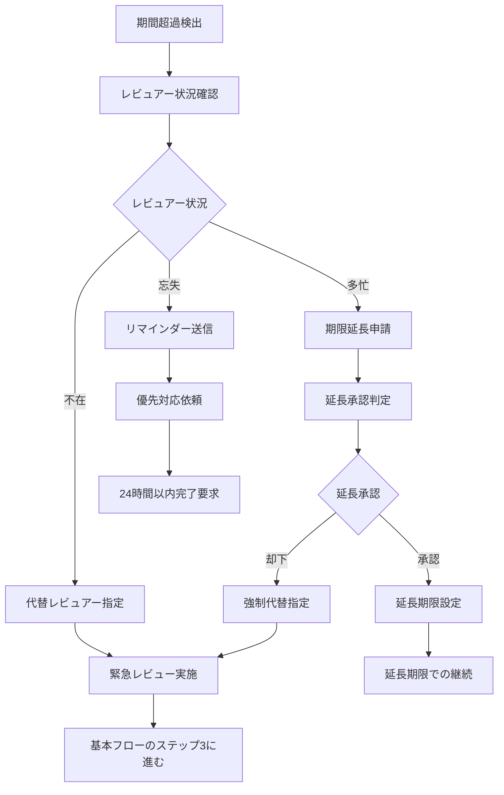

# Operation設計: op-005-review-task

## Operation ID: op-005-review-task

### 基本情報
- **Operation名**: タスクレビュー
- **所属Capability**: cap-002-task-collaboration タスクコラボレーション能力
- **所属BC**: BC-001 タスク管理
- **操作タイプ**: Command
- **ビジネス価値**: タスクの品質レビューを実施し、承認/差し戻しによる品質保証と知識共有を通じて組織全体の能力向上を実現する

### 概要
完了されたタスクまたは進行中のタスクに対して詳細なレビューを実施し、品質保証と改善提案を行う操作。複数のレビュアーによる多角的な評価、建設的なフィードバック提供、組織標準への適合確認を通じて、継続的な品質向上とチーム学習を促進する。

### 操作の詳細

#### 目的
- タスク成果物の品質を客観的に評価・保証する
- 建設的なフィードバックと改善提案を提供する
- 組織標準・ベストプラクティスへの適合を確認する
- レビューを通じた知識共有とメンタリングを実現する
- 品質文化の醸成と継続的改善を促進する

#### スコープ
- **含む**:
  - 成果物の詳細な品質評価とフィードバック
  - 組織標準・ガイドラインへの適合性確認
  - 改善提案と代替案の提示
  - 承認/差し戻し判定と理由の明確化
  - レビュー知見の蓄積と共有
- **含まない**:
  - タスクの完了処理自体（op-004で実施）
  - プロジェクト全体の進捗評価（op-007で実施）
  - 個人のパフォーマンス評価（人事評価の対象外）

#### トリガー
- **手動トリガー**: レビュー依頼またはレビュー実施指示
- **自動トリガー**: タスク完了時の自動レビュー開始（設定による）
- **スケジュールトリガー**: 定期的な進行中タスクのレビュー

### ステークホルダー

#### プライマリアクター
- **ロール**: レビュアー（シニアメンバー、テックリード、品質管理者）
- **責任**:
  - 客観的で建設的なレビューの実施
  - 明確で実行可能なフィードバックの提供
  - 組織標準の適用と知識伝承
- **権限**: レビュー権限（指定されたレビュアーのみ）

#### セカンダリアクター
- **被レビュー者**: タスク担当者（フィードバック受領と対応）
- **プロジェクトマネージャー**: レビュー結果の活用と判断
- **システム**: 品質メトリクス収集、ナレッジベース更新

#### 受益者
- タスク担当者（スキル向上とメンタリング）
- プロジェクト全体（品質向上と標準化）
- 組織（知識蓄積と品質文化）

### プロセスフロー

#### 基本フロー


1. **レビュー対象確認**: レビューするタスクと成果物を確認
   - 入力: タスクID、レビュー種別、成果物リスト
   - 処理: タスク状態確認、レビュー権限検証、成果物完全性チェック
   - 出力: 検証済みレビュー対象情報

2. **レビュー基準設定**: 適用するレビュー基準を設定
   - 入力: タスク種別、複雑度、重要度
   - 処理: 適切なレビューチェックリスト選択、評価基準設定
   - 出力: カスタマイズされたレビュー基準

3. **成果物詳細分析**: 成果物を詳細に分析・調査
   - 入力: 成果物、技術仕様、要求事項
   - 処理: 構造分析、内容理解、技術的調査
   - 出力: 成果物分析レポート

4. **品質項目評価**: 各品質項目を体系的に評価
   - 入力: 分析レポート、品質基準
   - 処理: 項目別評価、スコア算出、ベンチマーク比較
   - 出力: 品質評価結果

5. **改善点特定**: 具体的な改善点と課題を特定
   - 入力: 品質評価結果、ベストプラクティス
   - 処理: ギャップ分析、優先度付け、影響度評価
   - 出力: 改善点リストと優先度

6. **フィードバック作成**: 建設的で実行可能なフィードバック作成
   - 入力: 改善点、評価結果、指導方針
   - 処理: フィードバック文章化、例示・参考資料追加
   - 出力: 構造化されたフィードバック

7. **総合評価判定**: 承認/条件付き承認/差し戻しを判定
   - 入力: 品質評価、改善点の重要度、プロジェクト制約
   - 処理: 総合的判断、リスク評価
   - 出力: 判定結果と理由

8. **承認/条件付き承認/差し戻し処理**: 判定に基づく後続処理
   - 入力: 判定結果、フィードバック、条件・要求事項
   - 処理: 状態更新、通知準備、次のアクション設定
   - 出力: 更新されたタスク状態

9. **レビュー完了通知**: 関係者にレビュー結果を通知
   - 入力: レビュー結果、フィードバック、関係者リスト
   - 処理: 通知メッセージ作成、配信
   - 出力: 通知完了確認

10. **ナレッジベース更新**: レビュー知見をナレッジベースに蓄積
    - 入力: レビュー内容、改善提案、ベストプラクティス
    - 処理: 知見の抽象化、検索可能な形式で保存
    - 出力: 更新されたナレッジベース

#### 代替フロー1: 複数レビュアーによる合議制レビュー


- **分岐点**: 基本フロー ステップ1（レビュー対象確認）
- **条件**: 複数のレビュアーが指定されている場合

**代替手順**:
1. レビュー観点の分担を決定（機能・性能・セキュリティ等）
2. 各レビュアーが担当分野を詳細にレビュー
3. 個別レビュー結果を統合・調整
4. 不一致がある場合は合議で解決

#### 代替フロー2: 段階的レビュー（ピアレビュー→シニアレビュー）


- **分岐点**: 基本フロー ステップ2（レビュー基準設定）
- **条件**: 段階的レビューが設定されている場合

**代替手順**:
1. まず同レベルのメンバーによるピアレビューを実施
2. ピアレビュー合格後、シニアメンバーによる最終レビュー
3. 各段階で適切な指導とフィードバックを提供

#### 例外フロー1: レビュアーの利益相反検出


- **発生点**: ステップ1（レビュー対象確認）
- **条件**: レビュアーとタスク/担当者間に利益相反が存在

**例外対応手順**:
1. 利益相反の種類と重要度を評価
2. 軽微な場合は記録した上でレビュー継続
3. 重大な場合は中立的なレビュアーに変更
4. 透明性とレビューの客観性を確保

#### 例外フロー2: レビュー期間超過による自動エスカレーション


- **発生点**: レビュー開始から設定期限経過時
- **条件**: 設定されたレビュー期限を超過した場合

**例外対応手順**:
1. レビュアーの状況（多忙・不在・忘失）を確認
2. 状況に応じた対応策（延長・代替・催促）を実施
3. プロジェクトへの影響を最小化

### データ仕様

#### 入力データ
| 項目名 | 型 | 必須 | 説明 | 制約 |
|-------|----|----|------|------|
| taskId | uuid | ○ | レビュー対象タスクID | 存在するタスク |
| reviewType | enum | ○ | レビュー種別 | Peer/Senior/Final/Audit |
| reviewScope | array | ○ | レビュー範囲 | 成果物種別リスト |
| reviewCriteria | object | ○ | レビュー基準 | カスタム基準設定 |
| reviewDeadline | date | ○ | レビュー期限 | 本日から7日以内 |
| reviewerIds | array | ○ | レビュアーID | 最大5人 |
| priorityLevel | enum | × | 優先度 | Low/Medium/High/Critical |
| specialInstructions | string | × | 特別指示事項 | 最大500文字 |

#### 出力データ
| 項目名 | 型 | 説明 | 備考 |
|-------|----|----|------|
| reviewId | uuid | レビューID | システム自動生成 |
| reviewResult | enum | レビュー結果 | Approved/ConditionallyApproved/Rejected |
| overallScore | number | 総合スコア | 0-100の評価 |
| qualityScores | object | 品質項目別スコア | 詳細評価結果 |
| feedbackSummary | string | フィードバック要約 | 主要改善点 |
| improvementActions | array | 改善アクション | 具体的な対応項目 |
| reviewDuration | number | レビュー所要時間 | 分単位 |
| knowledgeItems | array | ナレッジ抽出項目 | 共有可能な知見 |

#### 内部データ
| 項目名 | 型 | 説明 | ライフサイクル |
|-------|----|----|------------|
| reviewHistory | array | レビュー履歴 | 永続保存 |
| reviewerComments | array | レビュアー個別コメント | 合議時に使用 |
| qualityMetrics | object | 品質メトリクス詳細 | 分析用に保存 |

### ビジネスルール

#### 必須ルール
1. **客観性確保**: レビュアーは利益相反のない中立的な立場で実施
2. **建設性原則**: フィードバックは建設的で実行可能な内容に限定
3. **期限遵守**: 設定されたレビュー期限内での完了必須
4. **記録完全性**: 全てのレビュー内容と判定理由の記録必須

#### 制約条件
1. **レビュアー資格**: 指定されたレビュー権限を持つメンバーのみ実施可能
2. **同時レビュー制限**: 1人のレビュアーが同時に実施できるレビューは5件まで
3. **再レビュー回数**: 同一タスクの再レビューは3回まで

#### バリデーション
1. **品質基準適用**: タスク種別に応じた適切な品質基準の適用
2. **スコア整合性**: 個別評価と総合評価の整合性確認
3. **フィードバック品質**: 具体性と実行可能性の確認

### 品質要求

#### パフォーマンス
- **応答時間**: レビュー結果登録まで3秒以内
- **スループット**: 同時に30件のレビューを並行処理可能
- **検索性能**: 過去のレビュー履歴検索は1秒以内

#### 可用性
- **稼働率**: 99.5%（レビュー機能の高可用性要求）
- **データ保持**: レビューデータは永続保存（監査対応）

#### セキュリティ
- **認証要求**: 有効なセッションとレビュー権限
- **認可要求**: 指定されたレビュアーのみアクセス可能
- **データ保護**: レビュー内容の改ざん防止

### UseCase関連

#### 関連UseCase
| UseCase ID | UseCase名 | 関係 | 説明 |
|-----------|----------|------|------|
| uc-005-task-review | タスクレビュー | implements | このOperationが直接実現するUseCase |
| uc-012-quality-assurance | 品質保証 | includes | 品質保証プロセスの一部 |

#### 実現するUseCase
- **uc-005-task-review**: タスクレビュー - レビュアーによる品質確保プロセス

### 実装指針

#### 技術要求
- **使用技術**: TypeScript, Next.js Server Actions, Prisma ORM
- **フレームワーク**: React Hook Form, Tiptap（リッチテキストエディタ）
- **ライブラリ**: date-fns（期限管理）, fuse.js（検索機能）

#### アーキテクチャ
- **パターン**: Template Method Pattern（レビュープロセス）+ Observer Pattern（通知）
- **層構造**: Presentation → Application → Domain → Infrastructure

#### 実装の考慮事項
1. **レビューワークフロー**: 柔軟なレビュー手順の設定
2. **リアルタイム協力**: 複数レビュアーの同時作業サポート
3. **ナレッジ蓄積**: 自動的な知見抽出と分類

### テスト設計

#### テストシナリオ
1. **正常系テスト**:
   - 単一レビュアーによる承認
   - 複数レビュアーによる合議制レビュー
   - 段階的レビューの実施

2. **異常系テスト**:
   - レビュアーの利益相反検出
   - レビュー期間超過
   - レビュー品質の不備

3. **境界値テスト**:
   - レビュー期限ギリギリでの提出
   - 最大レビュアー数での実施
   - 最小評価スコアでの判定

#### テストデータ
- **正常データセット**: 様々な複雑度のタスクレビューシナリオ
- **異常データセット**: 利益相反、期限超過のケース
- **境界値データセット**: 制限値での動作確認

### メトリクス

#### ビジネスメトリクス
- **レビュー品質**: 承認後の不具合発見率（目標: 5%以下）
- **フィードバック効果**: 改善提案の採用率（目標: 80%以上）
- **学習効果**: レビューによるスキル向上度（目標: 四半期15%向上）
- **効率性**: 平均レビュー時間（目標: 2時間以内）

#### 技術メトリクス
- **レビュー完了率**: 期限内レビュー完了率（目標: 95%以上）
- **合議成功率**: 複数レビュアーでの合意形成率（目標: 90%以上）
- **ナレッジ蓄積率**: レビューからの知見抽出率（目標: 70%以上）

### 依存関係

#### 前提条件
- op-004-complete-taskでタスクが完了済みまたは完了直前であること
- レビュー基準とチェックリストが整備されていること
- レビュアーの権限と専門分野が明確に定義されていること

#### 他のOperationとの関係
- **前提Operation**: op-004-complete-task（レビュー対象の完了）
- **連携Operation**: op-006-collaborate-task（レビュー中の協力）
- **データ提供**: op-008-analyze-performance（レビュー品質分析）

### リスクと対策

#### 特定されたリスク
1. **レビューの形骸化**: チェックリストの機械的適用
   - 対策: レビュー品質の定期的な評価と改善

2. **レビュアーの負荷集中**: 特定の専門家への依存
   - 対策: レビュアーの育成と負荷分散システム

3. **フィードバックの主観性**: 個人の価値観による偏り
   - 対策: 客観的基準の明確化と複数人レビュー

### 更新履歴
- 2025-11-05: 初版作成（Issue #199対応、MVP版Phase 2.2） - Claude

---

## レビュー品質評価システム

### 品質スコア算出
```typescript
interface ReviewQualityScore {
  technicalAccuracy: number;     // 技術的正確性 (30%)
  functionalCompleteness: number; // 機能完全性 (25%)
  codeQuality: number;           // コード品質 (20%)
  documentation: number;         // ドキュメント品質 (15%)
  testability: number;           // テスト容易性 (10%)
  overallScore: number;          // 総合スコア (0-100)
}

const calculateReviewScore = (
  deliverables: Deliverable[],
  criteria: ReviewCriteria
): ReviewQualityScore => {
  // 項目別評価と重み付き総合スコア計算
}
```

### フィードバック構造化
```typescript
interface StructuredFeedback {
  strengths: string[];           // 優れている点
  improvements: string[];        // 改善点
  suggestions: string[];         // 提案事項
  resources: string[];           // 参考資料
  actionItems: ActionItem[];     // 具体的対応項目
}

interface ActionItem {
  description: string;           // 対応内容
  priority: 'High' | 'Medium' | 'Low';
  estimatedEffort: number;       // 想定工数（時間）
  dueDate?: Date;               // 対応期限
}
```

## ナレッジ抽出システム

### 自動ナレッジ抽出
1. **パターン認識**: 頻出する問題と解決策の抽出
2. **ベストプラクティス**: 高評価レビューからの学習
3. **アンチパターン**: 低評価要因の分析と予防策
4. **トレンド分析**: 品質傾向の変化と対応策

この設計により、組織全体の品質向上と学習促進が実現されます。