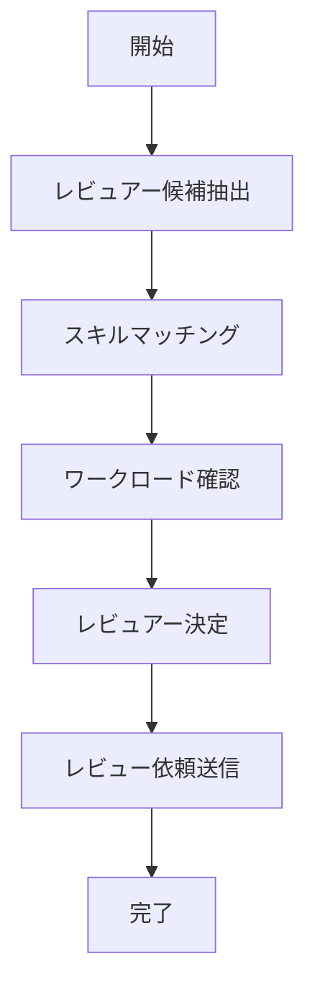

# UC-052: レビュー割り当て

## 概要
適切なレビュアーの選定と割り当てを行うユースケース。

## 基本フロー


## インターフェース定義
```typescript
interface ReviewAssignment {
  reviewId: string;
  taskId: string;
  reviewers: ReviewerInfo[];
  reviewType: 'TECHNICAL' | 'QUALITY' | 'BUSINESS';
  assignedBy: string;
  assignedAt: Date;
  deadline: Date;
}
```

## 更新履歴
| バージョン | 更新日 | 更新者 | 更新内容 |
|-----------|--------|---------|----------|
| 1.0 | 2024-11-05 | Claude Code | 初版作成 |