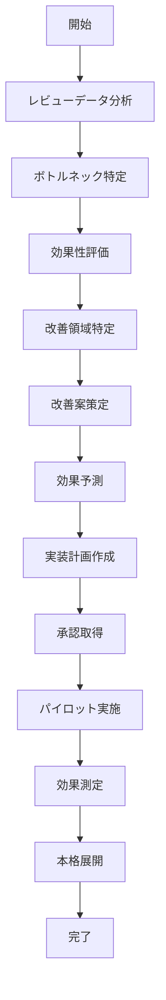

# UC-063: レビュープロセス改善

## 概要

レビュープロセスの効果性分析と継続的改善の実施。

## アクター

- **プライマリ**: プロセス改善チーム、品質管理者
- **セカンダリ**: システム（分析エンジン）、レビュアー、開発チーム

## 前提条件

- [ ] レビューメトリクスが蓄積済み
- [ ] レビュープロセスが標準化済み
- [ ] 改善提案の評価基準が明確

## 事後条件

- [ ] プロセス改善案が策定済み
- [ ] 改善効果が予測済み
- [ ] 実装計画が作成済み

## 基本フロー



## インターフェース定義

```typescript
interface ReviewProcessImprovement {
  improvementId: string;
  analysisResults: ProcessAnalysis;
  improvementAreas: ImprovementArea[];
  proposedChanges: ProcessChange[];
  expectedBenefits: Benefit[];
  implementationPlan: ImplementationStep[];
  pilotResults: PilotResult[];
  approvalStatus: 'PENDING' | 'APPROVED' | 'REJECTED';
  implementationStatus: 'PLANNED' | 'PILOT' | 'ROLLING_OUT' | 'COMPLETED';
}

interface ProcessAnalysis {
  reviewVelocity: number; // reviews per week
  averageReviewTime: number; // hours
  defectDetectionRate: number; // percentage
  reviewerSatisfaction: number; // 1-5 scale
  bottlenecks: Bottleneck[];
  qualityTrends: QualityTrend[];
}

interface ImprovementArea {
  area: 'EFFICIENCY' | 'QUALITY' | 'SATISFACTION' | 'COVERAGE';
  currentState: string;
  targetState: string;
  priority: 'HIGH' | 'MEDIUM' | 'LOW';
  complexityLevel: 'LOW' | 'MEDIUM' | 'HIGH';
}
```

## 関連ページ

- **P-047**: プロセス分析ダッシュボード
- **P-048**: 改善提案管理ページ
- **P-049**: パイロット結果表示ページ

## メトリクス

- レビュー効率向上: 20%以上
- 品質向上: 15%以上（欠陥検出率）
- レビュアー満足度: 4.0/5.0以上
- プロセス改善サイクル: 四半期毎

## 更新履歴

| バージョン | 更新日 | 更新者 | 更新内容 |
|-----------|--------|---------|----------|
| 1.0 | 2024-11-05 | Claude Code | 初版作成 |