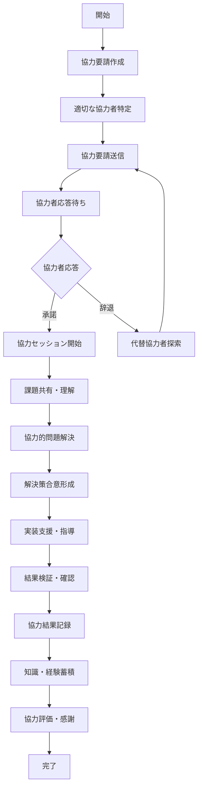
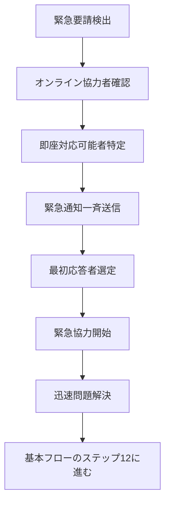
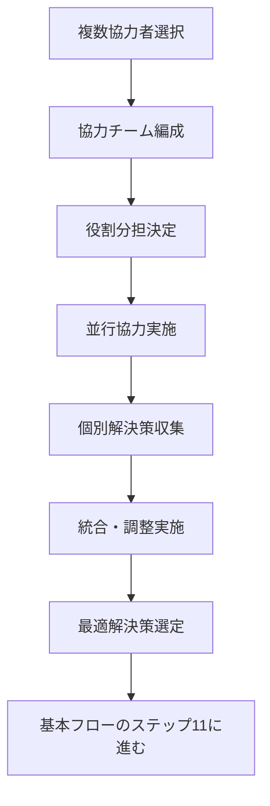
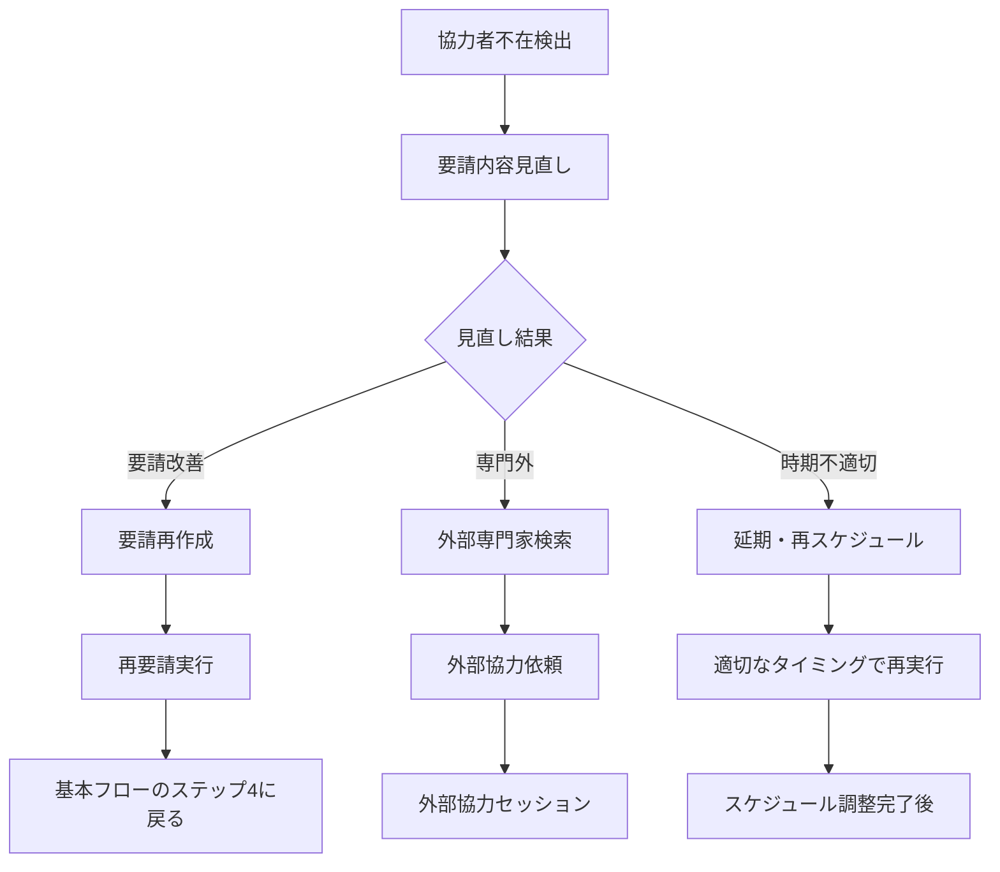
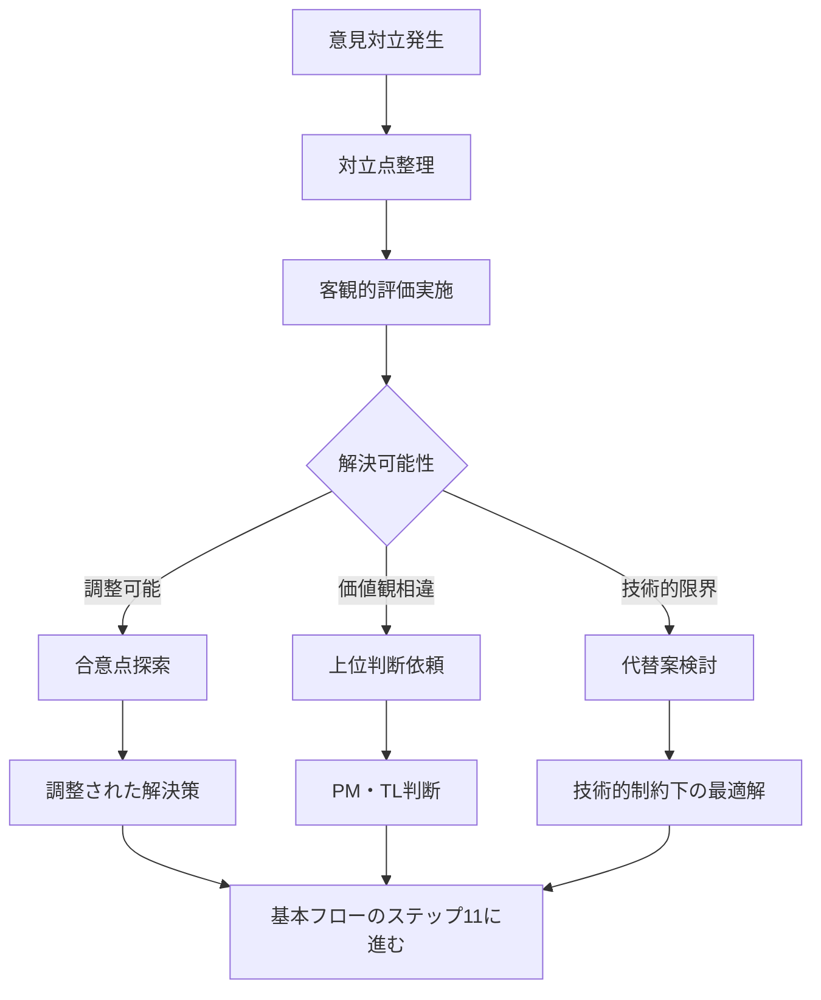

# Operation設計: op-006-collaborate-task

## Operation ID: op-006-collaborate-task

### 基本情報
- **Operation名**: タスク協力
- **所属Capability**: cap-002-task-collaboration タスクコラボレーション能力
- **所属BC**: BC-001 タスク管理
- **操作タイプ**: Command
- **ビジネス価値**: チームメンバー間のリアルタイム協力を促進し、集合知を活用することで課題解決の質とスピードを向上させる

### 概要
タスク実行中に発生する課題や論点に対して、チームメンバーが専門知識とスキルを相互に提供し合う協力プロセス。リアルタイムディスカッション、知識共有、問題解決支援を通じて、個人の限界を超えた高品質なタスク実行を実現し、チーム全体の学習と成長を促進する。

### 操作の詳細

#### 目的
- タスク実行中の課題に対する迅速な支援提供
- チームメンバーの専門知識と経験の相互活用
- リアルタイムコラボレーションによる創発的解決策の生成
- 知識共有を通じたチーム全体のスキル向上
- チーム結束力と相互信頼の強化

#### スコープ
- **含む**:
  - 協力要請の発信と受信
  - リアルタイムディスカッションの促進
  - 専門知識・経験の共有と伝授
  - 協力的問題解決プロセスの実施
  - 協力結果の文書化と知識蓄積
- **含まない**:
  - 長期的なメンタリング関係の構築（別プロセス）
  - プロジェクト全体の意思決定（PMの責任範囲）
  - 個人の人事評価（評価プロセスとは分離）

#### トリガー
- **手動トリガー**: チームメンバーからの協力要請
- **自動トリガー**: 課題検出時の自動協力提案
- **スケジュールトリガー**: 定期的な協力機会の提示

### ステークホルダー

#### プライマリアクター
- **ロール**: 協力要請者（タスク担当者）、協力提供者（チームメンバー）
- **責任**:
  - 要請者: 明確な協力要請と状況説明
  - 提供者: 建設的な支援と知識共有
- **権限**: プロジェクトメンバー権限（相互協力の権利と義務）

#### セカンダリアクター
- **ファシリテーター**: チームリーダー、スクラムマスター
- **システム**: 協力マッチングシステム、ナレッジベース
- **外部専門家**: 必要に応じて招集される社外エキスパート

#### 受益者
- 協力要請者（問題解決とスキル向上）
- 協力提供者（指導経験と視野拡大）
- チーム全体（集合知の向上と結束力強化）
- プロジェクト（品質向上と効率化）

### プロセスフロー

#### 基本フロー


1. **協力要請作成**: 具体的で明確な協力要請を作成
   - 入力: 課題内容、必要な専門知識、緊急度
   - 処理: 要請内容の構造化、必要スキルの特定
   - 出力: 構造化された協力要請

2. **適切な協力者特定**: 最適な協力者を特定・推奨
   - 入力: 協力要請、チームメンバー情報、スキルマトリックス
   - 処理: スキルマッチング、負荷状況確認、過去の協力実績分析
   - 出力: 推奨協力者リスト

3. **協力要請送信**: 選択された協力者に要請を送信
   - 入力: 協力要請、協力者情報
   - 処理: 個人向けメッセージ作成、通知送信
   - 出力: 送信完了確認

4. **協力者応答待ち**: 協力者からの応答を待機
   - 入力: 送信済み要請、応答期限
   - 処理: 応答監視、リマインダー送信
   - 出力: 協力者応答

5. **協力セッション開始**: 実際の協力作業を開始
   - 入力: 応諾確認、協力者・要請者情報
   - 処理: セッション環境準備、開始通知
   - 出力: アクティブな協力セッション

6. **課題共有・理解**: 課題の詳細を協力者と共有
   - 入力: 課題詳細、背景情報、制約条件
   - 処理: 情報整理、質疑応答、理解度確認
   - 出力: 共通理解された課題定義

7. **協力的問題解決**: 協力者と共に解決策を検討
   - 入力: 共有された課題、双方の知識・経験
   - 処理: ブレインストーミング、選択肢評価、最適解検討
   - 出力: 候補解決策リスト

8. **解決策合意形成**: 最適な解決策について合意
   - 入力: 候補解決策、評価基準、制約条件
   - 処理: 詳細検討、リスク評価、実装可能性確認
   - 出力: 合意された解決策

9. **実装支援・指導**: 解決策の実装を共同で実施
   - 入力: 合意された解決策、実装計画
   - 処理: 共同作業、技術指導、進行支援
   - 出力: 実装された解決策

10. **結果検証・確認**: 実装結果の有効性を検証
    - 入力: 実装された解決策、検証基準
    - 処理: 動作確認、品質確認、効果測定
    - 出力: 検証済み解決策

11. **協力結果記録**: 協力プロセスと結果を記録
    - 入力: 協力内容、解決策、学習内容
    - 処理: 内容の構造化、重要ポイント抽出
    - 出力: 協力記録レポート

12. **知識・経験蓄積**: 協力で得られた知見を蓄積
    - 入力: 協力記録、学習内容、ベストプラクティス
    - 処理: 知識の抽象化、検索可能形式での保存
    - 出力: 更新されたナレッジベース

13. **協力評価・感謝**: 協力の質と効果を評価
    - 入力: 協力プロセス、結果、関係者フィードバック
    - 処理: 定量・定性評価、感謝の表明
    - 出力: 協力評価結果

#### 代替フロー1: 緊急協力要請（即座対応）


- **分岐点**: 基本フロー ステップ1（協力要請作成）
- **条件**: 協力要請が緊急フラグ付きで作成された場合

**代替手順**:
1. オンライン状況とリアルタイム対応可能性を確認
2. 緊急対応可能なメンバーに一斉通知
3. 最初に応答した協力者と即座に協力開始
4. 短時間集中での問題解決実施

#### 代替フロー2: 複数協力者による集合知活用


- **分岐点**: 基本フロー ステップ2（適切な協力者特定）
- **条件**: 複雑な課題で複数の専門知識が必要な場合

**代替手順**:
1. 異なる専門分野から複数の協力者を選定
2. 各協力者の役割と担当領域を明確化
3. 並行して個別の専門知識を提供
4. 多角的な解決策を統合して最適解を構築

#### 例外フロー1: 協力者不在・全員辞退


- **発生点**: ステップ4（協力者応答待ち）
- **条件**: 指定時間内に協力可能な応答が得られない場合

**例外対応手順**:
1. 協力要請の内容・タイミング・対象者を見直し
2. 改善可能な要因があれば要請を再構成
3. 内部で対応困難な場合は外部専門家を検討
4. 緊急性が低い場合は適切なタイミングまで延期

#### 例外フロー2: 協力中の意見対立・解決不能


- **発生点**: ステップ7-8（協力的問題解決・合意形成）
- **条件**: 協力者間で解決策について合意が得られない場合

**例外対応手順**:
1. 対立の根本原因を分析（技術的・価値観・制約等）
2. 客観的な評価基準に基づく判断を実施
3. 調整不可能な場合は上位者の判断を求める
4. 学習機会として対立の経験も記録・共有

### データ仕様

#### 入力データ
| 項目名 | 型 | 必須 | 説明 | 制約 |
|-------|----|----|------|------|
| taskId | uuid | ○ | 協力対象タスクID | 実行中のタスク |
| collaborationRequest | object | ○ | 協力要請内容 | 構造化された要請 |
| requiredSkills | array | ○ | 必要スキル | スキル種別リスト |
| urgencyLevel | enum | ○ | 緊急度 | Low/Medium/High/Critical |
| preferredCollaborators | array | × | 希望協力者 | 最大5人 |
| sessionType | enum | ○ | セッション種別 | Realtime/Async/Hybrid |
| estimatedDuration | number | ○ | 想定時間 | 0.5-4時間 |
| supportMaterials | array | × | 支援資料 | ファイル・リンク等 |

#### 出力データ
| 項目名 | 型 | 説明 | 備考 |
|-------|----|----|------|
| collaborationId | uuid | 協力セッションID | システム自動生成 |
| participantIds | array | 参加者IDリスト | 要請者・協力者 |
| sessionSummary | string | セッション要約 | 主要な議論・結論 |
| solutionImplemented | object | 実装された解決策 | 詳細な解決内容 |
| knowledgeShared | array | 共有された知識 | 学習・指導内容 |
| collaborationRating | number | 協力評価 | 1-5の満足度 |
| followUpActions | array | フォローアップ | 後続の必要アクション |

#### 内部データ
| 項目名 | 型 | 説明 | ライフサイクル |
|-------|----|----|------------|
| collaborationHistory | array | 協力履歴 | 永続保存 |
| skillTransferLog | array | スキル伝承ログ | 学習分析用 |
| collaborationNetwork | object | 協力ネットワーク | 関係性分析用 |

### ビジネスルール

#### 必須ルール
1. **相互尊重**: 全ての協力は相互尊重の精神で実施
2. **建設性**: 批判ではなく建設的な解決策提示を重視
3. **知識共有**: 協力で得られた知見は可能な限りチーム全体で共有
4. **時間尊重**: 協力者の時間を尊重し、効率的なセッション実施

#### 制約条件
1. **協力時間制限**: 1回のセッションは最大4時間まで
2. **同時協力数**: 1人が同時に参加できる協力は3件まで
3. **緊急協力頻度**: 緊急協力要請は1週間に2回まで

#### バリデーション
1. **要請明確性**: 協力要請は具体的で理解可能な内容であること
2. **スキル適合性**: 要請内容と協力者のスキルが適合していること
3. **双方合意**: 協力開始前に双方の合意確認必須

### 品質要求

#### パフォーマンス
- **応答時間**: 協力者特定まで5秒以内
- **マッチング精度**: スキルマッチングの適合率80%以上
- **セッション開始**: 協力承諾から開始まで2分以内

#### 可用性
- **稼働率**: 99.5%（協力機能の高可用性要求）
- **リアルタイム性**: 通知・メッセージの遅延1秒以内

#### セキュリティ
- **認証要求**: 有効なセッションとプロジェクトメンバー権限
- **認可要求**: 協力対象タスクへのアクセス権
- **データ保護**: 協力内容の機密性保持

### UseCase関連

#### 関連UseCase
| UseCase ID | UseCase名 | 関係 | 説明 |
|-----------|----------|------|------|
| uc-006-task-collaboration | チーム協力 | implements | このOperationが直接実現するUseCase |

#### 実現するUseCase
- **uc-006-task-collaboration**: チーム協力 - メンバー間の相互支援プロセス

### 実装指針

#### 技術要求
- **使用技術**: TypeScript, Next.js Server Actions, Prisma ORM
- **フレームワーク**: Socket.io（リアルタイム通信）, React Query
- **ライブラリ**: date-fns（時間管理）, fuse.js（スキル検索）

#### アーキテクチャ
- **パターン**: Mediator Pattern（協力調整）+ Observer Pattern（通知）
- **層構造**: Presentation → Application → Domain → Infrastructure

#### 実装の考慮事項
1. **リアルタイム協力**: WebSocketによる即座のコミュニケーション
2. **スキルマッチング**: 機械学習による最適協力者推奨
3. **知識蓄積**: 自動的な協力パターン分析と学習

### テスト設計

#### テストシナリオ
1. **正常系テスト**:
   - 通常の協力要請と実施
   - 複数協力者による集合知活用
   - 緊急協力要請の処理

2. **異常系テスト**:
   - 協力者不在時の対応
   - 協力中の意見対立
   - ネットワーク障害時の動作

3. **境界値テスト**:
   - 最大協力時間での実施
   - 最多協力者数での実施
   - 緊急協力頻度の上限

#### テストデータ
- **正常データセット**: 様々なスキル組み合わせの協力シナリオ
- **異常データセット**: 対立・不在・障害のケース
- **境界値データセット**: 制限値での動作確認

### メトリクス

#### ビジネスメトリクス
- **協力成功率**: 要請された協力の解決率（目標: 90%以上）
- **知識伝承効果**: 協力によるスキル向上度（目標: 月次10%向上）
- **チーム結束度**: 協力頻度と満足度（目標: 4.0/5.0以上）
- **問題解決速度**: 協力による解決時間短縮（目標: 50%短縮）

#### 技術メトリクス
- **マッチング精度**: 協力者推奨の適合率（目標: 85%以上）
- **応答時間**: 協力要請から開始までの時間（目標: 10分以内）
- **セッション品質**: 協力セッションの完了率（目標: 95%以上）

### 依存関係

#### 前提条件
- プロジェクトメンバーのスキル情報が整備されていること
- リアルタイムコミュニケーション環境が整備されていること
- 協力文化と相互支援の価値観が共有されていること

#### 他のOperationとの関係
- **連携Operation**: op-003-update-progress（協力中の進捗共有）
- **連携Operation**: op-005-review-task（レビュー中の議論・調整）
- **データ提供**: op-008-analyze-performance（協力効果分析）

### リスクと対策

#### 特定されたリスク
1. **協力への依存**: 自立的問題解決能力の低下
   - 対策: 協力前の自己解決試行の推奨と指導

2. **特定メンバーへの負荷集中**: 専門家の過負荷
   - 対策: 協力負荷の可視化と分散化システム

3. **知識の属人化**: 協力内容の個人依存
   - 対策: 協力内容の必須文書化とナレッジベース蓄積

### 更新履歴
- 2025-11-05: 初版作成（Issue #199対応、MVP版Phase 2.2） - Claude

---

## 協力マッチングシステム

### スキルマッチングアルゴリズム
```typescript
interface CollaborationMatch {
  collaboratorId: string;        // 協力者ID
  skillMatch: number;           // スキル適合度 (0-100)
  availabilityScore: number;    // 稼働可能度 (0-100)
  pastCollaboration: number;    // 過去の協力実績 (0-100)
  responseSpeed: number;        // 応答速度スコア (0-100)
  overallScore: number;         // 総合マッチングスコア
}

const findOptimalCollaborators = (
  request: CollaborationRequest,
  availableMembers: TeamMember[]
): CollaborationMatch[] => {
  // 多次元評価による最適協力者選定
}
```

### 協力効果測定
```typescript
interface CollaborationOutcome {
  problemSolved: boolean;        // 問題解決成功
  solutionQuality: number;       // 解決策品質 (1-5)
  knowledgeTransfer: number;     // 知識伝承度 (1-5)
  participantSatisfaction: number; // 参加者満足度 (1-5)
  timeToSolution: number;        // 解決までの時間（分）
  followUpRequired: boolean;     // フォローアップ必要性
}
```

## リアルタイム協力環境

### 協力セッション機能
1. **画面共有**: 問題の可視化と共有
2. **コードレビュー**: リアルタイムコード編集支援
3. **ホワイトボード**: 図解による説明と理解促進
4. **音声/ビデオ**: 高帯域コミュニケーション

### 非同期協力サポート
1. **スレッド型議論**: 時差のあるメンバーとの協力
2. **プログレッシブ解決**: 段階的な解決策構築
3. **文書型協力**: 詳細な解説と手順書作成

この設計により、チーム全体の集合知を最大限活用した協力システムが実現されます。